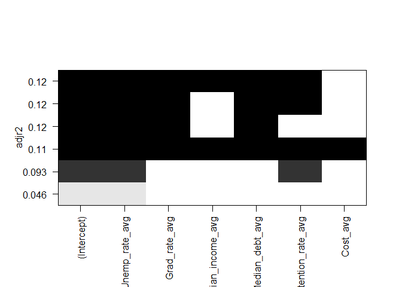
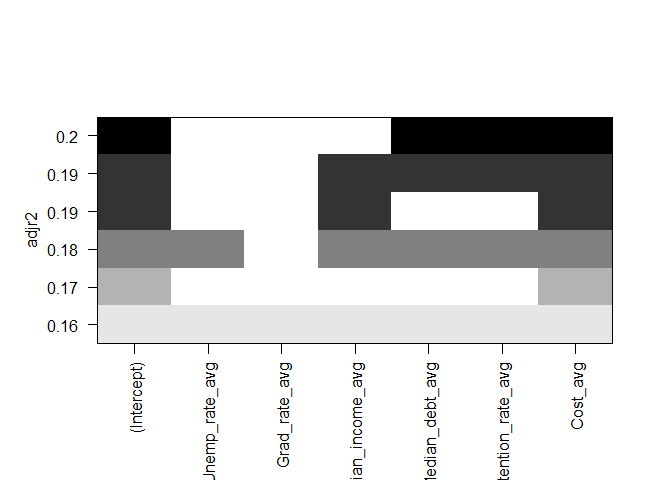
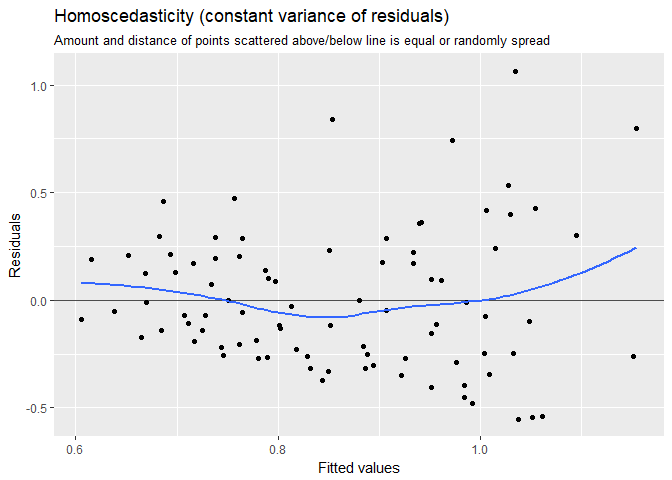
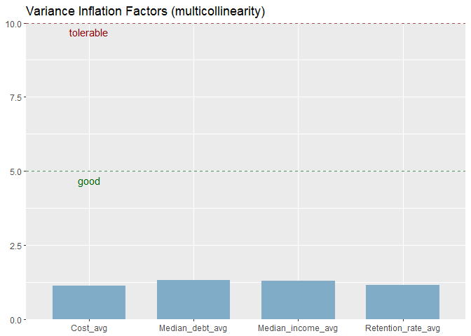
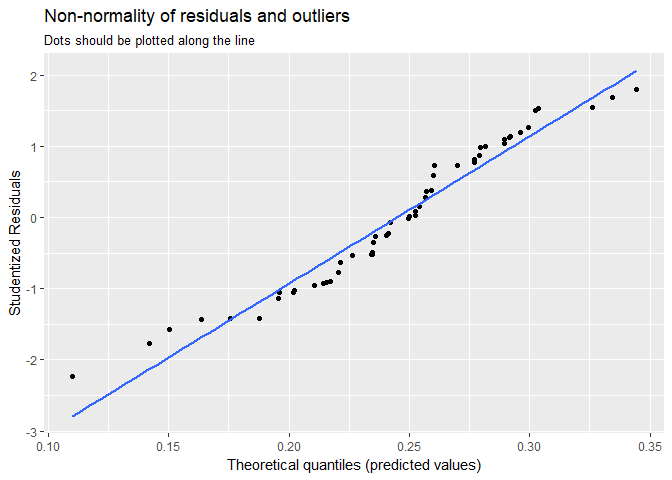
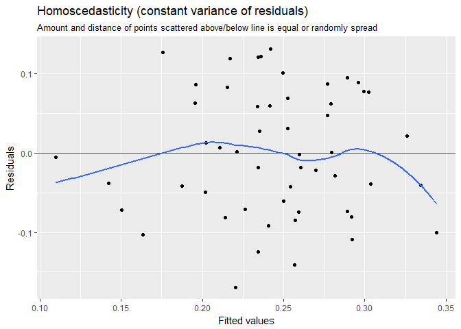

# __Predicting The Effects Of Unemployment And Education On Violent Crime Rate__

## __Introduction__

Violent crime is one of the most concerning topics of discussion in society; it can lead to the deterioration of a community's health, prosperity, and economic mobility.  Historical data has shown as a city's violent crime rate increases more financially secure families will move away towards a safer location, taking economic strength and mobility from these cities with them.  This leaves those left behind, typically less wealthy and less educated, falling into economic hardship and into a city with a higher crime rate.

## __Problem__

The families that have the privilege to leave a city with increasing crime rate for "greener" pastures include the business owners and job creators. This leaves those left behind, typically the less wealthy and less educated, falling into economic hardship and into a city with a higher crime rate.  

Violent crime rate has been anecdotally shown to be closely tied to a city's economy, and thus its policies.  Policy makers and businesses who contribute to community wellness need to be informed of this correlation with a data driven plan to specifically tailor their limited resources and target the factors that can reduce a city's violent crime rate.  To further convey the impact these factors have on violent crime, comparisons will be made between the top 100 most violent and the top 100 least violent cities.

The goal of this project is to statistically determine the factors that affect violent crime rate, what is the significance are those effects, and to compare them between the most violent and least violent cities.  Models will then be built upon these results to predict the change in violent crime rate better when investing resources into the targeted significant factors.

## __Data Set__

This project uses violent crime rate as the response/dependent variable for our models, so publically available crime data sets were collected from the FBI's website from the years 2013 - 2015.  These data sets contained the city and their respective violent crime total count.  A data set containing population totals for U.S. cities was merged with the crime data set to calculate the violent crime rate variable.  Specifically, violent crime rate (VCR) was calculated by per capita, therefore only cities with >100,000 were used in the data sets to remove outlier high crime/low population cities to create more normalized regression models.

The predictors/independent variables used in this project are as follows:

* UR = Unemployment Rate
* GR = College Graduation Rate
* Median Income
* Median Debt
* Retention Rate = College Retention Rate
* Cost = Cost of College

Data is available from the following links:

"U.S. Unemployment Rate by County, 1990-2016" (U.S. Bureau of Labor Statistics)
https://www.kaggle.com/jayrav13/unemployment-by-county-us

"FBI Uniform Crime Report" (FBI)
https://ucr.fbi.gov/crime-in-the-u.s/2016/preliminary-semiannual-uniform-crime-report-januaryjune-2016

"College Scorecard Data" (U.S. Department of Education)
https://collegescorecard.ed.gov/data/

## __Data Limitations__

Violent crime rate is not a simple analytical variable; it is neither based upon financial fundamentals nor physical mathematics.  It is a societal and human construct.  Crime is a result of breaking current law, and law is decided by a societies own moral compass and governmental structure.  All these factors not only differ from one county to the next, but also from city to city.  To expect to discover a highly accurate model that can predict the crime rate for a nation and account for every societal, personal, economic, and global effect is beyond this project, and most likely beyond present data science methodology.

The raw data sets collected for crime, unemployment, and college data contain many missing values, as well as self-reported numbers.  The FBI doesn't have the manpower nor systems to log every crime that occurs across the nation, therefore there will be inherit error contained in these data sets.  The same limitation applies to the U.S. Bureau of Labor Statistics and its ability to collect unemployment data, as well as the college data from the Department of Education.

This project is not looking to address every variable that effects violent crime rate and have a best fitting model with an R2 of >95%.  The scope of this project is to evaluate the effects education and unemployment can have upon violent crime rate, and to compare the differences of significant factors between the most violent and least violent cities.

## __Data Extraction__


```r
# Load needed packages
library(tidyr)
library(dplyr)
library(readr)
library(readxl)
library(magrittr)
library(stringi)
library(GGally)
library(lme4)
library(ggplot2)
library(car)
library(sjPlot)
library(sjmisc)
library(leaps)
library(gridExtra)
library(caret)

# Import raw data as objects, remove rows w/o observations
crime_13_raw <- read_excel("Raw Data/2013 Crime Data/Table_8_Offenses_Known_to_Law_Enforcement_by_State_by_City_2013.xls", skip = 2)
crime_14_raw <- read_excel("Raw Data/2014 Crime Data/Table_8_Offenses_Known_to_Law_Enforcement_by_State_by_City_2014.xls", skip = 2)
crime_15_raw <- read_excel("Raw Data/2015 Crime Data/Table_8_Offenses_Known_to_Law_Enforcement_by_State_by_City_2015.xls", skip = 2)
college_score_raw <- read_csv("Raw Data/College Score Data/college_score_raw.csv")
unemployment_raw <- read_csv("Raw Data/Unemployment Data/unemployment_raw.csv")
population_raw <- read_csv("Raw Data/City Population/sub-est2016_all.csv")
city_county_raw <- read_delim("Raw Data/City by County/us_cities_states_counties.csv", delim = "|")
```

The data sets examined were formatted very poorly for data analysis in their raw forms.  The crime data sets were especially difficult to arrange into a coherent and easily accessible data frame structure, and many custom wrangling parameters had to be implemented.  A thorough stepwise review of the code used in this project can be located in the "Capstone Final Code" markdown document. 

After importing all the raw data into R, many of the rows in the data were design choices for a custom excel layout and were removed to get into a tidy format (all columns are variables, all rows are observations) for easier analysis downstream.  Columns also had to be renamed for clarity due to ambiguous names in the excel document i.e. X1, X2, etc. Missing values and correct data types of variables were assigned to be able to conduct EDA, modeling, and data visualization. The crime data was simplified into a data frame with only the necessary response variables and descriptors necessary (violent crime rate and city) and iterated for each year examined.


```r
## --------------------------------------------
## Crime Data
## --------------------------------------------

# Rename header and remove nonsense rows 
crime_13_detailed <- crime_13_raw %>%
  select(., 1:14) %>%
  set_colnames(.[1,]) %>% 
  slice(2:9293) %>%
  
  # Assign the correct data type
  mutate_at(., 1:2, funs(as.character)) %>%
  mutate_at(., 3:14, funs(as.integer)) %>% 
  
  # Replace and Fill missing State values  
  fill(State, .direction = c("down")) %>% 
  
  # Sum crime data into one variable
  mutate(Total_crime_13 = rowSums(.[4:14], na.rm = T, dims = 1))

# Tidy format, clean up names
crime_13_tidy <- crime_13_detailed %>% 
  select(., 1:2, 4, 15) %>% 
  mutate(City = gsub("\\d.*", "", .$City)) %>% 
  mutate(State = stri_trans_totitle(State))

names(crime_13_tidy)[3] <- c("Violent_crime_13")

## --------------------------------------------
## Iterate for 2014 and 2015 crime data
## --------------------------------------------

# Tidy 2014 Crime Data 
crime_14_detailed <- crime_14_raw %>%
  select(., 1:14) %>%
  set_colnames(.[1,]) %>% 
  slice(2:9348) %>% 
  mutate_at(., 1:2, funs(as.character)) %>%
  mutate_at(., 3:14, funs(as.integer)) %>% 
  fill(State, .direction = c("down")) %>% 
  mutate(Total_crime_14 = rowSums(.[4:14], na.rm = T, dims = 1))

crime_14_tidy <- crime_14_detailed %>% 
  select(., 1:2, 4, 15) %>% 
  mutate(City = gsub("\\d.*", "", .$City)) %>% 
  mutate(State = stri_trans_totitle(State))

names(crime_14_tidy)[3] <- c("Violent_crime_14")

# Tidy 2015 Crime Data 
crime_15_detailed <- crime_15_raw %>%
  select(., 1:14) %>%
  set_colnames(.[1,]) %>% 
  slice(2:9396) %>% 
  mutate_at(., 1:2, funs(as.character)) %>%
  mutate_at(., 3:14, funs(as.integer)) %>% 
  fill(State, .direction = c("down")) %>% 
  mutate(Total_crime_15 = rowSums(.[4:14], na.rm = T, dims = 1))

crime_15_tidy <- crime_15_detailed %>% 
  select(., 1:2, 4, 15) %>% 
  mutate(City = gsub("\\d.*", "", .$City)) %>% 
  mutate(State = stri_trans_totitle(State))

names(crime_15_tidy)[3] <- c("Violent_crime_15")
```


A data set of the counties to which U.S. cities belonged was imported and formatted because the unemployment data set used only recorded the unemployment rate by county, not city.  The column containing state abbreviations and city alias was removed because the unemployment county data was formatted by full state name and the crime data was formatted by official city name.  A distinct() function was passed through to remove duplicate data entries.
  

```r
## --------------------------------------------
## City and County Data
## --------------------------------------------

# Remove unnecessary variables / observations, and place into tidy format 
city_county_tidy <- city_county_raw %>% 
  select(., 1, 3:4) %>% 
  rename(., State = "State full") %>% 
  distinct(.) %>%
  mutate_at(., 1:3, funs(as.character)) %>% 
  mutate(County = stri_trans_totitle(County))
```

The raw unemployment data was organized by individual entries of the unemployment rate for each county for every year from 1990 to 2016. The spread() function was used to get the data into a tidy format where each observation was the county, rather than the unemployment rate record.  The unemployment rate data from 2013 to 2015 was filtered and renamed for each county to match and merge with the crime and college data sets.


```r
## --------------------------------------------
## Unemployment Data
## --------------------------------------------

# Remove county names
unemployment_tidy <- unemployment_raw %>% 
  mutate(County = gsub("\\sCounty.*", "", .$County)) %>% 
  
  # Spread data to determine annual rate, tidy up 
  spread(., Month, Rate) %>% 
  mutate(Annual_rate = rowMeans(.[4:15], na.rm = T, dims = 1)) %>% 
  filter(., Year > 2012 & Year < 2016) %>% 
  select(., 1:3, 16) %>% 
  spread(., Year, Annual_rate) %>% 
  rename(., Unemp_rate_13 = "2013", Unemp_rate_14 = "2014", Unemp_rate_15 = "2015")
```

A number of unused variables were given in the college score data set and are available for observation in the link provided above.  Only the variables deemed impactful to this project were selected for further analysis i.e. Graduation rate, Average cost of tuition, etc.  Values for each variable were renamed for clarity.


```r
## --------------------------------------------
## College Score Data
## --------------------------------------------

# Remove unnecessary variables
college_score_tidy <- college_score_raw %>% 
  select(., 4:5, 7, 10:12, 85, 97:99, 110:111, 115, 117:119, 123) %>% 
  
  # Rename varibles for readability
  rename(., Uni = INSTNM, 
         City = CITY, 
         State = STATE, 
         Under_Inv = HCM2, 
         Degree_Level = PREDDEG, 
         Type = CONTROL, 
         Online = DISTANCEONLY, 
         Certified = CURROPER,
         Avg_Price_Pub = NPT4_PUB,
         Avg_Price_Priv = NPT4_PRIV,
         Pell_Grant_Rate = PCTPELL,
         Retention_Rate = RET_FT4,
         Fed_Loan_Rate = PCTFLOAN,
         Median_Earnings_10years = MD_EARN_WNE_P10,
         Over_25K_6years = GT_25K_P6,
         Median_Debt_Grads = GRAD_DEBT_MDN_SUPP,
         Grad_Rate = C150_4_POOLED_SUPP) %>%
  
  mutate_at(., 9:17, funs(as.numeric))
```


Population data for each city was needed in order to filter down the violent crime data set and calculated the violent crime rate per capita (VCR). Renaming of the selected variables was executed for clarity. Multiple custom gsub() functions were needed because many of the observations for the "City" variable had unnecessary descriptors i.e. Bakerstown town, New York City city, etc.


```r
## --------------------------------------------
## Population Data
## --------------------------------------------

# Remove unnecessary variables
population_tidy <- population_raw %>% 
  select(., 9:10, 16:18) %>% 
  mutate_at(., 1:2, funs(as.character)) %>% 
  
# Tidy variable and observation names
  rename(., City = NAME, 
         State = STNAME, 
         pop_13 = POPESTIMATE2013,
         pop_14 = POPESTIMATE2014,
         pop_15 = POPESTIMATE2015) %>% 
  mutate(City = gsub("\\scity", "", .$City)) %>% 
  mutate(City = gsub("\\stown", "", .$City)) %>% 
  mutate(City = gsub("\\sborough", "", .$City)) %>% 
  mutate(City = gsub("\\svillage", "", .$City)) %>% 
  mutate(City = gsub("\\sship", "", .$City)) %>% 
  mutate(City = gsub(".*\\(pt.)", "", .$City)) %>% 
  distinct(.)
```

Finally, the individual tidy data frames were merged into one data frame via joins by the City and State variables.  This ensured no duplicate values were introduced into the data and our analysis between the top 100 most violent and least violent cities and their respective predictors would be as accurate as possible.  An ifelse statement was used to calculated the response/dependent variable VCR by dividing the violent crime total by the population total and multiplying it by 100 for cities with a minimum population of 100,000.


```r
## --------------------------------------------
## Merged Tidy Dataframe
## --------------------------------------------

crime_1 <- left_join(crime_13_tidy, crime_14_tidy, by = c("State", "City"))

crime_total <- left_join(crime_1, crime_15_tidy, by = c("State", "City"))

crime_pop <- left_join(crime_total, population_tidy, by = c("State", "City"))

crime_county <- left_join(crime_pop, city_county_tidy, by = c("State", "City"))

risk_tidy <- left_join(crime_county, unemployment_tidy, by = c("State", "County"))

# Violent crime rate(VCR) per capita of cities > or = to 100,000 population size
risk_VCR <- risk_tidy %>% 
  mutate(VCR_13 = ifelse(.$pop_13 < 100000, NA, (.$Violent_crime_13 / .$pop_13 * 100))) %>% 
  mutate(VCR_14 = ifelse(.$pop_14 < 100000, NA, (.$Violent_crime_14 / .$pop_14 * 100))) %>% 
  mutate(VCR_15 = ifelse(.$pop_15 < 100000, NA, (.$Violent_crime_15 / .$pop_15 * 100))) %>% 
  drop_na(.)

# Separate expanded df to incorporate college data
risk_VCR_final <- left_join(risk_VCR, college_score_tidy, by = c("State", "City"))
```

## __Exploratory Data Analysis__

EDA is used to identify potential trends in the data and determine which variables appear to have significance in regards to the problem being asked.  In this case, we are looking for independent variables that have statically significant correlation to VCR, and interesting trends in sample distribution when comparing the most violent and least violent cities.

There was not enough yearly data for a time series analysis, so the mean of the 2013-2015 data was taken for VCR, Unemployment Rate (UR), and Graduation Rate (GR).


```r
# Find the mean of VCR and Unemployment data from 2013-2015
risk_VCR_avg <- risk_VCR %>%
  mutate(VCR_avg = rowMeans(.[16:18], na.rm = T, dims = 1)) %>% 
  mutate(Unemp_rate_avg = rowMeans(.[13:15], na.rm = T, dims = 1))
```

A new categorical variable "rank" was created to identify and split the data into the top 100 most violent(MV) and least violent(LV) cities by VCR.  Comparisons can now be made between these two data sets' statically analysis, including the regression models.


```r
# Creat a new variable to facet plot between top and bottom 100 cities
top100_UR <- risk_VCR_avg %>%
  arrange(., desc(VCR_avg)) %>% 
  distinct(., VCR_avg, .keep_all = T) %>% 
  top_n(., 100, VCR_avg) %>% 
  mutate(rank = "Most_Violent")

bot100_UR <- risk_VCR_avg %>%
  arrange(., desc(VCR_avg)) %>% 
  distinct(., VCR_avg, .keep_all = T) %>% 
  top_n(., -100, VCR_avg) %>% 
  mutate(rank = "Least_Violent")
```

An initial comparison of the data to VCR was only performed on GR and UR based upon our initial hypothesis that the raising of unemployment and lowering college graduation rate would alter the response of the violent crime rate in a city. 

Scatterplots were used to visualize VCR vs. GR and VCR vs. UR.  The results showed a significant difference between the MV cities and the LV cities.  Both GR and UR seem to have no statistical significance in LV cities.  The horizontal trend line indicates that the variance in data is random.  However, high VCR cities appear to have a slightly positive correlation with UR, and a slightly negative correlation with GR.  The error appears large in both plots, and will be investigated more thoroughly with a summary analysis of the regression models.


```r
# Plot the mean VCR against Uemployment rate for top and bottom 100 cities
VCR_UR <- bind_rows(top100_UR, bot100_UR)

VCR_UR_scat <- ggplot(VCR_UR, aes(x = Unemp_rate_avg, y = VCR_avg, col = rank)) +
  geom_point(size = 2, shape = 1, na.rm = T, show.legend = F) +
  geom_smooth(method = "lm", se = T, show.legend = F) +
  facet_grid(. ~ rank) +
  labs(title = "Violent Crime Rate by Unemployment Rate", 
       x = "Mean Unemployment Rate (2013-2015)", y = "Mean Violent Crime Rate (2013-2015)")
```

<!-- -->


```r
# Find avg grad rate by city
GR_by_city <- risk_VCR_final %>% 
  group_by(., City, State) %>% 
  summarise(Grad_rate_avg = mean(Grad_Rate, na.rm = T))

risk_VCR_avg_GR <- left_join(risk_VCR_avg, GR_by_city, by = c("State", "City"))

# Plot mean VCR against college grad rate
top100_GR <- risk_VCR_avg_GR %>% 
  arrange(., desc(VCR_avg)) %>% 
  distinct(., VCR_avg, .keep_all = T) %>% 
  top_n(., 100, VCR_avg) %>% 
  mutate(rank = "Most_Violent")

bot100_GR <- risk_VCR_avg_GR %>%
  arrange(., desc(VCR_avg)) %>% 
  distinct(., VCR_avg, .keep_all = T) %>% 
  top_n(., -100, VCR_avg) %>% 
  mutate(rank = "Least_Violent")

VCR_GR <- bind_rows(top100_GR, bot100_GR)

VCR_GR_scat <- ggplot(VCR_GR, aes(x = Grad_rate_avg, y = VCR_avg, col = rank)) +
  geom_point(size = 2, shape = 1, na.rm = T, show.legend = F) +
  geom_smooth(method = "lm", se = T, show.legend = F) +
  facet_grid(. ~ rank) +
  labs(title = "Violent Crime Rate by Graduation Rate", 
       x = "Mean Graduation Rate (2013-2015)", y = "Mean Violent Crime Rate (2013-2015)")
```

<!-- -->

Histograms were created to evaluate the distribution differences between all 3 variables.  VCR reveals that the range for the LV cities is much smaller than the right tailed distribution of the MV cities.  This indicates there are more extreme examples of higher VCR than lower VCR. The GR histograms don't provide much detail in visualizing the differences between the two sets of data.  There appears to be a tighter concentration of GR on the lower end for more violent cities that will be examined closer.  The UR histograms reveal more violent cities have a higher distribution of unemployment.  All these factors seem to coincide with the hypothesis that unemployment rate has a positive correlation with violent crime rate, whereas graduation rate has a negative correlation.


```r
# Plot VCR, GR, and UR distributions for top and bot 100 VCR cities
VCR_hist <- ggplot(VCR_GR, aes(x = VCR_avg, fill = rank)) +
  geom_histogram(binwidth = 0.04, alpha = 0.6, na.rm = T) +
  labs(title = "Violent Crime Rate Sample Distribution", 
       x = "Mean Violent Crime Rate (2013-2015)", y = "# of Cities") +
  guides(fill=guide_legend(title = "Top 100 Cities"))

GR_hist <- ggplot(VCR_GR, aes(x = Grad_rate_avg, fill = rank)) +
  geom_histogram(binwidth = 0.02, alpha = 0.6, show.legend = F, na.rm = T) +
  facet_grid(. ~ rank) +
  labs(title = "Graduation Rate Sample Distribution", 
       x = "Mean Graduation Rate (2013-2015)", y = "# of Cities")

UR_hist <- ggplot(VCR_UR, aes(x = Unemp_rate_avg, fill = rank)) +
  geom_histogram(binwidth = 0.25, alpha = 0.6, show.legend = F, na.rm = T) +
  facet_grid(. ~ rank) +
  labs(title = "Unemployment Rate Sample Distribution", 
       x = "Mean Unemployment Rate (2013-2015)", y = "# of Cities")
```

<!-- --><!-- --><!-- -->

Density plots were evaluated to easily compare the distributions on a relative scale rather than a direct count.  The histograms the VCR for the LV cities is tightly concentrated from approximately 0 to 0.5%, and the MV cities ranges from approximately 0.5% to 2%.  The GR density distributions appear to show the central tendency of the MV cities is lower and more tightly concentrated between the interquartile range, whereas the GR for the LV cities appears to be a normal distribution.  The UR density distributions were similar between the sets, with the MV central tendency to be slightly higher, however interestingly both distributions are bimodal.  This characteristic could be the result of a number of unforeseen factors, i.e. the data set isn't large enough. This effect is beyond the scope of this study and will not be further investigated.


```r
# Plot overlapping densities for VCR, GR, and UR
VCR_den <- ggplot(VCR_GR, aes(x = VCR_avg, fill = rank)) +
  geom_density(na.rm = T, alpha = 0.6) +
  labs(title = "Violent Crime Rate Density Comparison", 
       x = "Mean Violent Crime Rate (2013-2015)", y = "Density") +
  guides(fill=guide_legend(title = "Top 100 Cities"))

GR_den <- ggplot(VCR_GR, aes(x = Grad_rate_avg, fill = rank)) +
  geom_density(na.rm = T, alpha = 0.6) +
  labs(title = "Graduation Rate Density Comparison", 
       x = "Mean Graduation Rate (2013-2015)", y = "Density") +
  guides(fill=guide_legend(title = "Top 100 Cities"))

UR_den <- ggplot(VCR_UR, aes(x = Unemp_rate_avg, fill = rank)) +
  geom_density(na.rm = T, alpha = 0.6) +
  labs(title = "Unemployment Rate Density Comparison", 
       x = "Mean Unemployment Rate (2013-2015)", y = "Density") +
  guides(fill=guide_legend(title = "Top 100 Cities"))
```

<!-- --><!-- --><!-- -->

A matrix of the factors in question was created to evaluate common statistical methods and create a correlation matrix of all variables used for this study.  The central tendency statistical methods evaluated were the mean, range, and quantile coefficients.  

Because the data sets were ranked by violent crime, the differences in VCR were expected. The mean of MV_VCR was ~0.84%, compared to the mean of the LV_VCR at ~0.23%.  The interquartile ranges follow the distributions previously examined. The significant value lies in the differences in range.  The LV_VCR is from ~0.05% to ~0.38% (a 0.33% total range), and the MV_VCR is from ~0.47% to ~2.1% (a 1.63% total range).  This shows a 5x difference in the extremes when comparing the two sets for VCR.  The GR statistics reveal the expected left shift to lower values of the MV set compared to the LV set.  The interquartile range does not show a significant difference in the distributions of the data as hypothesized from the density distribution. The MV_GR set was between ~39% and ~55%, and the LV_GR set from ~43% to ~60%. The UR statistical values confirm the right shift of the MV set towards higher values when compared to the LV set.  For example, the mean of the MV_UR is ~6.5% and the mean of the LV_UR is ~5.9%.


```r
# Group city and state to find averages of college data
risk_VCR_final_grouped <- risk_VCR_final %>% 
  mutate(Cost_total = rowMeans(.[25:26], na.rm = T, dims = 1)) %>% 
  group_by(., City, State) %>% 
  summarise(., "Median_income_avg" = mean(Median_Earnings_10years, na.rm = T),
            "Median_debt_avg" = mean(Median_Debt_Grads, na.rm = T),
            "Retention_rate_avg" = mean(Retention_Rate, na.rm = T),
            "Cost_avg" = mean(Cost_total, na.rm = T))

# Retain only averages of data from data exploration plots
matrix_1 <- VCR_GR %>% 
  select(., 1:2, 12, 19:22)

matrix_2 <- left_join(matrix_1, risk_VCR_final_grouped, by = c("State", "City"))
matrix_2 <- as_data_frame(matrix_2) %>% 
  mutate_at(., 1:3, funs(as.factor)) %>% 
  mutate_at(., 7, funs(as.factor))

# Central Tendancy comparisons of VCR, UR, and GR by rank
matrix_1_MV <- subset(matrix_1, subset = rank == "Most_Violent")
summary(matrix_1_MV)
```

```
##     State               City              County             VCR_avg      
##  Length:100         Length:100         Length:100         Min.   :0.4689  
##  Class :character   Class :character   Class :character   1st Qu.:0.5797  
##  Mode  :character   Mode  :character   Mode  :character   Median :0.7540  
##                                                           Mean   :0.8354  
##                                                           3rd Qu.:0.9674  
##                                                           Max.   :2.0999  
##                                                                           
##  Unemp_rate_avg   Grad_rate_avg        rank          
##  Min.   : 3.028   Min.   :0.2203   Length:100        
##  1st Qu.: 5.332   1st Qu.:0.3927   Class :character  
##  Median : 6.250   Median :0.4816   Mode  :character  
##  Mean   : 6.518   Mean   :0.4791                     
##  3rd Qu.: 7.747   3rd Qu.:0.5474                     
##  Max.   :11.667   Max.   :0.8515                     
##                   NA's   :12
```

```r
matrix_1_LV <- subset(matrix_1, subset = rank == "Least_Violent")
summary(matrix_1_LV)
```

```
##     State               City              County         
##  Length:100         Length:100         Length:100        
##  Class :character   Class :character   Class :character  
##  Mode  :character   Mode  :character   Mode  :character  
##                                                          
##                                                          
##                                                          
##                                                          
##     VCR_avg        Unemp_rate_avg  Grad_rate_avg        rank          
##  Min.   :0.05086   Min.   :2.467   Min.   :0.1715   Length:100        
##  1st Qu.:0.15056   1st Qu.:4.763   1st Qu.:0.4299   Class :character  
##  Median :0.23140   Median :5.787   Median :0.5106   Mode  :character  
##  Mean   :0.23266   Mean   :5.929   Mean   :0.5221                     
##  3rd Qu.:0.30786   3rd Qu.:7.168   3rd Qu.:0.6000                     
##  Max.   :0.38591   Max.   :8.450   Max.   :0.9159                     
##                                    NA's   :42
```

```r
# Plot matrix data comparing all variables
comparison_plot <- ggpairs(matrix_2, 
                           columns = c(4:6, 8:11),
                           title = "100 Most Violent Cities vs 100 Least Violent Cities",
                           upper = list(
                             continuous = "cor",
                             mapping = aes(color = rank, alpha = 0.6)
                           ),
                           lower = list(
                             continuous = "smooth",
                             mapping = aes(color = rank, alpha = 0.6)
                           ),
                           diag = list(
                             continuous = "densityDiag",
                             mapping = aes(color = rank, alpha = 0.6)
                           )
)
```

<!-- -->

## __Models and Predictions__

This project used supervised linear regression machine learning techniques to produce models based upon the insights achieved from the EDA. A linear regression model will be created using statistically significant features to predict the response of VCR. Specifically, the features evaluated are: Unemployment Rate, College Graduation Rate, Median Income, Median Debt, College Retention Rate, and Average Cost of College.  Both the MV and LV data sets have their own models to be used in discovering what the different features/predictors effects are on VCR.

Two methods to determine the best model features used in this project are stepwise multiple linear regression and best subsets multiple linear regression. Both methods produce a number of statistical values for the regression models.  Each model's fit and predictive strength was evaluated using the following parameters: R2, Adjusted R2, Predictive R2, and P Value.

R2 (coefficient of determination) is a statistical measure of how close the data are to the fitted regression line.  This value ranges from 0-100% and is the percentage of the response/dependent variable variation (VCR) that is explained by the model.  0% denotes the given model explains none of the variability of VCR around its mean, while 100% denotes the model explains all the variability.  Higher R2 means the model fits the data better; however there are many limitations of this statistic with multiple linear regressions. R2 inherently increases every time a predictor is added to a model, falsely leading to the conclusion that a model with more variables is a better fit to the data and has stronger predictive accuracy.  Having more predictors also leads to the model being subject to overfitting, where it models random noise in the data. Adjusted R2 addresses many of the limitations of R2, and is a more acceptable statistic to use for model selection. 

Adjusted R2 is directly proportional to the MSE, and thus can compare the explanatory accuracy of regression models that contain different numbers of predictors. Its value increases only if the new predictor improves the model more than would be expected by chance and decreases when a predictor improves the model by less than expected by chance, because it incorporates a model's degrees of freedom. This leads to a better statistic to use when dealing with multiple linear regression models, but still has the limitation of being subject to the sample data.  This limits its predictive accuracy when used on unseen data.

P values are used to determine statically significance in hypothesis tests.  Technically, it is the probability of obtaining an effect at least as extreme as the one in your sample data, assuming the truth of the null hypothesis. This means assuming a true null hypothesis (the predictors effects on VCR are by random chance), how likely is the data. A high P value indicates the data agree with a true null, and a low P value indicates the data are unlikely with a true null.  Low P values in this project indicate that the predictors are statistically significant enough to not be a random effect on VCR.


```r
# Separate by rank variable into 2 separate data frames to create 2 separate linear regressions for 
# comparison purposes
MV_df <- filter(matrix_2, rank == "Most_Violent")

LV_df <- filter(matrix_2, rank == "Least_Violent")
```

The stepwise method uses a backward selection approach where all the predictors are included in the model, and removes non-significant factors in a step by step method. This method allows analysis of the beta constants, p values, F statistic, and adjusted R2 for all the features present in the data sets to determine which features are not statistically significant, or potentially have multicollinearity with other features which can lead to an overfitting.  However this method can lead to bias in the selection process by sticking with variables early on to achieve higher adjusted R2 and lower p values, potentially missing more significant feature selection combinations that produce a stronger fitting model to the data in question.


```r
## --------------------------------------------
## Stepwise Mulitple Linear Regression Feature Selection (Most Violent Series)
## --------------------------------------------

# Regession using all predictors available
lm_MV_VCR_1 <- lm(VCR_avg ~ Unemp_rate_avg + Grad_rate_avg + Median_income_avg +    
                  Median_debt_avg + Retention_rate_avg + Cost_avg,
                  data = MV_df)
```

The inclusion of all features indicates 5 of the 6 features are not statistically significant with an overall p value of 1.4% and adj. R2 of 11.3%.


```
## 
## Call:
## lm(formula = VCR_avg ~ Unemp_rate_avg + Grad_rate_avg + Median_income_avg + 
##     Median_debt_avg + Retention_rate_avg + Cost_avg, data = MV_df)
## 
## Residuals:
##      Min       1Q   Median       3Q      Max 
## -0.58543 -0.22867 -0.03829  0.17296  1.09834 
## 
## Coefficients:
##                      Estimate Std. Error t value Pr(>|t|)   
## (Intercept)         5.353e-01  3.313e-01   1.616  0.10995   
## Unemp_rate_avg      7.208e-02  2.271e-02   3.173  0.00213 **
## Grad_rate_avg      -5.409e-01  3.803e-01  -1.422  0.15877   
## Median_income_avg   4.995e-06  4.680e-06   1.067  0.28901   
## Median_debt_avg     1.725e-05  1.218e-05   1.416  0.16069   
## Retention_rate_avg -4.950e-01  3.799e-01  -1.303  0.19634   
## Cost_avg           -5.234e-07  1.298e-05  -0.040  0.96792   
## ---
## Signif. codes:  0 '***' 0.001 '**' 0.01 '*' 0.05 '.' 0.1 ' ' 1
## 
## Residual standard error: 0.33 on 81 degrees of freedom
##   (12 observations deleted due to missingness)
## Multiple R-squared:  0.1743,	Adjusted R-squared:  0.1132 
## F-statistic:  2.85 on 6 and 81 DF,  p-value: 0.01436
```

To improve the model, the average cost of college predictor was removed due to its high p value.


```r
# Reduce the model by removing least correlated predictor, the average cost of colleges
lm_MV_VCR_2 <- lm(VCR_avg ~ Unemp_rate_avg + Grad_rate_avg + Median_income_avg +
                  Median_debt_avg + Retention_rate_avg,
                  data = MV_df)
```

This model still possesses 4 out of 5 non-significant features, however the p value has been reduced to 0.69% and the adj. R2 improved to 12.4%. 


```
## 
## Call:
## lm(formula = VCR_avg ~ Unemp_rate_avg + Grad_rate_avg + Median_income_avg + 
##     Median_debt_avg + Retention_rate_avg, data = MV_df)
## 
## Residuals:
##      Min       1Q   Median       3Q      Max 
## -0.58404 -0.22820 -0.03652  0.17211  1.09644 
## 
## Coefficients:
##                      Estimate Std. Error t value Pr(>|t|)   
## (Intercept)         5.309e-01  3.101e-01   1.712  0.09068 . 
## Unemp_rate_avg      7.211e-02  2.257e-02   3.195  0.00198 **
## Grad_rate_avg      -5.439e-01  3.709e-01  -1.466  0.14636   
## Median_income_avg   4.995e-06  4.651e-06   1.074  0.28598   
## Median_debt_avg     1.709e-05  1.142e-05   1.496  0.13860   
## Retention_rate_avg -4.956e-01  3.772e-01  -1.314  0.19255   
## ---
## Signif. codes:  0 '***' 0.001 '**' 0.01 '*' 0.05 '.' 0.1 ' ' 1
## 
## Residual standard error: 0.328 on 82 degrees of freedom
##   (12 observations deleted due to missingness)
## Multiple R-squared:  0.1743,	Adjusted R-squared:  0.124 
## F-statistic: 3.462 on 5 and 82 DF,  p-value: 0.006883
```

Stepwise reduction continues on with the removal of median income because of its potential multicollinearity with median debt discovered in the correlation matrix during EDA, as well as its high p value relative to the remaining features.


```r
# Remove median income due to high multicolinearity with median debt
lm_MV_VCR_3 <- lm(VCR_avg ~ Unemp_rate_avg + Grad_rate_avg + Median_debt_avg +
                  Retention_rate_avg,
                  data = MV_df)
```

This model now contains 2 significant features out of 4, as well as an improved p value (0.48%) and similar adj. R2 (12.2%).


```
## 
## Call:
## lm(formula = VCR_avg ~ Unemp_rate_avg + Grad_rate_avg + Median_debt_avg + 
##     Retention_rate_avg, data = MV_df)
## 
## Residuals:
##      Min       1Q   Median       3Q      Max 
## -0.57624 -0.25277 -0.04578  0.19652  1.10324 
## 
## Coefficients:
##                      Estimate Std. Error t value Pr(>|t|)   
## (Intercept)         5.647e-01  3.088e-01   1.829  0.07099 . 
## Unemp_rate_avg      7.105e-02  2.257e-02   3.149  0.00228 **
## Grad_rate_avg      -4.651e-01  3.639e-01  -1.278  0.20482   
## Median_debt_avg     2.119e-05  1.078e-05   1.967  0.05258 . 
## Retention_rate_avg -4.402e-01  3.740e-01  -1.177  0.24263   
## ---
## Signif. codes:  0 '***' 0.001 '**' 0.01 '*' 0.05 '.' 0.1 ' ' 1
## 
## Residual standard error: 0.3283 on 83 degrees of freedom
##   (12 observations deleted due to missingness)
## Multiple R-squared:  0.1627,	Adjusted R-squared:  0.1223 
## F-statistic: 4.032 on 4 and 83 DF,  p-value: 0.004888
```

To reduce selection bias, the median income feature replaced the median debt feature from the previous model to investigate potentially improved statistical significance.


```r
# Replace median debt with median income and compare to model 3
lm_MV_VCR_4 <- lm(VCR_avg ~ Unemp_rate_avg + Grad_rate_avg + Median_income_avg +
                  Retention_rate_avg,
                  data = MV_df)
```

This model is not an improvement over model 3 as indicated by the removal of a significant feature, an increase in p value (0.79%) and reduction in adj. R2 (11.0%).  Model 3 will be used in further stepwise regression.


```
## 
## Call:
## lm(formula = VCR_avg ~ Unemp_rate_avg + Grad_rate_avg + Median_income_avg + 
##     Retention_rate_avg, data = MV_df)
## 
## Residuals:
##     Min      1Q  Median      3Q     Max 
## -0.6260 -0.2223 -0.0255  0.1532  1.0326 
## 
## Coefficients:
##                      Estimate Std. Error t value Pr(>|t|)   
## (Intercept)         8.031e-01  2.529e-01   3.176  0.00210 **
## Unemp_rate_avg      6.524e-02  2.226e-02   2.931  0.00436 **
## Grad_rate_avg      -5.038e-01  3.727e-01  -1.352  0.18010   
## Median_income_avg   7.322e-06  4.416e-06   1.658  0.10103   
## Retention_rate_avg -5.373e-01  3.790e-01  -1.418  0.16000   
## ---
## Signif. codes:  0 '***' 0.001 '**' 0.01 '*' 0.05 '.' 0.1 ' ' 1
## 
## Residual standard error: 0.3304 on 83 degrees of freedom
##   (12 observations deleted due to missingness)
## Multiple R-squared:  0.1518,	Adjusted R-squared:  0.1109 
## F-statistic: 3.713 on 4 and 83 DF,  p-value: 0.007876
```

The retention rate feature is removed in the next model regression because it also has potential multicollinearity with another feature, graduation rate, as seen in the EDA correlation matrix.


```r
# Debt is more stat. sig., reduce model 3 by removing retention rate of college 
# students due to multicolinearity with graduation rate 
lm_MV_VCR_5 <- lm(VCR_avg ~ Unemp_rate_avg + Grad_rate_avg + Median_debt_avg,
                  data = MV_df)
```

The features for this final model of the MV data set are all statistically significant as seen in their respective p values. The p value of the model is also the lowest at 0.035%, with a slightly weaker adj. R2 of 11.8%.  This lower adj. R2 will be addressed when the predicted R2 values are calculated in a later section of this project.


```
## 
## Call:
## lm(formula = VCR_avg ~ Unemp_rate_avg + Grad_rate_avg + Median_debt_avg, 
##     data = MV_df)
## 
## Residuals:
##      Min       1Q   Median       3Q      Max 
## -0.55387 -0.24977 -0.06389  0.20400  1.06520 
## 
## Coefficients:
##                   Estimate Std. Error t value Pr(>|t|)   
## (Intercept)      3.944e-01  2.733e-01   1.443  0.15281   
## Unemp_rate_avg   6.808e-02  2.248e-02   3.029  0.00326 **
## Grad_rate_avg   -7.305e-01  2.862e-01  -2.552  0.01251 * 
## Median_debt_avg  2.157e-05  1.080e-05   1.998  0.04892 * 
## ---
## Signif. codes:  0 '***' 0.001 '**' 0.01 '*' 0.05 '.' 0.1 ' ' 1
## 
## Residual standard error: 0.329 on 84 degrees of freedom
##   (12 observations deleted due to missingness)
## Multiple R-squared:  0.1487,	Adjusted R-squared:  0.1183 
## F-statistic: 4.892 on 3 and 84 DF,  p-value: 0.003496
```

The same stepwise regression method was used to determine the best model for the LV set.


```r
## --------------------------------------------
## Stepwise Multiple Linear Regression Feature Selection (Least Violent Series)
## --------------------------------------------

# Regression using all predictors available
lm_LV_VCR_1 <- lm(VCR_avg ~ Unemp_rate_avg + Grad_rate_avg + Median_income_avg +
                  Median_debt_avg + Retention_rate_avg + Cost_avg,
                  data = LV_df)
```

Only 1 of the 6 features was statistically significant when including all features in the model.  The p value of the model was 2.9% with an adj. R2 of 16.0%.


```
## 
## Call:
## lm(formula = VCR_avg ~ Unemp_rate_avg + Grad_rate_avg + Median_income_avg + 
##     Median_debt_avg + Retention_rate_avg + Cost_avg, data = LV_df)
## 
## Residuals:
##       Min        1Q    Median        3Q       Max 
## -0.172400 -0.067379 -0.005014  0.072925  0.127042 
## 
## Coefficients:
##                      Estimate Std. Error t value Pr(>|t|)    
## (Intercept)         5.710e-01  1.040e-01   5.492 1.76e-06 ***
## Unemp_rate_avg     -5.227e-03  8.722e-03  -0.599   0.5520    
## Grad_rate_avg       3.002e-02  1.034e-01   0.290   0.7730    
## Median_income_avg  -1.388e-06  1.684e-06  -0.824   0.4141    
## Median_debt_avg    -4.575e-06  3.693e-06  -1.239   0.2219    
## Retention_rate_avg -7.773e-02  8.233e-02  -0.944   0.3502    
## Cost_avg           -7.504e-06  2.994e-06  -2.506   0.0159 *  
## ---
## Signif. codes:  0 '***' 0.001 '**' 0.01 '*' 0.05 '.' 0.1 ' ' 1
## 
## Residual standard error: 0.08454 on 45 degrees of freedom
##   (48 observations deleted due to missingness)
## Multiple R-squared:  0.2595,	Adjusted R-squared:  0.1607 
## F-statistic: 2.628 on 6 and 45 DF,  p-value: 0.02859
```

The graduation rate feature was removed because it contained the highest p value which indicated the least amount of statistical significance to the response variable VCR.


```r
# Reduce by removing least significant predictor, graduation rate of college students
lm_LV_VCR_2 <- lm(VCR_avg ~ Unemp_rate_avg + Median_income_avg + Median_debt_avg + 
                  Retention_rate_avg + Cost_avg,
                  data = LV_df)
```

This model still only contains 1 significant feature of 5, but has an improved p value of 0.82% and adj. R2 of 19.8%.


```
## 
## Call:
## lm(formula = VCR_avg ~ Unemp_rate_avg + Median_income_avg + Median_debt_avg + 
##     Retention_rate_avg + Cost_avg, data = LV_df)
## 
## Residuals:
##       Min        1Q    Median        3Q       Max 
## -0.170916 -0.066771  0.000509  0.073513  0.123701 
## 
## Coefficients:
##                      Estimate Std. Error t value Pr(>|t|)    
## (Intercept)         5.844e-01  9.619e-02   6.076 2.07e-07 ***
## Unemp_rate_avg     -5.370e-03  8.537e-03  -0.629    0.532    
## Median_income_avg  -1.240e-06  1.561e-06  -0.794    0.431    
## Median_debt_avg    -5.135e-06  3.337e-06  -1.539    0.131    
## Retention_rate_avg -7.129e-02  7.169e-02  -0.994    0.325    
## Cost_avg           -7.307e-06  2.893e-06  -2.526    0.015 *  
## ---
## Signif. codes:  0 '***' 0.001 '**' 0.01 '*' 0.05 '.' 0.1 ' ' 1
## 
## Residual standard error: 0.08287 on 47 degrees of freedom
##   (47 observations deleted due to missingness)
## Multiple R-squared:  0.2748,	Adjusted R-squared:  0.1976 
## F-statistic: 3.562 on 5 and 47 DF,  p-value: 0.008204
```

The unemployment rate feature was removed next for the same reasons as graduation rate.


```r
# Remove next least significant predictor, unemployment rate
lm_LV_VCR_3 <- lm(VCR_avg ~ Median_income_avg + Median_debt_avg + Retention_rate_avg +
                  Cost_avg,
                  data = LV_df)
```

This model contains 1 signficant feature of 4, with a p value of 0.41% and adj. R2 of 20.8%.


```
## 
## Call:
## lm(formula = VCR_avg ~ Median_income_avg + Median_debt_avg + 
##     Retention_rate_avg + Cost_avg, data = LV_df)
## 
## Residuals:
##       Min        1Q    Median        3Q       Max 
## -0.169482 -0.070918 -0.001438  0.069519  0.131794 
## 
## Coefficients:
##                      Estimate Std. Error t value Pr(>|t|)    
## (Intercept)         5.515e-01  8.018e-02   6.878 1.13e-08 ***
## Median_income_avg  -1.052e-06  1.523e-06  -0.691  0.49301    
## Median_debt_avg    -4.760e-06  3.262e-06  -1.459  0.15102    
## Retention_rate_avg -7.623e-02  7.081e-02  -1.077  0.28705    
## Cost_avg           -7.706e-06  2.805e-06  -2.747  0.00844 ** 
## ---
## Signif. codes:  0 '***' 0.001 '**' 0.01 '*' 0.05 '.' 0.1 ' ' 1
## 
## Residual standard error: 0.08234 on 48 degrees of freedom
##   (47 observations deleted due to missingness)
## Multiple R-squared:  0.2687,	Adjusted R-squared:  0.2077 
## F-statistic: 4.409 on 4 and 48 DF,  p-value: 0.004079
```

The next feature to be removed is median income for the same reason it was removed in the MV stepwise regression, its potential multicollinearity with median debt.


```r
# Remove median income due to high multicolinearity with median debt
lm_LV_VCR_4 <- lm(VCR_avg ~ Median_debt_avg + Retention_rate_avg + Cost_avg,
                 data = LV_df)
```

This final model contains 2 out of 3 significant features, with a slightly worse p value (0.68%) and adj. R2 (16.7%) when compared to model 3.  To determine whether model 3 or model 4 is a better fit for the LV data set, predicted R2 values will be calculated and best subsets regression will be performed on both data sets for a more exhaustive approach.


```
## 
## Call:
## lm(formula = VCR_avg ~ Median_debt_avg + Retention_rate_avg + 
##     Cost_avg, data = LV_df)
## 
## Residuals:
##       Min        1Q    Median        3Q       Max 
## -0.188180 -0.066447 -0.006014  0.072517  0.170639 
## 
## Coefficients:
##                      Estimate Std. Error t value Pr(>|t|)    
## (Intercept)         5.182e-01  7.977e-02   6.495  3.7e-08 ***
## Median_debt_avg    -6.073e-06  3.108e-06  -1.954   0.0564 .  
## Retention_rate_avg -8.702e-02  6.839e-02  -1.273   0.2091    
## Cost_avg           -5.983e-06  2.785e-06  -2.148   0.0366 *  
## ---
## Signif. codes:  0 '***' 0.001 '**' 0.01 '*' 0.05 '.' 0.1 ' ' 1
## 
## Residual standard error: 0.08491 on 50 degrees of freedom
##   (46 observations deleted due to missingness)
## Multiple R-squared:  0.2144,	Adjusted R-squared:  0.1673 
## F-statistic:  4.55 on 3 and 50 DF,  p-value: 0.006774
```

The best subsets regression method was used to address the limitations of the stepwise method. Instead of identifying a single model based on a tunneling of statistical significance, best subsets feature selection exhaustively evaluates every feature to produce a number of different models and statistical values.  These models are displayed in a matrix ranked by their adj. R2 values to help visualize the comparison.


```r
## --------------------------------------------
## Best Subsets Regression Feature Selection
## --------------------------------------------

# Use Best subsets regression to plot adjusted R2 of all variables
MV_df_na <- MV_df[complete.cases(MV_df),]
MV_df_na <- MV_df_na[c(4:6, 8:11)]

LV_df_na <- LV_df[complete.cases(LV_df),]
LV_df_na <- LV_df_na[c(4:6, 8:11)]

best_lm_MV_VCR <- regsubsets(VCR_avg ~ ., data = MV_df_na)

best_lm_LV_VCR <- regsubsets(VCR_avg ~ ., data = LV_df_na)
```

The first matrix is a display of the MV data set, and the black blocks display the most significant predictors to use and their correlation adj. R2 values.  Best subsets regression shows there is a lot of flexbility in the choice of predictors due to the similar adj. R2 values, but it is common knowledge in data analysis that a simpler model is better, therefore model 5 stands to be the best choice.

The second matrix displays the LV data set, and shows model 4 to be the best choice when evaluating the adj. R2 values.  Combined with the stepwise regression results, it is still not clear whether model 3 or model 4 is better for the LV set. Calculating the predicted R2 value should assist in this decision.

<!-- --><!-- -->

Predicted R2 is directly proportional to the PRESS statistic (predicted residual sum of squares), and can indicate how well a model predicts the responses of new data.  It works by methodically removing each observation in the data set, estimating the regression, and using that estimation to predict the removed observation.  Predicted R2 also prevents overfitting, because it is impossible to predict random noise thus predicted R2 will drop for an overfit model.


```r
# Predicted R2 for all models using Tom Hopper's function
pred_r_squared <- function(linear.model) {
  lm.anova <- anova(linear.model)
  tss <- sum(lm.anova$"Sum Sq")
  # predictive R^2
  pred.r.squared <- 1 - PRESS(linear.model)/(tss)
  return(pred.r.squared)
}
PRESS <- function(linear.model) {
  pr <- residuals(linear.model)/(1 - lm.influence(linear.model)$hat)
  PRESS <- sum(pr^2)
  return(PRESS)
}

MV_pred_names <- c("MV_Model_1", "MV_Model_2", "MV_Model_3", "MV_Model_4", "MV_Model_5")

MV_pred_r2_results <- c(pred_r_squared(lm_MV_VCR_1),
                        pred_r_squared(lm_MV_VCR_2),
                        pred_r_squared(lm_MV_VCR_3),
                        pred_r_squared(lm_MV_VCR_4),
                        pred_r_squared(lm_MV_VCR_5))

MV_model_results <- data.frame(MV_pred_names, MV_pred_r2_results)
```

The results conclude that the model with the best predictive accuracy for the MV data set is model 5 with a value of 3.99%.


```
##   MV_pred_names MV_pred_r2_results
## 1    MV_Model_1        0.003965607
## 2    MV_Model_2        0.031134277
## 3    MV_Model_3        0.034660659
## 4    MV_Model_4        0.025533228
## 5    MV_Model_5        0.039979844
```


```r
LV_pred_names <- c("LV_Model_1", "LV_Model_2", "LV_Model_3", "LV_Model_4")

LV_pred_r2_results <- c(pred_r_squared(lm_LV_VCR_1),
                        pred_r_squared(lm_LV_VCR_2),
                        pred_r_squared(lm_LV_VCR_3),
                        pred_r_squared(lm_LV_VCR_4))

LV_model_results <- data.frame(LV_pred_names, LV_pred_r2_results)
```

Since we are concered with predicting the response to VCR with new data, the results conclude that the model with the best predictive accuracy for the MV data set is model 3 with a value of 11.1%.


```
##   LV_pred_names LV_pred_r2_results
## 1    LV_Model_1         0.00131812
## 2    LV_Model_2         0.08025219
## 3    LV_Model_3         0.11140922
## 4    LV_Model_4         0.09599753
```

Combining all these variables will allow us to choose the best model containing the most significant features.  This model for both MV and LV data sets will then be tested via k-fold cross-validation, where the original samples is randomly partitioned into k subsamples and one is left out in each iteration.  Cross-validation is another way to measure predictive performance of a statistical model by taking removing a subset of data as a "test set" and evaluating the remaining data as the "training set".  The test set is then introduced as new unseen data to evaluate the predictive accuracy of the training set. 

The RMSE (root mean squared error) indicates how close the predicted values are from the actual data. It is statistically punished for outlier data because it is an absolute measure of fit. Lower RMSE values indicate a better fit of the model to the data. If the RMSE values are close in comparison when comparing the cross-validated model against the regression model, it indicates a higher predictive accuracy for the model being validated.


```r
## --------------------------------------------
## Cross Validation of Linear Models
## --------------------------------------------

# Train and test linear regressions via a repeated k-fold cross validation
tcont <- trainControl(method = "repeatedcv", number = 10, repeats = 10)

cv_lm_MV_VCR_5 <- train(VCR_avg ~ Unemp_rate_avg + Grad_rate_avg + Median_debt_avg,
                        data = na.omit(MV_df),
                        trControl = tcont,
                        method = "lm")
```


```
## Linear Regression 
## 
## 88 samples
##  3 predictor
## 
## No pre-processing
## Resampling: Cross-Validated (10 fold, repeated 10 times) 
## Summary of sample sizes: 78, 80, 79, 80, 80, 79, ... 
## Resampling results:
## 
##   RMSE       Rsquared   MAE      
##   0.3317386  0.1565382  0.2716445
## 
## Tuning parameter 'intercept' was held constant at a value of TRUE
```


```r
cv_lm_LV_VCR_3 <- train(VCR_avg ~ Median_debt_avg + Retention_rate_avg + Cost_avg + 
                        Median_income_avg,
                        data = na.omit(LV_df),
                        trControl = tcont,
                        method = "lm")
```


```
## Linear Regression 
## 
## 52 samples
##  4 predictor
## 
## No pre-processing
## Resampling: Cross-Validated (10 fold, repeated 10 times) 
## Summary of sample sizes: 48, 47, 46, 48, 46, 48, ... 
## Resampling results:
## 
##   RMSE        Rsquared   MAE       
##   0.08445161  0.3184431  0.07447943
## 
## Tuning parameter 'intercept' was held constant at a value of TRUE
```


```r
# Calculate RMSE for comparison against k-fold cross validation results of final models 
# (highest predicted R2)
RMSE_lm_MV_VCR_5 <- sqrt(sum((residuals(lm_MV_VCR_5)/(1-hatvalues(lm_MV_VCR_5)))^2)/length(lm_MV_VCR_5$residuals))

RMSE_lm_LV_VCR_3 <- sqrt(sum((residuals(lm_LV_VCR_3)/(1-hatvalues(lm_LV_VCR_3)))^2)/length(lm_LV_VCR_3$residuals))
```

The RMSE for the model 5 of the MV data set is 34.1%, which is close in value to the cross-validated RMSE at 32.9%.  This is another indication that this model would more accurately predict new data.

The same conclusion can be made with model 3 of the LV data set with a value of 8.6% compared to the cross-validated RMSE at 8.4%.


```
## [1] 0.3413583
```

```
## [1] 0.08638
```

## __Results__

Using the previous methods, the best models for both MV and LV cities were determined. These models and their features have can now be visualized and used to display the impact they have on violent crime rate.  Breaking down the features present in each model will lead to a data-driven policy making process with statisical reasoning on why changes must be made in order to address a rising crime rate. The best model for MV cities (model 5) was anlayzed first.

A table of the model 5's coefficients was displayed to show the slopes and error of the 3 significant features: Unemployment Rate, Graduation Rate, and Median Debt.  The slopes can be used to predict a change in violent crime when a change in the feature occurs.


```r
### -------------------------------------------- ###
###                   Results                    ###
### -------------------------------------------- ###

## --------------------------------------------
## Feature Impact on VCR for Violent Cities (Model 5)
## --------------------------------------------

# Table of regression model coefficients
sjt.lm(lm_MV_VCR_5,
       group.pred = F,
       p.numeric = F,
       emph.p = T,
       show.ci = F,
       show.se = T,
       show.header = T,
       show.fstat = T,
       digits.est = 6,
       digits.se = 6,
       string.dv = "Model 5 Coefficients to predict VCR for Violent Cities")
```

<table style="border-collapse:collapse; border:none;">
<tr>
<td style="padding:0.2cm; border-top:double;" rowspan="2"><em>Predictors</em></td>
<td colspan="3" style="padding:0.2cm; border-top:double; text-align:center; border-bottom:1px solid;"><em>Model 5 Coefficients to predict VCR for Violent Cities</em></td>
</tr>

<td style=" padding-left:0.5em; padding-right:0.5em;">&nbsp;</td>
<td style="padding:0.2cm; text-align:center; " colspan="2">VCR_avg</td>
</tr>
<tr>
<td style="padding:0.2cm; font-style:italic;">&nbsp;</td>
<td style="padding-left:0.5em; padding-right:0.5em; font-style:italic;">&nbsp;</td>
<td style="padding:0.2cm; text-align:center; font-style:italic; ">B</td>
<td style="padding:0.2cm; text-align:center; font-style:italic; ">std. Error</td> 
</tr>
<tr>
<td style="padding:0.2cm; border-top:1px solid; text-align:left;">(Intercept)</td>
<td style="padding-left:0.5em; padding-right:0.5em; border-top:1px solid; ">&nbsp;</td>
<td style="padding:0.2cm; text-align:center; border-top:1px solid; ">0.394368&nbsp;</td>
<td style="padding:0.2cm; text-align:center; border-top:1px solid; ">0.273348</td>
</tr>
<tr>
<td style="padding:0.2cm; text-align:left;">Unemp_rate_avg</td>
<td style="padding-left:0.5em; padding-right:0.5em;">&nbsp;</td>
<td style="padding:0.2cm; text-align:center; ">0.068083&nbsp;**</td>
<td style="padding:0.2cm; text-align:center; ">0.022475</td>
</tr>
<tr>
<td style="padding:0.2cm; text-align:left;">Grad_rate_avg</td>
<td style="padding-left:0.5em; padding-right:0.5em;">&nbsp;</td>
<td style="padding:0.2cm; text-align:center; ">&#45;0.730522&nbsp;*</td>
<td style="padding:0.2cm; text-align:center; ">0.286215</td>
</tr>
<tr>
<td style="padding:0.2cm; text-align:left;">Median_debt_avg</td>
<td style="padding-left:0.5em; padding-right:0.5em;">&nbsp;</td>
<td style="padding:0.2cm; text-align:center; ">0.000022&nbsp;*</td>
<td style="padding:0.2cm; text-align:center; ">0.000011</td>
</tr>
<tr>
<td style="padding:0.2cm; padding-top:0.1cm; padding-bottom:0.1cm; text-align:left; border-top:1px solid;">Observations</td>
<td style="padding-left:0.5em; padding-right:0.5em; border-top:1px solid;">&nbsp;</td><td style="padding:0.2cm; padding-top:0.1cm; padding-bottom:0.1cm; text-align:center; border-top:1px solid;" colspan="2">88</td>
</tr>
<tr>
<td style="padding:0.2cm; text-align:left; padding-top:0.1cm; padding-bottom:0.1cm;">R<sup>2</sup> / adj. R<sup>2</sup></td>

<td style="padding-left:0.5em; padding-right:0.5em;">&nbsp;</td><td style="padding:0.2cm; text-align:center; padding-top:0.1cm; padding-bottom:0.1cm;" colspan="2">.149 / .118</td>
 </tr>
 <tr>
 <td style="padding:0.2cm; text-align:left; padding-top:0.1cm; padding-bottom:0.1cm;">F&#45;statistics</td>

<td style="padding-left:0.5em; padding-right:0.5em;">&nbsp;</td> <td style="padding:0.2cm; text-align:center; padding-top:0.1cm; padding-bottom:0.1cm;" colspan="2">4.892**</td>
 </tr>
<tr style="padding:0.2cm; border-top:1px solid;">
<td style="padding:0.2cm;">Notes</td><td style="padding:0.2cm; text-align:right;" colspan="3"><em>* p&lt;.05&nbsp;&nbsp;&nbsp;** p&lt;.01&nbsp;&nbsp;&nbsp;*** p&lt;.001</em></td>
</tr>
</table>

A few assumptions must be made in order to change individual features in a model to use in comparison to the mean values of the total model:

  1) There must be 0 correlation between the features.  If not, changing the value of one would effect the value of the correlated feature.
  2) The mean values must remain constant for the features not being changed. 
  3) No outside factors would significantly impact VCR when one feature is changed.
  
In reality these assumptions should be rigorously tested, and the entire model should be robust enough to handle changes in multiple features.  This is beyond the scope of this project.

The first feature examined for model 5 was Graduation Rate and its effect it had on VCR.  A plot of the data is shown to visualize the slight negative trend which occurs when GR increases; a more thorough prediction calculation was performed and determined raising GR 50% above the mean decreased the VCR for MV cities from 0.86% to 0.68%. As expected in our hypothesis, increasing the rate of college graduation can have a significant impact on decreasing violent crime rate.


```r
# Plot VCR vs. GR assuming zero correlation and constant mean values from other features
plot_model(lm_MV_VCR_5, 
           type = c("pred"),
           terms = c("Grad_rate_avg"),
           mdrt.values = c("all"),
           title = "Impact of Graduation Rate on Violent Crime Rate (Violent Cities)",
           show.data = T,
           dot.alpha = 0.3
           )
```

<!-- -->

```r
# VCR response to the mean of all features in the data
predict(lm_MV_VCR_5, 
        data.frame(Grad_rate_avg = 0.4791, Unemp_rate_avg = 6.518, Median_debt_avg = 33408), 
        interval = "prediction", 
        level = 0.95)
```

```
##        fit      lwr      upr
## 1 1.208864 0.467631 1.950098
```

```r
# VCR response to increasing GR 50% above the mean
predict(lm_MV_VCR_5, 
        data.frame(Grad_rate_avg = 0.7187, Unemp_rate_avg = 6.518, Median_debt_avg = 33408), 
        interval = "prediction", 
        level = 0.95)
```

```
##        fit      lwr     upr
## 1 1.033831 0.290673 1.77699
```

The next feature examined for model 5 was the impact of Unemployment Rate on VCR. A plot of the data is shown to visualize the slight positive trend which occurs when UR increases; a more thorough prediction calculation was performed and determined decreasing UR 50% below the mean decreased the VCR for MV cities from 0.86% to 0.64%. This data also reinforces our hypothesis; decreasing the unemployment rate can decrease the violent crime rate.   


```r
# Plot VCR vs. UR assuming zero correlation and constant mean values from other features
plot_model(lm_MV_VCR_5, 
           type = c("pred"),
           terms = c("Unemp_rate_avg"),
           mdrt.values = c("all"),
           title = "Impact of Unemployment Rate on Violent Crime Rate (Violent Cities)",
           show.data = T,
           dot.alpha = 0.3
)
```

<!-- -->

```r
# VCR response to the mean of all features in the data
predict(lm_MV_VCR_5, 
        data.frame(Grad_rate_avg = 0.4791, Unemp_rate_avg = 6.409, Median_debt_avg = 17566), 
        interval = "prediction", 
        level = 0.95)
```

```
##         fit       lwr      upr
## 1 0.8596762 0.2016984 1.517654
```

```r
# VCR response to decreasing UR 50% below the mean
predict(lm_MV_VCR_5, 
        data.frame(Grad_rate_avg = 0.4791, Unemp_rate_avg = (6.409/2), Median_debt_avg = 17566), 
        interval = "prediction", 
        level = 0.95)
```

```
##         fit         lwr      upr
## 1 0.6415057 -0.03187589 1.314887
```

The last feature examined for model 5 was the impact Median Debt had on VCR. A plot of the data is shown to visualize the very slight positive trend which occurs when median debt increases; a more thorough prediction calculation was performed and determined decreasing the median debt 50% below the mean decreased the VCR for MV cities from 0.86% to 0.67%. These results were an addition to the original hypothesis adding that decreasing the median debt of a city's citizens can significantly decrease the violent crime rate.  This result shows that as more data is collected and examined, a deeper understanding of the trends behind important policy issues can be mapped, broken down, and executed upon.


```r
# Plot VCR vs. Median Debt assuming zero correlation and constant mean values from other features
plot_model(lm_MV_VCR_5, 
           type = c("pred"),
           terms = c("Median_debt_avg"),
           mdrt.values = c("all"),
           title = "Impact of Debt on Violent Crime Rate (Violent Cities)",
           show.data = T,
           dot.alpha = 0.3
)
```

<!-- -->

```r
# VCR response to the mean of all features in the data
predict(lm_MV_VCR_5, 
        data.frame(Grad_rate_avg = 0.4791, Unemp_rate_avg = 6.409, Median_debt_avg = 17566), 
        interval = "prediction", 
        level = 0.95)
```

```
##         fit       lwr      upr
## 1 0.8596762 0.2016984 1.517654
```

```r
# VCR response to decreasing debt 50% below the mean
predict(lm_MV_VCR_5, 
        data.frame(Grad_rate_avg = 0.4791, Unemp_rate_avg = 6.409, Median_debt_avg = (17566/2), 
        interval = "prediction", 
        level = 0.95))
```

```
##         1 
## 0.6701963
```

The best model for LV cities (model 3) was examined next. A table of the model 3's coefficients was displayed to show the slopes and error of the 4 significant features: Median Income, Median Debt, College Retention Rate, and Average Cost of College. Like with model 5 for MV cities, the slopes can be used to predict a change in violent crime when a change in the feature occurs.


```r
## --------------------------------------------
## Feature Impact vs. VCR for Safe Cities (Model 3)
## --------------------------------------------

# Table of regression model coefficients
sjt.lm(lm_LV_VCR_3,
       group.pred = F,
       p.numeric = F,
       emph.p = T,
       show.ci = F,
       show.se = T,
       show.header = T,
       show.fstat = T,
       digits.est = 8,
       digits.se = 8,
       string.dv = "Model 3 Coefficients to predict VCR for Safe Cities")
```

<table style="border-collapse:collapse; border:none;">
<tr>
<td style="padding:0.2cm; border-top:double;" rowspan="2"><em>Predictors</em></td>
<td colspan="3" style="padding:0.2cm; border-top:double; text-align:center; border-bottom:1px solid;"><em>Model 3 Coefficients to predict VCR for Safe Cities</em></td>
</tr>

<td style=" padding-left:0.5em; padding-right:0.5em;">&nbsp;</td>
<td style="padding:0.2cm; text-align:center; " colspan="2">VCR_avg</td>
</tr>
<tr>
<td style="padding:0.2cm; font-style:italic;">&nbsp;</td>
<td style="padding-left:0.5em; padding-right:0.5em; font-style:italic;">&nbsp;</td>
<td style="padding:0.2cm; text-align:center; font-style:italic; ">B</td>
<td style="padding:0.2cm; text-align:center; font-style:italic; ">std. Error</td> 
</tr>
<tr>
<td style="padding:0.2cm; border-top:1px solid; text-align:left;">(Intercept)</td>
<td style="padding-left:0.5em; padding-right:0.5em; border-top:1px solid; ">&nbsp;</td>
<td style="padding:0.2cm; text-align:center; border-top:1px solid; ">0.55149948&nbsp;***</td>
<td style="padding:0.2cm; text-align:center; border-top:1px solid; ">0.08017938</td>
</tr>
<tr>
<td style="padding:0.2cm; text-align:left;">Median_income_avg</td>
<td style="padding-left:0.5em; padding-right:0.5em;">&nbsp;</td>
<td style="padding:0.2cm; text-align:center; ">&#45;0.00000105&nbsp;</td>
<td style="padding:0.2cm; text-align:center; ">0.00000152</td>
</tr>
<tr>
<td style="padding:0.2cm; text-align:left;">Median_debt_avg</td>
<td style="padding-left:0.5em; padding-right:0.5em;">&nbsp;</td>
<td style="padding:0.2cm; text-align:center; ">&#45;0.00000476&nbsp;</td>
<td style="padding:0.2cm; text-align:center; ">0.00000326</td>
</tr>
<tr>
<td style="padding:0.2cm; text-align:left;">Retention_rate_avg</td>
<td style="padding-left:0.5em; padding-right:0.5em;">&nbsp;</td>
<td style="padding:0.2cm; text-align:center; ">&#45;0.07623266&nbsp;</td>
<td style="padding:0.2cm; text-align:center; ">0.07081016</td>
</tr>
<tr>
<td style="padding:0.2cm; text-align:left;">Cost_avg</td>
<td style="padding-left:0.5em; padding-right:0.5em;">&nbsp;</td>
<td style="padding:0.2cm; text-align:center; ">&#45;0.00000771&nbsp;**</td>
<td style="padding:0.2cm; text-align:center; ">0.00000280</td>
</tr>
<tr>
<td style="padding:0.2cm; padding-top:0.1cm; padding-bottom:0.1cm; text-align:left; border-top:1px solid;">Observations</td>
<td style="padding-left:0.5em; padding-right:0.5em; border-top:1px solid;">&nbsp;</td><td style="padding:0.2cm; padding-top:0.1cm; padding-bottom:0.1cm; text-align:center; border-top:1px solid;" colspan="2">53</td>
</tr>
<tr>
<td style="padding:0.2cm; text-align:left; padding-top:0.1cm; padding-bottom:0.1cm;">R<sup>2</sup> / adj. R<sup>2</sup></td>

<td style="padding-left:0.5em; padding-right:0.5em;">&nbsp;</td><td style="padding:0.2cm; text-align:center; padding-top:0.1cm; padding-bottom:0.1cm;" colspan="2">.269 / .208</td>
 </tr>
 <tr>
 <td style="padding:0.2cm; text-align:left; padding-top:0.1cm; padding-bottom:0.1cm;">F&#45;statistics</td>

<td style="padding-left:0.5em; padding-right:0.5em;">&nbsp;</td> <td style="padding:0.2cm; text-align:center; padding-top:0.1cm; padding-bottom:0.1cm;" colspan="2">4.409**</td>
 </tr>
<tr style="padding:0.2cm; border-top:1px solid;">
<td style="padding:0.2cm;">Notes</td><td style="padding:0.2cm; text-align:right;" colspan="3"><em>* p&lt;.05&nbsp;&nbsp;&nbsp;** p&lt;.01&nbsp;&nbsp;&nbsp;*** p&lt;.001</em></td>
</tr>
</table>

The first feature examined for model 3 was the impact Median Income had on VCR.  A plot of the data is shown to visualize the very slight negative trend which occurs when median income increases; a more thorough prediction calculation was performed and determined raising the median income 50% above the mean decreased the VCR for LV cities from 0.24% to 0.22%. This change in VCR is much smaller relative to the changes features had in MV cities.  This result is expected because LV cities are already the safest cities examined in this data set, however it doesn't make it any less significant.  Raising the income of citizens in safe cities can reduce the crime rate. 


```r
# Plot VCR vs. Median Income assuming zero correlation and constant mean values from other features
plot_model(lm_LV_VCR_3, 
           type = c("pred"),
           terms = c("Median_income_avg"),
           mdrt.values = c("all"),
           title = "Impact of Income on Violent Crime Rate (Safe Cities)",
           show.data = T,
           dot.alpha = 0.3
)
```

<!-- -->

```r
# VCR response to the mean of all features in the data
predict(lm_LV_VCR_3, 
        data.frame(Median_income_avg = 35224, Median_debt_avg = 17373, 
                   Retention_rate_avg = .7144, Cost_avg = 17410), 
        interval = "prediction", 
        level = 0.95)
```

```
##         fit        lwr       upr
## 1 0.2431237 0.07600108 0.4102463
```

```r
# VCR response to increasing Income 50% above the mean
predict(lm_LV_VCR_3, 
        data.frame(Median_income_avg = (35224*1.5), Median_debt_avg = 17373, 
                   Retention_rate_avg = .7144, Cost_avg = 17410),
        interval = "prediction", 
        level = 0.95)
```

```
##         fit        lwr       upr
## 1 0.2245943 0.04896536 0.4002231
```

The next feature examined for model 3 was the impact Median Debt can have on VCR. A plot of the data is shown to visualize the slight negative trend which occurs when median debt increases; a more thorough prediction calculation was performed and determined decreasing the median debt 50% below the mean actually increased the VCR for LV cities from 0.24% to 0.28%.  This was a startling revelation that only a thorough analysis of the data could find; decreasing debt in violent cities lowered VCR, but decreasing debt in safe cities actually increases it.  

It is highly unlikely that burdening citizens with more debt would be the correct way to handle a rising crime rate in safe cities.  This result may be a good example of how outside factors and domain knowledge apply when examining models and trends.  A more extensive data set and in-depth analysis would need to be performed to accurately conclude the reasoning, however the rise in VCR with the decrease in debt may be attributed to what is known as "good debt".  "Good debt" generally refers to mortgages, student loans, or investments.  It is the items an individual pays for now to increase potential returns later.  This kind of debt would more likely be associated with cities that are safer, because more wealthy people live in those cities.  With these assumptions, this data reinforces our hypothesis that the individuals who greatly improve the economic wellbeing of a city generally move to safer cities.


```r
# Plot VCR vs. Median Debt assuming zero correlation and constant mean values from other features
plot_model(lm_LV_VCR_3, 
           type = c("pred"),
           terms = c("Median_debt_avg"),
           mdrt.values = c("all"),
           title = "Impact of Debt on Violent Crime Rate (Safe Cities)",
           show.data = T,
           dot.alpha = 0.3
)
```

<!-- -->

```r
# VCR response to the mean of all features in the data
predict(lm_LV_VCR_3, 
        data.frame(Median_income_avg = 35224, Median_debt_avg = 17373, 
                   Retention_rate_avg = .7144, Cost_avg = 17410),
        interval = "prediction", 
        level = 0.95)
```

```
##         fit        lwr       upr
## 1 0.2431237 0.07600108 0.4102463
```

```r
# VCR response to decreasing Debt by 50% below the mean
predict(lm_LV_VCR_3, 
        data.frame(Median_income_avg = 35224, Median_debt_avg = (17373/2), 
                   Retention_rate_avg = .7144, Cost_avg = 17410),
        interval = "prediction", 
        level = 0.95)
```

```
##         fit       lwr       upr
## 1 0.2844745 0.1082368 0.4607122
```

The next feature examined for model 3 was the impact College Retention Rate had on VCR.  A plot of the data is shown to visualize the very slight negative trend which occurs when retention rate increases; a more thorough prediction calculation was performed and determined raising the retention rate 20% above the mean decreased the VCR for LV cities from 0.24% to 0.23%; a slight but significant change. As expected, having more students stay in college decreases the VCR.


```r
# Plot VCR vs. College Retention Rate assuming zero correlation and constant mean values from other features
plot_model(lm_LV_VCR_3, 
           type = c("pred"),
           terms = c("Retention_rate_avg"),
           mdrt.values = c("all"),
           title = "Impact of College Retention Rate on Violent Crime Rate (Safe Cities)",
           show.data = T,
           dot.alpha = 0.3
)
```

<!-- -->

```r
# VCR response to the mean of all features in the data
predict(lm_LV_VCR_3, 
        data.frame(Median_income_avg = 35224, Median_debt_avg = 17373, 
                   Retention_rate_avg = .7144, Cost_avg = 17410), 
        interval = "prediction", 
        level = 0.95)
```

```
##         fit        lwr       upr
## 1 0.2431237 0.07600108 0.4102463
```

```r
# VCR response to increasing College Retention 20% above the mean
predict(lm_LV_VCR_3, 
        data.frame(Median_income_avg = 35224, Median_debt_avg = 17373, 
                   Retention_rate_avg = (.7144*1.2), Cost_avg = 17410),
        interval = "prediction", 
        level = 0.95)
```

```
##         fit        lwr      upr
## 1 0.2322315 0.06380906 0.400654
```

The last feature examined for model 3 was the impact the Average Cost of College had on VCR. A plot of the data is shown to visualize the slight negative trend which occurs when college cost increases; a more thorough prediction calculation was performed and determined decreasing the college cost 50% below the mean actually increase the VCR for LV cities from 0.24% to 0.31%. Another startling result that would only be seen in a thorough analysis of data, making college cheaper for LV cities actually increased the VCR.

However, much like the impact median debt had on VCR, an understanding of the underlying data must be taken into account.  Making college more expensive in cities will most likely not decrease a safe cities violent crime rate; in fact in may do the opposite.  More expensive colleges may correlate to a lower VCR because they are institutions of higher quality.  Thus, they generally have the resources and facilities to guarantee safety easier on their campuses and attract the more wealthy families sending their children to college.  These additional outside assumptions must be considered and more extensively researched before making policy on only a few data trends.


```r
# Plot VCR vs. Average Cost of College assuming zero correlation and constant mean values from other features
plot_model(lm_LV_VCR_3, 
           type = c("pred"),
           terms = c("Cost_avg"),
           mdrt.values = c("all"),
           title = "Impact of Average Cost of College on Violent Crime Rate (Safe Cities)",
           show.data = T,
           dot.alpha = 0.3
)
```

<!-- -->

```r
# VCR response to the mean of all features in the data
predict(lm_LV_VCR_3, 
        data.frame(Median_income_avg = 35224, Median_debt_avg = 17373, 
                   Retention_rate_avg = .7144, Cost_avg = 17410),
        interval = "prediction", 
        level = 0.95)
```

```
##         fit        lwr       upr
## 1 0.2431237 0.07600108 0.4102463
```

```r
# VCR response to decreasing the Cost of College 50% below the mean
predict(lm_LV_VCR_3, 
        data.frame(Median_income_avg = 35224, Median_debt_avg = 17373, 
                   Retention_rate_avg = .7144, Cost_avg = (17410/2),
        interval = "prediction", 
        level = 0.95))
```

```
##        1 
## 0.310201
```

The final section of this project contains data visualizations of the most important values to present to the clients (policy makers).

The constants from the correlation matrix found during EDA are presented in table matrix for both the MV and LC sets.


```r
# Table of correlation matrix
sjt.corr(MV_df_na, title = "Correlation Matrix of Variables (MV data set)")
```

<table style="border-collapse:collapse; border:none;">
<caption style="font-weight: bold; text-align:left;">Correlation Matrix of Variables (MV data set)</caption>
<tr>
<th style="font-style:italic; font-weight:normal; border-top:double black; border-bottom:1px solid black; padding:0.2cm;">&nbsp;</th>
<th style="font-style:italic; font-weight:normal; border-top:double black; border-bottom:1px solid black; padding:0.2cm;">VCR_avg</th>
<th style="font-style:italic; font-weight:normal; border-top:double black; border-bottom:1px solid black; padding:0.2cm;">Unemp_rate_avg</th>
<th style="font-style:italic; font-weight:normal; border-top:double black; border-bottom:1px solid black; padding:0.2cm;">Grad_rate_avg</th>
<th style="font-style:italic; font-weight:normal; border-top:double black; border-bottom:1px solid black; padding:0.2cm;">Median_income_avg</th>
<th style="font-style:italic; font-weight:normal; border-top:double black; border-bottom:1px solid black; padding:0.2cm;">Median_debt_avg</th>
<th style="font-style:italic; font-weight:normal; border-top:double black; border-bottom:1px solid black; padding:0.2cm;">Retention_rate_avg</th>
<th style="font-style:italic; font-weight:normal; border-top:double black; border-bottom:1px solid black; padding:0.2cm;">Cost_avg</th>
</tr>
<tr>
<td style="font-style:italic;">VCR_avg</td>
<td style="padding:0.2cm; text-align:center;">&nbsp;</td>
<td style="padding:0.2cm; text-align:center;">0.239<span style="vertical-align:super;font-size:0.8em;">*</span></td>
<td style="padding:0.2cm; text-align:center; color:#999999;">-0.195<span style="vertical-align:super;font-size:0.8em;"></span></td>
<td style="padding:0.2cm; text-align:center; color:#999999;">0.043<span style="vertical-align:super;font-size:0.8em;"></span></td>
<td style="padding:0.2cm; text-align:center; color:#999999;">0.105<span style="vertical-align:super;font-size:0.8em;"></span></td>
<td style="padding:0.2cm; text-align:center; color:#999999;">-0.194<span style="vertical-align:super;font-size:0.8em;"></span></td>
<td style="padding:0.2cm; text-align:center; color:#999999;">-0.029<span style="vertical-align:super;font-size:0.8em;"></span></td>
</tr>
<tr>
<td style="font-style:italic;">Unemp_rate_avg</td>
<td style="padding:0.2cm; text-align:center;">0.239<span style="vertical-align:super;font-size:0.8em;">*</span></td>
<td style="padding:0.2cm; text-align:center;">&nbsp;</td>
<td style="padding:0.2cm; text-align:center; color:#999999;">0.124<span style="vertical-align:super;font-size:0.8em;"></span></td>
<td style="padding:0.2cm; text-align:center; color:#999999;">-0.054<span style="vertical-align:super;font-size:0.8em;"></span></td>
<td style="padding:0.2cm; text-align:center;">-0.216<span style="vertical-align:super;font-size:0.8em;">*</span></td>
<td style="padding:0.2cm; text-align:center; color:#999999;">0.172<span style="vertical-align:super;font-size:0.8em;"></span></td>
<td style="padding:0.2cm; text-align:center; color:#999999;">-0.064<span style="vertical-align:super;font-size:0.8em;"></span></td>
</tr>
<tr>
<td style="font-style:italic;">Grad_rate_avg</td>
<td style="padding:0.2cm; text-align:center; color:#999999;">-0.195<span style="vertical-align:super;font-size:0.8em;"></span></td>
<td style="padding:0.2cm; text-align:center; color:#999999;">0.124<span style="vertical-align:super;font-size:0.8em;"></span></td>
<td style="padding:0.2cm; text-align:center;">&nbsp;</td>
<td style="padding:0.2cm; text-align:center;">0.364<span style="vertical-align:super;font-size:0.8em;">***</span></td>
<td style="padding:0.2cm; text-align:center; color:#999999;">0.135<span style="vertical-align:super;font-size:0.8em;"></span></td>
<td style="padding:0.2cm; text-align:center;">0.630<span style="vertical-align:super;font-size:0.8em;">***</span></td>
<td style="padding:0.2cm; text-align:center;">0.306<span style="vertical-align:super;font-size:0.8em;">**</span></td>
</tr>
<tr>
<td style="font-style:italic;">Median_income_avg</td>
<td style="padding:0.2cm; text-align:center; color:#999999;">0.043<span style="vertical-align:super;font-size:0.8em;"></span></td>
<td style="padding:0.2cm; text-align:center; color:#999999;">-0.054<span style="vertical-align:super;font-size:0.8em;"></span></td>
<td style="padding:0.2cm; text-align:center;">0.364<span style="vertical-align:super;font-size:0.8em;">***</span></td>
<td style="padding:0.2cm; text-align:center;">&nbsp;</td>
<td style="padding:0.2cm; text-align:center;">0.365<span style="vertical-align:super;font-size:0.8em;">***</span></td>
<td style="padding:0.2cm; text-align:center;">0.305<span style="vertical-align:super;font-size:0.8em;">**</span></td>
<td style="padding:0.2cm; text-align:center;">0.224<span style="vertical-align:super;font-size:0.8em;">*</span></td>
</tr>
<tr>
<td style="font-style:italic;">Median_debt_avg</td>
<td style="padding:0.2cm; text-align:center; color:#999999;">0.105<span style="vertical-align:super;font-size:0.8em;"></span></td>
<td style="padding:0.2cm; text-align:center;">-0.216<span style="vertical-align:super;font-size:0.8em;">*</span></td>
<td style="padding:0.2cm; text-align:center; color:#999999;">0.135<span style="vertical-align:super;font-size:0.8em;"></span></td>
<td style="padding:0.2cm; text-align:center;">0.365<span style="vertical-align:super;font-size:0.8em;">***</span></td>
<td style="padding:0.2cm; text-align:center;">&nbsp;</td>
<td style="padding:0.2cm; text-align:center; color:#999999;">0.041<span style="vertical-align:super;font-size:0.8em;"></span></td>
<td style="padding:0.2cm; text-align:center;">0.382<span style="vertical-align:super;font-size:0.8em;">***</span></td>
</tr>
<tr>
<td style="font-style:italic;">Retention_rate_avg</td>
<td style="padding:0.2cm; text-align:center; color:#999999;">-0.194<span style="vertical-align:super;font-size:0.8em;"></span></td>
<td style="padding:0.2cm; text-align:center; color:#999999;">0.172<span style="vertical-align:super;font-size:0.8em;"></span></td>
<td style="padding:0.2cm; text-align:center;">0.630<span style="vertical-align:super;font-size:0.8em;">***</span></td>
<td style="padding:0.2cm; text-align:center;">0.305<span style="vertical-align:super;font-size:0.8em;">**</span></td>
<td style="padding:0.2cm; text-align:center; color:#999999;">0.041<span style="vertical-align:super;font-size:0.8em;"></span></td>
<td style="padding:0.2cm; text-align:center;">&nbsp;</td>
<td style="padding:0.2cm; text-align:center; color:#999999;">0.206<span style="vertical-align:super;font-size:0.8em;"></span></td>
</tr>
<tr>
<td style="font-style:italic;">Cost_avg</td>
<td style="padding:0.2cm; text-align:center; color:#999999;">-0.029<span style="vertical-align:super;font-size:0.8em;"></span></td>
<td style="padding:0.2cm; text-align:center; color:#999999;">-0.064<span style="vertical-align:super;font-size:0.8em;"></span></td>
<td style="padding:0.2cm; text-align:center;">0.306<span style="vertical-align:super;font-size:0.8em;">**</span></td>
<td style="padding:0.2cm; text-align:center;">0.224<span style="vertical-align:super;font-size:0.8em;">*</span></td>
<td style="padding:0.2cm; text-align:center;">0.382<span style="vertical-align:super;font-size:0.8em;">***</span></td>
<td style="padding:0.2cm; text-align:center; color:#999999;">0.206<span style="vertical-align:super;font-size:0.8em;"></span></td>
<td style="padding:0.2cm; text-align:center;">&nbsp;</td>
</tr>
<tr>
<td colspan="8" style="border-bottom:double black; border-top:1px solid black; font-style:italic; font-size:0.9em; text-align:right;">Computed correlation used pearson-method with listwise-deletion.</td>
</tr>
 
</table>

```r
sjt.corr(LV_df_na, title = "Correlation Matrix of Variables (LV data set)")
```

<table style="border-collapse:collapse; border:none;">
<caption style="font-weight: bold; text-align:left;">Correlation Matrix of Variables (LV data set)</caption>
<tr>
<th style="font-style:italic; font-weight:normal; border-top:double black; border-bottom:1px solid black; padding:0.2cm;">&nbsp;</th>
<th style="font-style:italic; font-weight:normal; border-top:double black; border-bottom:1px solid black; padding:0.2cm;">VCR_avg</th>
<th style="font-style:italic; font-weight:normal; border-top:double black; border-bottom:1px solid black; padding:0.2cm;">Unemp_rate_avg</th>
<th style="font-style:italic; font-weight:normal; border-top:double black; border-bottom:1px solid black; padding:0.2cm;">Grad_rate_avg</th>
<th style="font-style:italic; font-weight:normal; border-top:double black; border-bottom:1px solid black; padding:0.2cm;">Median_income_avg</th>
<th style="font-style:italic; font-weight:normal; border-top:double black; border-bottom:1px solid black; padding:0.2cm;">Median_debt_avg</th>
<th style="font-style:italic; font-weight:normal; border-top:double black; border-bottom:1px solid black; padding:0.2cm;">Retention_rate_avg</th>
<th style="font-style:italic; font-weight:normal; border-top:double black; border-bottom:1px solid black; padding:0.2cm;">Cost_avg</th>
</tr>
<tr>
<td style="font-style:italic;">VCR_avg</td>
<td style="padding:0.2cm; text-align:center;">&nbsp;</td>
<td style="padding:0.2cm; text-align:center; color:#999999;">-0.085<span style="vertical-align:super;font-size:0.8em;"></span></td>
<td style="padding:0.2cm; text-align:center; color:#999999;">-0.066<span style="vertical-align:super;font-size:0.8em;"></span></td>
<td style="padding:0.2cm; text-align:center; color:#999999;">-0.196<span style="vertical-align:super;font-size:0.8em;"></span></td>
<td style="padding:0.2cm; text-align:center;">-0.318<span style="vertical-align:super;font-size:0.8em;">*</span></td>
<td style="padding:0.2cm; text-align:center; color:#999999;">-0.125<span style="vertical-align:super;font-size:0.8em;"></span></td>
<td style="padding:0.2cm; text-align:center;">-0.429<span style="vertical-align:super;font-size:0.8em;">**</span></td>
</tr>
<tr>
<td style="font-style:italic;">Unemp_rate_avg</td>
<td style="padding:0.2cm; text-align:center; color:#999999;">-0.085<span style="vertical-align:super;font-size:0.8em;"></span></td>
<td style="padding:0.2cm; text-align:center;">&nbsp;</td>
<td style="padding:0.2cm; text-align:center; color:#999999;">-0.031<span style="vertical-align:super;font-size:0.8em;"></span></td>
<td style="padding:0.2cm; text-align:center; color:#999999;">-0.219<span style="vertical-align:super;font-size:0.8em;"></span></td>
<td style="padding:0.2cm; text-align:center; color:#999999;">-0.180<span style="vertical-align:super;font-size:0.8em;"></span></td>
<td style="padding:0.2cm; text-align:center; color:#999999;">0.069<span style="vertical-align:super;font-size:0.8em;"></span></td>
<td style="padding:0.2cm; text-align:center; color:#999999;">0.152<span style="vertical-align:super;font-size:0.8em;"></span></td>
</tr>
<tr>
<td style="font-style:italic;">Grad_rate_avg</td>
<td style="padding:0.2cm; text-align:center; color:#999999;">-0.066<span style="vertical-align:super;font-size:0.8em;"></span></td>
<td style="padding:0.2cm; text-align:center; color:#999999;">-0.031<span style="vertical-align:super;font-size:0.8em;"></span></td>
<td style="padding:0.2cm; text-align:center;">&nbsp;</td>
<td style="padding:0.2cm; text-align:center;">0.380<span style="vertical-align:super;font-size:0.8em;">**</span></td>
<td style="padding:0.2cm; text-align:center; color:#999999;">-0.120<span style="vertical-align:super;font-size:0.8em;"></span></td>
<td style="padding:0.2cm; text-align:center;">0.515<span style="vertical-align:super;font-size:0.8em;">***</span></td>
<td style="padding:0.2cm; text-align:center; color:#999999;">0.043<span style="vertical-align:super;font-size:0.8em;"></span></td>
</tr>
<tr>
<td style="font-style:italic;">Median_income_avg</td>
<td style="padding:0.2cm; text-align:center; color:#999999;">-0.196<span style="vertical-align:super;font-size:0.8em;"></span></td>
<td style="padding:0.2cm; text-align:center; color:#999999;">-0.219<span style="vertical-align:super;font-size:0.8em;"></span></td>
<td style="padding:0.2cm; text-align:center;">0.380<span style="vertical-align:super;font-size:0.8em;">**</span></td>
<td style="padding:0.2cm; text-align:center;">&nbsp;</td>
<td style="padding:0.2cm; text-align:center;">0.287<span style="vertical-align:super;font-size:0.8em;">*</span></td>
<td style="padding:0.2cm; text-align:center;">0.281<span style="vertical-align:super;font-size:0.8em;">*</span></td>
<td style="padding:0.2cm; text-align:center; color:#999999;">0.030<span style="vertical-align:super;font-size:0.8em;"></span></td>
</tr>
<tr>
<td style="font-style:italic;">Median_debt_avg</td>
<td style="padding:0.2cm; text-align:center;">-0.318<span style="vertical-align:super;font-size:0.8em;">*</span></td>
<td style="padding:0.2cm; text-align:center; color:#999999;">-0.180<span style="vertical-align:super;font-size:0.8em;"></span></td>
<td style="padding:0.2cm; text-align:center; color:#999999;">-0.120<span style="vertical-align:super;font-size:0.8em;"></span></td>
<td style="padding:0.2cm; text-align:center;">0.287<span style="vertical-align:super;font-size:0.8em;">*</span></td>
<td style="padding:0.2cm; text-align:center;">&nbsp;</td>
<td style="padding:0.2cm; text-align:center; color:#999999;">-0.133<span style="vertical-align:super;font-size:0.8em;"></span></td>
<td style="padding:0.2cm; text-align:center;">0.341<span style="vertical-align:super;font-size:0.8em;">*</span></td>
</tr>
<tr>
<td style="font-style:italic;">Retention_rate_avg</td>
<td style="padding:0.2cm; text-align:center; color:#999999;">-0.125<span style="vertical-align:super;font-size:0.8em;"></span></td>
<td style="padding:0.2cm; text-align:center; color:#999999;">0.069<span style="vertical-align:super;font-size:0.8em;"></span></td>
<td style="padding:0.2cm; text-align:center;">0.515<span style="vertical-align:super;font-size:0.8em;">***</span></td>
<td style="padding:0.2cm; text-align:center;">0.281<span style="vertical-align:super;font-size:0.8em;">*</span></td>
<td style="padding:0.2cm; text-align:center; color:#999999;">-0.133<span style="vertical-align:super;font-size:0.8em;"></span></td>
<td style="padding:0.2cm; text-align:center;">&nbsp;</td>
<td style="padding:0.2cm; text-align:center; color:#999999;">-0.034<span style="vertical-align:super;font-size:0.8em;"></span></td>
</tr>
<tr>
<td style="font-style:italic;">Cost_avg</td>
<td style="padding:0.2cm; text-align:center;">-0.429<span style="vertical-align:super;font-size:0.8em;">**</span></td>
<td style="padding:0.2cm; text-align:center; color:#999999;">0.152<span style="vertical-align:super;font-size:0.8em;"></span></td>
<td style="padding:0.2cm; text-align:center; color:#999999;">0.043<span style="vertical-align:super;font-size:0.8em;"></span></td>
<td style="padding:0.2cm; text-align:center; color:#999999;">0.030<span style="vertical-align:super;font-size:0.8em;"></span></td>
<td style="padding:0.2cm; text-align:center;">0.341<span style="vertical-align:super;font-size:0.8em;">*</span></td>
<td style="padding:0.2cm; text-align:center; color:#999999;">-0.034<span style="vertical-align:super;font-size:0.8em;"></span></td>
<td style="padding:0.2cm; text-align:center;">&nbsp;</td>
</tr>
<tr>
<td colspan="8" style="border-bottom:double black; border-top:1px solid black; font-style:italic; font-size:0.9em; text-align:right;">Computed correlation used pearson-method with listwise-deletion.</td>
</tr>
 
</table>

Tables of the predicted R2 values for each data set are presented to clarify why model 5 for MV and model 3 for LV were selected.


```r
# List of Predicted R2 for model comparison
MV_model_results
```

```
##   MV_pred_names MV_pred_r2_results
## 1    MV_Model_1        0.003965607
## 2    MV_Model_2        0.031134277
## 3    MV_Model_3        0.034660659
## 4    MV_Model_4        0.025533228
## 5    MV_Model_5        0.039979844
```

```r
LV_model_results
```

```
##   LV_pred_names LV_pred_r2_results
## 1    LV_Model_1         0.00131812
## 2    LV_Model_2         0.08025219
## 3    LV_Model_3         0.11140922
## 4    LV_Model_4         0.09599753
```

The residual plots of each model are plotted to visualize bias of the coefficient estimates and predictions. 

The "Variance Inflation Factors" display that the selected features do not possess multicollinearity with each other. 

Barring a few outliers on the extremes, the residuals in the "Non-normality of residuals and outliers" plots follow straight lines, which indicate they are normally distributed.  This distribution is shown in the next plot "Non-normality of residuals".  Both plots appear to possess a slight bimodal curve, however this is most likely due to lack of data points rather than a true bimodal effect.

Lastly, plots of the fitted values vs. the residuals display the homoscedasticity of each model.  Both plots conclude the error around the regression line is constant across all values of the features.


```r
# MV_model residual plots to visualize randomness of data
plot_model(lm_MV_VCR_5, 
           type = c("diag"))
```

```
## [[1]]
```

<!-- -->

```
## 
## [[2]]
```

<!-- -->

```
## 
## [[3]]
```

<!-- -->

```
## 
## [[4]]
```

<!-- -->

```r
# LV_model residual plots to visualize randomness of data
plot_model(lm_LV_VCR_3, 
           type = c("diag"))
```

```
## [[1]]
```

<!-- -->

```
## 
## [[2]]
```

<!-- -->

```
## 
## [[3]]
```

<!-- -->

```
## 
## [[4]]
```

<!-- -->

## __Conclusions__

In conclusion, model 5 is the best model to use to predict the violent crime rate in violent cities, and model 3 is the best model for safe cities.

Model 5 reveals the statistically significant features to predict the violent crime rate for violent cities are the unemployment rate, the college graduation rate, and the median debt of its population.  This coincides with the initial hypothesis that the most impactful conditions for policy makers to address when tasked to lower violent crime rate is unemployment and secondary education, as well as the new discovery of needing to tackle the economic effects of debt.

Model 3 reveals the statistically significant features in predicting the violent crime rate for safe cities is the average cost of college, retention rate of college students, the median debt, and the median income of a population.  This conveys economic issues beyond employment and having educational opportunity are a larger impact on safer cities. The reasoning could be safer cities have a more educated population because those with economic mobility statistically have a higher education, and thus can move to safer locations. Further investigation must be conducted into the reasons why there is a difference predicting violent crime between violent and safe cities.  

Additional investigations using the data presented in this project are as follows:

  * Evaluate different models using different predictors within this data set.  For example, look at the response of Unemployment Rate given the predictors already used plus the violent crime rate.
  
  * To answer different questions, evaluate different model types such as logistic, random forest, hierarchal, etc.  With a hierarchal model, look at types of jobs and the count across the nation.  Do safer cities possess more jobs?  What is the distribution of blue collar to white collar jobs between safe and violent cities?

  * Find more data to do a time series analysis on the change in violent crime rate and what factors greatly changed in conjunction.

  
## __Recommendations__

1) When addressing policy to reduce violent crime rate in an already violent city, collect and evaluate data on unemployment, college graduation rate, and median debt of your citizens.  Create policy that not only increases the budgets of law enforcement and the judicial system, but policy that addresses those 3 factors.  An improved job market, a more educated population, and a reduced debt-based economic environment is likely more impactful at preventing and reversing violent crime.  

2) To prevent violent crime from rising in a safe city, collect and evaluate data on the cost of higher education, median debt and median income of your citizens, and the retention rate of your college student bodies.  Create policy that prevents the successful businesses and market movers that bring jobs to the economy by investing in the local higher education opportunities given to your population, holding those institutions to high standards to increase retention rates, and to improve the local economy by reducing debt-based economic factors and stimulate an increasing average household income.

3) Survey, collect, and analyze more data to create additional data driven models to solve the problems of specific populations.  Every city is different, with different age density and culture differences in their population, so no one model fits all.  Take the processes presented in this project and apply them to your own city.  Do not base policy on theory or belief alone, because populations migrate and change, and a data driven plan is the best way to improve the standard of living.
