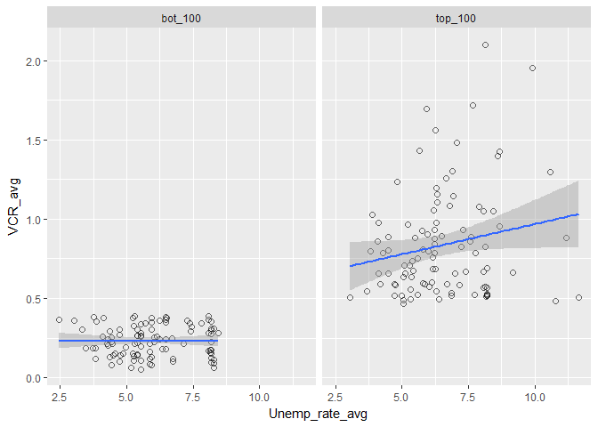
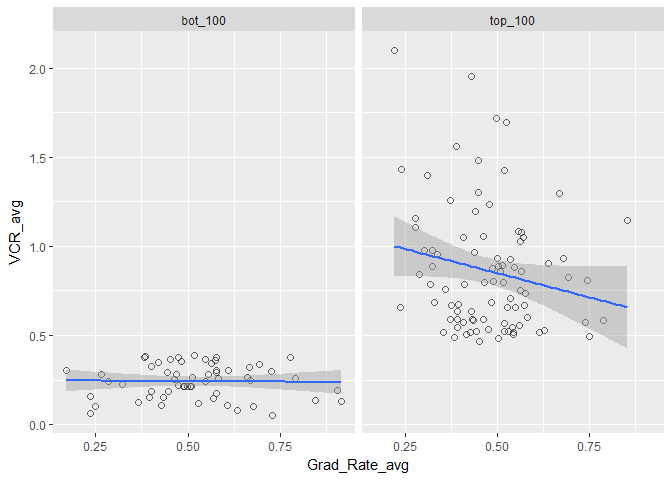
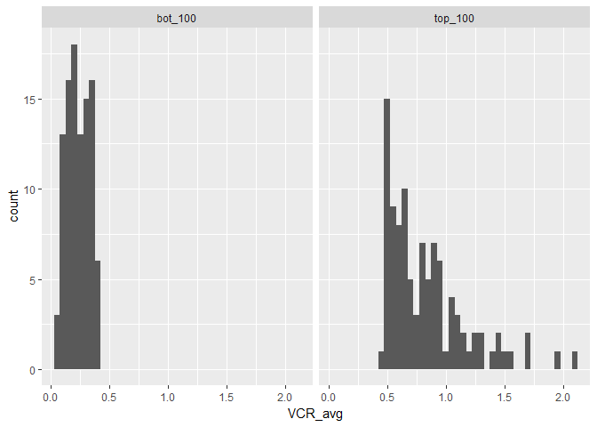
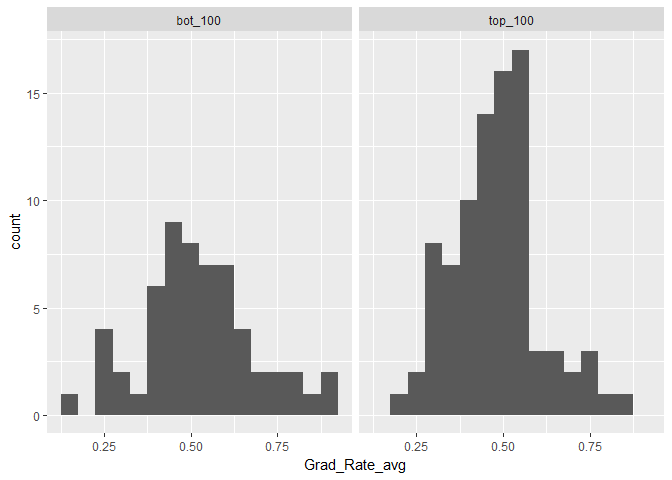
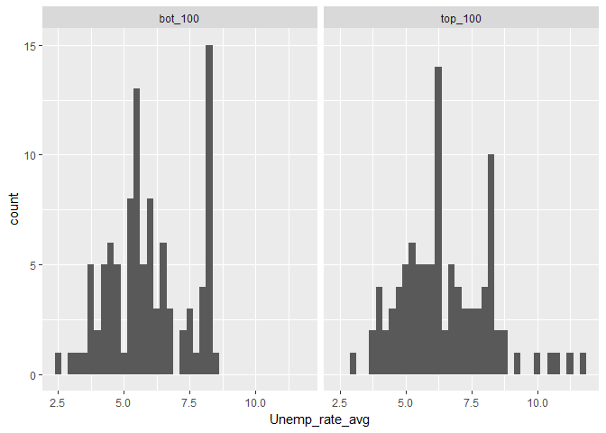
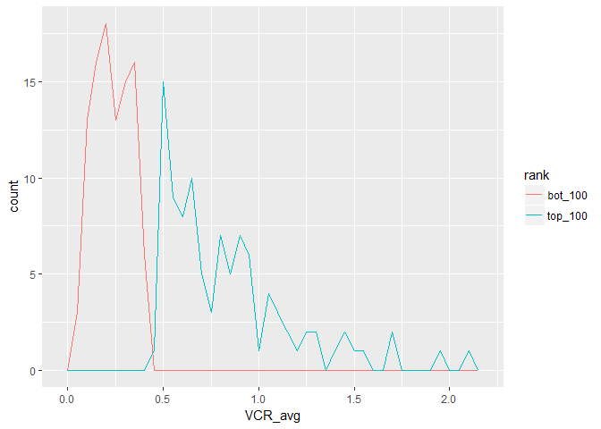
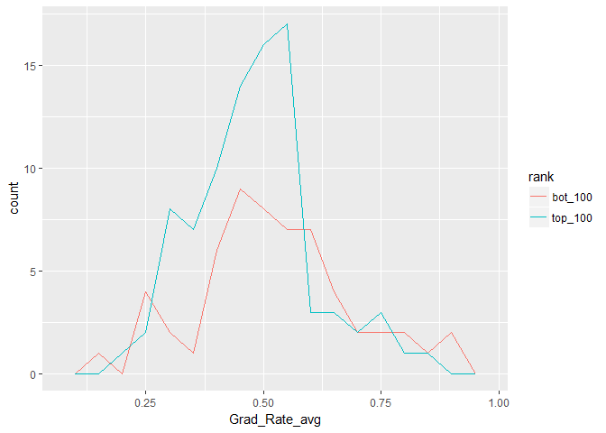
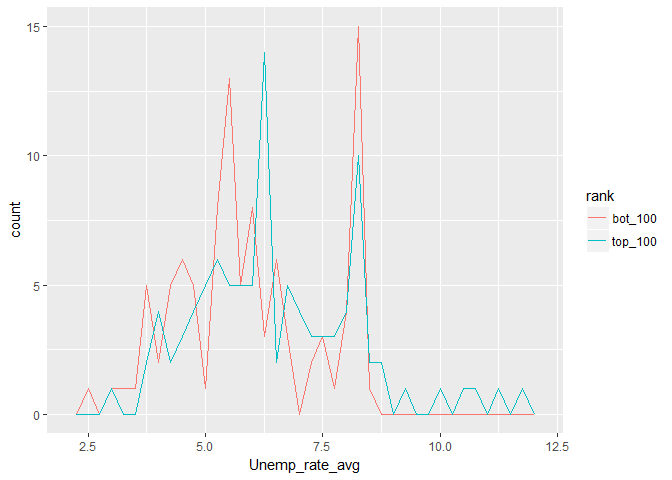
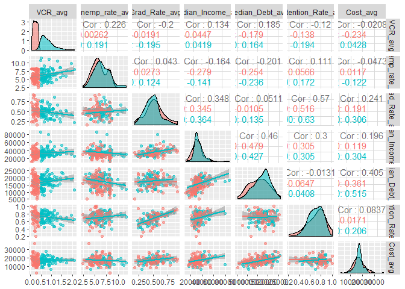

# Capstone_tidy
Andre Velez  
### Load needed packages and raw data ###

```r
library(tidyr)
library(dplyr)
library(readr)
library(readxl)
library(magrittr)
library(stringi)
library(knitr)
library(rmarkdown)

# Import raw data as objects, remove rows w/o observations #
crime_13_raw <- read_excel("Raw Data/2013 Crime Data/Table_8_Offenses_Known_to_Law_Enforcement_by_State_by_City_2013.xls", skip = 2)
crime_14_raw <- read_excel("Raw Data/2014 Crime Data/Table_8_Offenses_Known_to_Law_Enforcement_by_State_by_City_2014.xls", skip = 2)
crime_15_raw <- read_excel("Raw Data/2015 Crime Data/Table_8_Offenses_Known_to_Law_Enforcement_by_State_by_City_2015.xls", skip = 2)
college_score_raw <- read_csv("Raw Data/College Score Data/college_score_raw.csv")
unemployment_raw <- read_csv("Raw Data/Unemployment Data/unemployment_raw.csv")
population_raw <- read_csv("Raw Data/City Population/sub-est2016_all.csv")
city_county_raw <- read_delim("Raw Data/City by County/us_cities_states_counties.csv", delim = "|")
```

### Crime Data ###

```r
# Rename header and remove nonsense rows # 
crime_13_detailed <- crime_13_raw %>%
  select(., 1:14) %>%
  set_colnames(.[1,]) %>% 
  slice(2:9293) %>%
  
# Assign the correct data type #
  mutate_at(., 1:2, funs(as.character)) %>%
  mutate_at(., 3:14, funs(as.integer)) %>% 

# Replace and Fill missing State values #  
  fill(State, .direction = c("down")) %>% 
  
# Sum crime data into one variable #
  mutate(Total_crime_13 = rowSums(.[4:14], na.rm = T, dims = 1))

# Tidy format, clean up names #
crime_13_tidy <- crime_13_detailed %>% 
  select(., 1:2, 4, 15) %>% 
  mutate(City = gsub("\\d.*", "", .$City)) %>% 
  mutate(State = stri_trans_totitle(State))

names(crime_13_tidy)[3] <- c("Violent_crime_13")
```

### Iterate for 2014 and 2015 crime data ###

```r
# Tidy 2014 Crime Data #
crime_14_detailed <- crime_14_raw %>%
  select(., 1:14) %>%
  set_colnames(.[1,]) %>% 
  slice(2:9348) %>% 
  mutate_at(., 1:2, funs(as.character)) %>%
  mutate_at(., 3:14, funs(as.integer)) %>% 
  fill(State, .direction = c("down")) %>% 
  mutate(Total_crime_14 = rowSums(.[4:14], na.rm = T, dims = 1))

crime_14_tidy <- crime_14_detailed %>% 
  select(., 1:2, 4, 15) %>% 
  mutate(City = gsub("\\d.*", "", .$City)) %>% 
  mutate(State = stri_trans_totitle(State))

names(crime_14_tidy)[3] <- c("Violent_crime_14")

# Tidy 2015 Crime Data #
crime_15_detailed <- crime_15_raw %>%
  select(., 1:14) %>%
  set_colnames(.[1,]) %>% 
  slice(2:9396) %>% 
  mutate_at(., 1:2, funs(as.character)) %>%
  mutate_at(., 3:14, funs(as.integer)) %>% 
  fill(State, .direction = c("down")) %>% 
  mutate(Total_crime_15 = rowSums(.[4:14], na.rm = T, dims = 1))

crime_15_tidy <- crime_15_detailed %>% 
  select(., 1:2, 4, 15) %>% 
  mutate(City = gsub("\\d.*", "", .$City)) %>% 
  mutate(State = stri_trans_totitle(State))

names(crime_15_tidy)[3] <- c("Violent_crime_15")
```

### City and County Data ###

```r
# Remove unnecessary variables / observations, and place into tidy format #
city_county_tidy <- city_county_raw %>% 
  select(., 1, 3:4) %>% 
  rename(., State = "State full") %>% 
  distinct(.) %>%
  mutate_at(., 1:3, funs(as.character)) %>% 
  mutate(County = stri_trans_totitle(County))
```

### Unemployment Data ###

```r
# Remove county names #
unemployment_tidy <- unemployment_raw %>% 
  mutate(County = gsub("\\sCounty.*", "", .$County)) %>% 

# Spread data to determine annual rate, tidy up # 
  spread(., Month, Rate) %>% 
  mutate(Annual_rate = rowMeans(.[4:15], na.rm = T, dims = 1)) %>% 
  filter(., Year > 2012 & Year < 2016) %>% 
  select(., 1:3, 16) %>% 
  spread(., Year, Annual_rate) %>% 
  rename(., Unemp_rate_13 = "2013", Unemp_rate_14 = "2014", Unemp_rate_15 = "2015")
```

### College Score Data ###

```r
# Remove unnecessary variables #
college_score_tidy <- college_score_raw %>% 
  select(., 4:5, 7, 10:12, 85, 97:99, 110:111, 115, 117:119, 123) %>% 

# Rename varibles for readability #
  rename(., Uni = INSTNM, 
         City = CITY, 
         State = STATE, 
         Under_Inv = HCM2, 
         Degree_Level = PREDDEG, 
         Type = CONTROL, 
         Online = DISTANCEONLY, 
         Certified = CURROPER,
         Avg_Price_Pub = NPT4_PUB,
         Avg_Price_Priv = NPT4_PRIV,
         Pell_Grant_Rate = PCTPELL,
         Retention_Rate = RET_FT4,
         Fed_Loan_Rate = PCTFLOAN,
         Median_Earnings_10years = MD_EARN_WNE_P10,
         Over_25K_6years = GT_25K_P6,
         Median_Debt_Grads = GRAD_DEBT_MDN_SUPP,
         Grad_Rate = C150_4_POOLED_SUPP) %>%
  
  mutate_at(., 9:17, funs(as.numeric))
```

### Population Data ###

```r
# Remove unnecessary variables #
population_tidy <- population_raw %>% 
  select(., 9:10, 16:18) %>% 
  mutate_at(., 1:2, funs(as.character)) %>% 

# Tidy variable and observation names #
  rename(., City = NAME, 
         State = STNAME, 
         pop_13 = POPESTIMATE2013,
         pop_14 = POPESTIMATE2014,
         pop_15 = POPESTIMATE2015) %>% 
  mutate(City = gsub("\\scity", "", .$City)) %>% 
  mutate(City = gsub("\\stown", "", .$City)) %>% 
  mutate(City = gsub("\\sborough", "", .$City)) %>% 
  mutate(City = gsub("\\svillage", "", .$City)) %>% 
  mutate(City = gsub("\\sship", "", .$City)) %>% 
  mutate(City = gsub(".*\\(pt.)", "", .$City)) %>% 
  distinct(.)
```

### Merged Tidy Dataframe ###

```r
crime_1 <- left_join(crime_13_tidy, crime_14_tidy, by = c("State", "City"))

crime_total <- left_join(crime_1, crime_15_tidy, by = c("State", "City"))

crime_pop <- left_join(crime_total, population_tidy, by = c("State", "City"))

crime_county <- left_join(crime_pop, city_county_tidy, by = c("State", "City"))

risk_tidy <- left_join(crime_county, unemployment_tidy, by = c("State", "County"))
```

### Final data set used for statistical analysis ###

```r
# Violent crime rate(VCR) per capita of cities > or = to 100,000 population size #
risk_VCR <- risk_tidy %>% 
  mutate(VCR_13 = ifelse(.$pop_13 < 100000, NA, (.$Violent_crime_13 / .$pop_13 * 100))) %>% 
  mutate(VCR_14 = ifelse(.$pop_14 < 100000, NA, (.$Violent_crime_14 / .$pop_14 * 100))) %>% 
  mutate(VCR_15 = ifelse(.$pop_15 < 100000, NA, (.$Violent_crime_15 / .$pop_15 * 100))) %>% 
  drop_na(.)

# Separate expanded df to incorporate college data #
risk_VCR_final <- left_join(risk_VCR, college_score_tidy, by = c("State", "City"))
knitr::kable(risk_VCR, format = "markdown")
```


|State          |City             | Violent_crime_13| Total_crime_13| Violent_crime_14| Total_crime_14| Violent_crime_15| Total_crime_15|   pop_13|   pop_14|   pop_15|County              | Unemp_rate_13| Unemp_rate_14| Unemp_rate_15|    VCR_13|    VCR_14|    VCR_15|
|:--------------|:----------------|----------------:|--------------:|----------------:|--------------:|----------------:|--------------:|--------:|--------:|--------:|:-------------------|-------------:|-------------:|-------------:|---------:|---------:|---------:|
|Alabama        |Birmingham       |             2852|          34018|             3369|          34741|             3707|          34557|   211725|   211875|   212543|Jefferson           |      6.658333|      6.300000|      5.791667| 1.3470303| 1.5900885| 1.7441177|
|Alabama        |Birmingham       |             2852|          34018|             3369|          34741|             3707|          34557|   211725|   211875|   212543|Shelby              |      4.641667|      4.500000|      4.225000| 1.3470303| 1.5900885| 1.7441177|
|Alabama        |Huntsville       |             1507|          21446|             1467|          21284|             1541|          20568|   186252|   188325|   190943|Madison             |      6.341667|      6.191667|      5.475000| 0.8091188| 0.7789725| 0.8070471|
|Alabama        |Mobile           |             1541|          29104|             1488|          26182|             1529|          24646|   194126|   193805|   193393|Mobile              |      8.508333|      7.758333|      7.000000| 0.7938143| 0.7677820| 0.7906181|
|Arizona        |Chandler         |              575|          13027|              466|          12315|              490|          11811|   240270|   241133|   243829|Maricopa            |      6.583333|      5.833333|      5.166667| 0.2393141| 0.1932543| 0.2009605|
|Arizona        |Gilbert          |              193|           7352|              209|           7387|              177|           6908|   221506|   227217|   232399|Maricopa            |      6.583333|      5.833333|      5.166667| 0.0871308| 0.0919826| 0.0761621|
|Arizona        |Mesa             |             1807|          29570|             2119|          30203|             1972|          27834|   462982|   470551|   478243|Maricopa            |      6.583333|      5.833333|      5.166667| 0.3902960| 0.4503231| 0.4123427|
|Arizona        |Peoria           |              254|           8175|              244|           7089|              283|           7313|   156074|   157628|   160435|Maricopa            |      6.583333|      5.833333|      5.166667| 0.1627433| 0.1547948| 0.1763954|
|Arizona        |Phoenix          |             9492|         139423|             8749|         131765|             9261|         127434|  1525562|  1554179|  1582904|Maricopa            |      6.583333|      5.833333|      5.166667| 0.6221969| 0.5629339| 0.5850639|
|Arizona        |Surprise         |              149|           4544|              137|           4486|              168|           4723|   124821|   127673|   130157|Maricopa            |      6.583333|      5.833333|      5.166667| 0.1193709| 0.1073054| 0.1290749|
|Arizona        |Tempe            |              831|          17458|              799|          17728|              721|          16791|   170349|   174632|   177953|Maricopa            |      6.583333|      5.833333|      5.166667| 0.4878221| 0.4575336| 0.4051632|
|Arkansas       |Little Rock      |             2777|          36705|             2759|          34092|             2950|          31700|   197230|   197698|   198195|Pulaski             |      6.616667|      5.591667|      4.733333| 1.4080008| 1.3955629| 1.4884331|
|California     |Anaheim          |             1130|          21517|             1101|          18617|             1271|          22646|   344900|   345698|   349288|Orange              |      6.616667|      5.475000|      4.483333| 0.3276312| 0.3184861| 0.3638831|
|California     |Antioch          |              946|          10829|              849|          10121|              771|           9402|   107411|   109083|   110189|Contra Costa        |      7.500000|      6.166667|      5.000000| 0.8807292| 0.7783064| 0.6997069|
|California     |Bakersfield      |             1857|          37535|             1678|          32918|             1810|          35077|   363439|   367819|   372476|Kern                |     11.683333|     10.416667|     10.208333| 0.5109523| 0.4562026| 0.4859373|
|California     |Berkeley         |              562|          11894|              431|          11081|              530|          12894|   117045|   118754|   120613|Alameda             |      7.216667|      5.825000|      4.741667| 0.4801572| 0.3629351| 0.4394220|
|California     |Burbank          |              171|           5208|              150|           5164|              159|           5643|   104634|   104722|   104790|Los Angeles         |      9.683333|      8.241667|      6.650000| 0.1634268| 0.1432364| 0.1517320|
|California     |Carlsbad         |              221|           4622|              204|           3875|              172|           4620|   111173|   112181|   113259|San Diego           |      7.833333|      6.433333|      5.200000| 0.1987893| 0.1818490| 0.1518643|
|California     |Chula Vista      |              595|          11793|              612|          10307|              705|          10675|   257292|   260639|   265041|San Diego           |      7.833333|      6.433333|      5.200000| 0.2312548| 0.2348075| 0.2659966|
|California     |Concord          |              407|           9537|              465|          11330|              491|          10226|   125937|   127117|   128139|Contra Costa        |      7.500000|      6.166667|      5.000000| 0.3231775| 0.3658047| 0.3831776|
|California     |Corona           |              162|           7211|              171|           7245|              212|           7891|   159138|   160883|   163659|Riverside           |      9.900000|      8.183333|      6.716667| 0.1017984| 0.1062884| 0.1295376|
|California     |Costa Mesa       |              252|           7629|              318|           7578|              386|          10236|   112263|   112471|   112740|Orange              |      6.616667|      5.475000|      4.483333| 0.2244729| 0.2827396| 0.3423807|
|California     |Daly City        |              223|           4138|              194|           3767|              234|           4032|   105051|   105863|   106296|San Mateo           |      5.300000|      4.208333|      3.391667| 0.2122778| 0.1832557| 0.2201400|
|California     |Downey           |              326|           7245|              281|           6370|              335|           6471|   113125|   113400|   113563|Los Angeles         |      9.683333|      8.241667|      6.650000| 0.2881768| 0.2477954| 0.2949904|
|California     |El Cajon         |              386|           6249|              327|           5166|              360|           5269|   102464|   103002|   103451|San Diego           |      7.833333|      6.433333|      5.200000| 0.3767177| 0.3174696| 0.3479908|
|California     |Elk Grove        |              469|           6875|              622|           7393|              586|           7416|   160576|   163093|   166379|Sacramento          |      8.850000|      7.308333|      6.000000| 0.2920735| 0.3813775| 0.3522079|
|California     |El Monte         |              340|           5055|              333|           5097|              400|           5093|   115627|   115876|   116063|Los Angeles         |      9.683333|      8.241667|      6.650000| 0.2940490| 0.2873762| 0.3446404|
|California     |Escondido        |              596|           9134|              512|           7089|              529|           7859|   149080|   150072|   151070|San Diego           |      7.833333|      6.433333|      5.200000| 0.3997854| 0.3411696| 0.3501688|
|California     |Fairfield        |              498|           8084|              519|           8794|              486|           7860|   109127|   110792|   112518|Solano              |      9.066667|      7.500000|      6.125000| 0.4563490| 0.4684454| 0.4319309|
|California     |Fontana          |              725|           9635|              710|           8853|              804|          10158|   203202|   204655|   206893|San Bernardino      |      9.750000|      7.991667|      6.450000| 0.3567878| 0.3469253| 0.3886067|
|California     |Fremont          |              273|           8761|              284|           8402|              337|           9430|   225029|   228425|   231421|Alameda             |      7.216667|      5.825000|      4.741667| 0.1213177| 0.1243296| 0.1456220|
|California     |Fresno           |             2552|          50456|             2382|          47225|             2871|          49209|   508971|   514376|   518503|Fresno              |     13.250000|     11.566667|     10.183333| 0.5014038| 0.4630854| 0.5537094|
|California     |Fullerton        |              372|           8489|              339|           7115|              389|           8579|   138928|   139137|   140255|Orange              |      6.616667|      5.475000|      4.483333| 0.2677646| 0.2436448| 0.2773520|
|California     |Garden Grove     |              455|           7733|              406|           7032|              504|           9899|   174793|   174800|   174668|Orange              |      6.616667|      5.475000|      4.483333| 0.2603079| 0.2322654| 0.2885474|
|California     |Glendale         |              181|           6763|              186|           6534|              195|           7422|   195794|   198799|   199772|Los Angeles         |      9.683333|      8.241667|      6.650000| 0.0924441| 0.0935618| 0.0976113|
|California     |Hayward          |              589|          10887|              605|          10991|              556|          10108|   151847|   154412|   157763|Alameda             |      7.216667|      5.825000|      4.741667| 0.3878904| 0.3918089| 0.3524274|
|California     |Huntington Beach |              362|          10617|              391|           9278|              420|          10747|   197521|   200048|   201046|Orange              |      6.616667|      5.475000|      4.483333| 0.1832717| 0.1954531| 0.2089074|
|California     |Inglewood        |              739|           6937|              783|           7063|              775|           6786|   111254|   111178|   111029|Los Angeles         |      9.683333|      8.241667|      6.650000| 0.6642458| 0.7042760| 0.6980158|
|California     |Irvine           |              113|           6806|              120|           6338|              144|           8032|   236366|   247532|   255823|Orange              |      6.616667|      5.475000|      4.483333| 0.0478072| 0.0484786| 0.0562889|
|California     |Lancaster        |              832|           8703|              891|           9141|             1005|           9716|   159408|   160037|   160208|Los Angeles         |      9.683333|      8.241667|      6.650000| 0.5219311| 0.5567463| 0.6273095|
|California     |Long Beach       |             2346|          30787|             2304|          29562|             2766|          34275|   469148|   470431|   471439|Los Angeles         |      9.683333|      8.241667|      6.650000| 0.5000554| 0.4897636| 0.5867143|
|California     |Los Angeles      |            16524|         206166|            19171|         205757|            25156|         238449|  3890436|  3920173|  3949149|Los Angeles         |      9.683333|      8.241667|      6.650000| 0.4247339| 0.4890345| 0.6369980|
|California     |Modesto          |             1704|          23448|             1778|          21841|             2025|          24362|   206582|   208333|   210088|Stanislaus          |     12.883333|     11.141667|      9.508333| 0.8248541| 0.8534414| 0.9638818|
|California     |Moreno Valley    |              638|          13024|              584|          13998|              643|          14625|   200588|   202334|   203438|Riverside           |      9.900000|      8.183333|      6.716667| 0.3180649| 0.2886317| 0.3160668|
|California     |Murrieta         |               70|           3428|               68|           3065|               69|           3550|   107279|   108035|   109417|Riverside           |      9.900000|      8.183333|      6.716667| 0.0652504| 0.0629426| 0.0630615|
|California     |Norwalk          |              407|           5316|              316|           4643|              400|           4626|   106380|   106491|   106531|Los Angeles         |      9.683333|      8.241667|      6.650000| 0.3825907| 0.2967387| 0.3754776|
|California     |Oakland          |             7984|          66460|             6910|          62730|             6051|          61417|   407205|   413313|   417870|Alameda             |      7.216667|      5.825000|      4.741667| 1.9606832| 1.6718564| 1.4480580|
|California     |Oceanside        |              634|          10280|              652|           9306|              702|          10613|   173003|   174237|   175130|San Diego           |      7.833333|      6.433333|      5.200000| 0.3664676| 0.3742030| 0.4008451|
|California     |Ontario          |              453|           9948|              431|          10200|              547|          11464|   167487|   168607|   170755|San Bernardino      |      9.750000|      7.991667|      6.450000| 0.2704688| 0.2556240| 0.3203420|
|California     |Orange           |              147|           5145|              142|           4789|              172|           6146|   139911|   139371|   140431|Orange              |      6.616667|      5.475000|      4.483333| 0.1050668| 0.1018863| 0.1224801|
|California     |Oxnard           |              651|          11486|              884|          14559|              920|          15256|   203055|   204877|   206566|Ventura             |      7.883333|      6.633333|      5.675000| 0.3206028| 0.4314784| 0.4453782|
|California     |Palmdale         |              759|           8234|              840|           8139|              830|           7658|   156890|   157220|   157433|Los Angeles         |      9.683333|      8.241667|      6.650000| 0.4837784| 0.5342832| 0.5272084|
|California     |Pasadena         |              434|           8453|              394|           7754|              428|           8287|   139643|   139924|   141438|Los Angeles         |      9.683333|      8.241667|      6.650000| 0.3107925| 0.2815814| 0.3026061|
|California     |Pomona           |              809|          10423|              777|          10377|              792|          10637|   151230|   152317|   152396|Los Angeles         |      9.683333|      8.241667|      6.650000| 0.5349468| 0.5101203| 0.5196987|
|California     |Rancho Cucamonga |              331|           8327|              283|           7918|              264|           8406|   171214|   173753|   174771|San Bernardino      |      9.750000|      7.991667|      6.450000| 0.1933253| 0.1628749| 0.1510548|
|California     |Rialto           |              434|           6322|              328|           4973|              423|           5293|   101841|   102395|   102858|San Bernardino      |      9.750000|      7.991667|      6.450000| 0.4261545| 0.3203281| 0.4112466|
|California     |Riverside        |             1330|          23951|             1384|          22584|             1441|          24015|   316106|   318457|   321280|Riverside           |      9.900000|      8.183333|      6.716667| 0.4207449| 0.4345956| 0.4485184|
|California     |Roseville        |              261|           7225|              193|           6544|              239|           7078|   126494|   128199|   129918|Placer              |      7.716667|      6.241667|      5.041667| 0.2063339| 0.1505472| 0.1839622|
|California     |Sacramento       |             3137|          42398|             2968|          36261|             3611|          40364|   479201|   483920|   489202|Sacramento          |      8.850000|      7.308333|      6.000000| 0.6546314| 0.6133245| 0.7381409|
|California     |Salinas          |             1001|          12750|              997|          12484|             1098|          10505|   155361|   156149|   156674|Monterey            |     10.283333|      9.116667|      8.158333| 0.6443058| 0.6384927| 0.7008183|
|California     |San Bernardino   |             1949|          22763|             2128|          22854|             2697|          26239|   213852|   214431|   215550|San Bernardino      |      9.750000|      7.991667|      6.450000| 0.9113780| 0.9923938| 1.2512178|
|California     |San Diego        |             5303|          74240|             5214|          64261|             5582|          69654|  1358242|  1379299|  1390915|San Diego           |      7.833333|      6.433333|      5.200000| 0.3904312| 0.3780181| 0.4013186|
|California     |San Francisco    |             7064|         111003|             6761|         103949|             6710|         119730|   839280|   850424|   862004|San Francisco       |      5.466667|      4.366667|      3.633333| 0.8416738| 0.7950152| 0.7784187|
|California     |San Francisco    |             7064|         111003|             6761|         103949|             6710|         119730|   839280|   850424|   862004|San Mateo           |      5.300000|      4.208333|      3.391667| 0.8416738| 0.7950152| 0.7784187|
|California     |San Jose         |             3215|          57583|             3242|          55761|             3400|          56963|  1001580|  1013237|  1022627|Santa Clara         |      6.466667|      5.133333|      4.150000| 0.3209928| 0.3199646| 0.3324770|
|California     |San Mateo        |              239|           4620|              230|           4357|              266|           4630|   101379|   102658|   103269|San Mateo           |      5.300000|      4.208333|      3.391667| 0.2357490| 0.2240449| 0.2575797|
|California     |Santa Ana        |             1121|          15125|             1260|          14109|             1626|          17829|   334411|   334136|   334019|Orange              |      6.616667|      5.475000|      4.483333| 0.3352162| 0.3770920| 0.4867987|
|California     |Santa Clara      |              172|           6408|              162|           6871|              156|           7480|   120570|   121893|   125697|Santa Clara         |      6.466667|      5.133333|      4.150000| 0.1426557| 0.1329034| 0.1241080|
|California     |Santa Clarita    |              276|           5995|              307|           5498|              351|           6573|   179296|   180340|   181322|Los Angeles         |      9.683333|      8.241667|      6.650000| 0.1539354| 0.1702340| 0.1935783|
|California     |Santa Maria      |              490|           6861|              439|           6979|              463|           6883|   102350|   103388|   104857|Santa Barbara       |      7.233333|      6.100000|      5.258333| 0.4787494| 0.4246141| 0.4415537|
|California     |Santa Rosa       |              541|           8119|              636|           9014|              606|           9875|   171820|   173773|   174727|Sonoma              |      7.066667|      5.583333|      4.491667| 0.3148644| 0.3659947| 0.3468268|
|California     |Simi Valley      |              132|           3698|              140|           3528|              174|           3380|   126055|   126482|   126365|Ventura             |      7.883333|      6.633333|      5.675000| 0.1047162| 0.1106877| 0.1376964|
|California     |Stockton         |             3622|          37492|             3988|          34348|             4122|          34343|   297545|   301278|   304568|San Joaquin         |     12.283333|     10.525000|      8.891667| 1.2172949| 1.3236944| 1.3533923|
|California     |Sunnyvale        |              144|           5170|              167|           5060|              158|           5035|   148089|   149601|   151119|Santa Clara         |      6.466667|      5.133333|      4.150000| 0.0972388| 0.1116303| 0.1045534|
|California     |Temecula         |               91|           5887|              100|           5277|              114|           6065|   106422|   109091|   111600|Riverside           |      9.900000|      8.183333|      6.716667| 0.0855086| 0.0916666| 0.1021505|
|California     |Thousand Oaks    |              139|           3498|              128|           3459|              136|           3435|   128449|   128917|   128914|Ventura             |      7.883333|      6.633333|      5.675000| 0.1082142| 0.0992887| 0.1054967|
|California     |Torrance         |              187|           5952|              155|           5560|              214|           6194|   147314|   147537|   147641|Los Angeles         |      9.683333|      8.241667|      6.650000| 0.1269397| 0.1050584| 0.1449462|
|California     |Vallejo          |             1019|          13560|             1034|          11869|             1031|          12074|   118669|   119802|   120759|Solano              |      9.066667|      7.500000|      6.125000| 0.8586910| 0.8630908| 0.8537666|
|California     |Victorville      |              651|           9652|              642|          10057|              777|           9609|   121032|   121521|   121905|San Bernardino      |      9.750000|      7.991667|      6.450000| 0.5378743| 0.5283037| 0.6373816|
|California     |Visalia          |              500|          10711|              484|           8566|              608|           9217|   127518|   128726|   129653|Tulare              |     14.350000|     13.116667|     11.683333| 0.3921015| 0.3759924| 0.4689440|
|California     |West Covina      |              231|           7204|              225|           6119|              263|           6500|   107631|   107769|   107860|Los Angeles         |      9.683333|      8.241667|      6.650000| 0.2146222| 0.2087799| 0.2438346|
|Colorado       |Arvada           |              163|           5680|              169|           5670|              156|           6213|   111665|   113681|   115214|Jefferson           |      6.258333|      4.550000|      3.516667| 0.1459723| 0.1486616| 0.1354002|
|Colorado       |Aurora           |             1436|          24524|             1448|          22896|             1660|          24542|   345172|   351968|   358306|Arapahoe            |      6.566667|      4.900000|      3.725000| 0.4160245| 0.4114010| 0.4632912|
|Colorado       |Aurora           |             1436|          24524|             1448|          22896|             1660|          24542|   345172|   351968|   358306|Adams               |      8.091667|      5.725000|      4.325000| 0.4160245| 0.4114010| 0.4632912|
|Colorado       |Boulder          |              218|           6359|              242|           6066|              222|           6109|   103805|   105511|   107601|Boulder             |      5.500000|      4.100000|      3.175000| 0.2100092| 0.2293600| 0.2063178|
|Colorado       |Colorado Springs |             1893|          40198|             2039|          36810|             1983|          37100|   440971|   447939|   455535|El Paso             |      7.850000|      5.991667|      4.616667| 0.4292799| 0.4551959| 0.4353123|
|Colorado       |Denver           |             4087|          55692|             3983|          52808|             4599|          57488|   647433|   662425|   680032|Denver              |      6.625000|      4.800000|      3.708333| 0.6312622| 0.6012756| 0.6762917|
|Colorado       |Denver           |             4087|          55692|             3983|          52808|             4599|          57488|   647433|   662425|   680032|Jefferson           |      6.258333|      4.550000|      3.516667| 0.6312622| 0.6012756| 0.6762917|
|Colorado       |Denver           |             4087|          55692|             3983|          52808|             4599|          57488|   647433|   662425|   680032|Adams               |      8.091667|      5.725000|      4.325000| 0.6312622| 0.6012756| 0.6762917|
|Colorado       |Denver           |             4087|          55692|             3983|          52808|             4599|          57488|   647433|   662425|   680032|Arapahoe            |      6.566667|      4.900000|      3.725000| 0.6312622| 0.6012756| 0.6762917|
|Colorado       |Fort Collins     |              357|           8342|              329|           8246|              313|           8666|   153006|   157511|   161854|Larimer             |      5.800000|      4.275000|      3.291667| 0.2333242| 0.2088743| 0.1933842|
|Colorado       |Pueblo           |             1011|          17244|              886|          15960|              986|          16557|   107498|   107758|   108981|Pueblo              |      9.833333|      7.316667|      5.650000| 0.9404826| 0.8222127| 0.9047449|
|Colorado       |Thornton         |              331|           7269|              331|           8173|              325|           1844|   127711|   130449|   133329|Adams               |      8.091667|      5.725000|      4.325000| 0.2591789| 0.2537390| 0.2437579|
|Colorado       |Westminster      |              214|           6417|              259|           7025|              277|           8123|   110751|   111980|   113064|Adams               |      8.091667|      5.725000|      4.325000| 0.1932262| 0.2312913| 0.2449940|
|Connecticut    |Bridgeport       |             1397|          11753|             1338|          11278|              996|           8992|   147666|   147560|   147090|Fairfield           |      7.250000|      6.183333|      5.266667| 0.9460539| 0.9067498| 0.6771364|
|Connecticut    |Hartford         |             1473|          13063|             1380|          13365|             1421|          13833|   125004|   124325|   123869|Hartford            |      8.041667|      6.858333|      5.866667| 1.1783623| 1.1099940| 1.1471797|
|Connecticut    |Stamford         |              334|           4549|              306|           4693|              285|           4312|   126451|   127955|   128412|Fairfield           |      7.250000|      6.183333|      5.266667| 0.2641339| 0.2391466| 0.2219419|
|Connecticut    |Waterbury        |              410|          10094|              408|          10006|              467|           9996|   109689|   109308|   108780|New Haven           |      8.408333|      7.225000|      6.133333| 0.3737841| 0.3732572| 0.4293069|
|Illinois       |Aurora           |              601|           7166|              558|           7099|              650|           7490|   200074|   200495|   200577|Dupage              |      7.391667|      5.741667|      4.658333| 0.3003889| 0.2783112| 0.3240651|
|Illinois       |Aurora           |              601|           7166|              558|           7099|              650|           7490|   200074|   200495|   200577|Will                |      9.833333|      7.616667|      6.033333| 0.3003889| 0.2783112| 0.3240651|
|Illinois       |Aurora           |              601|           7166|              558|           7099|              650|           7490|   200074|   200495|   200577|Kane                |      8.733333|      6.833333|      5.816667| 0.3003889| 0.2783112| 0.3240651|
|Illinois       |Elgin            |              236|           4290|              221|           4451|              261|           3509|   110125|   110998|   111883|Kane                |      8.733333|      6.833333|      5.816667| 0.2143019| 0.1991027| 0.2332794|
|Illinois       |Joliet           |              557|           7599|              495|           7013|              461|           8086|   147984|   147887|   147801|Will                |      9.833333|      7.616667|      6.033333| 0.3763920| 0.3347150| 0.3119059|
|Illinois       |Naperville       |              105|           3950|              113|           3497|              128|           3563|   144779|   146106|   146861|Dupage              |      7.391667|      5.741667|      4.658333| 0.0725243| 0.0773411| 0.0871572|
|Illinois       |Naperville       |              105|           3950|              113|           3497|              128|           3563|   144779|   146106|   146861|Will                |      9.833333|      7.616667|      6.033333| 0.0725243| 0.0773411| 0.0871572|
|Illinois       |Peoria           |              784|          10435|              759|          11275|              772|          10478|   116483|   115830|   115118|Peoria              |      9.666667|      7.616667|      6.916667| 0.6730596| 0.6552707| 0.6706162|
|Illinois       |Rockford         |             2065|          18315|             1847|          16578|             2349|          16473|   150492|   149287|   148422|Winnebago           |     10.533333|      8.191667|      7.091667| 1.3721660| 1.2372142| 1.5826495|
|Illinois       |Springfield      |             1191|          14236|             1248|          13621|             1251|          13201|   117026|   116840|   116463|Sangamon            |      7.400000|      5.858333|      5.275000| 1.0177226| 1.0681274| 1.0741609|
|Indiana        |Evansville       |              564|          12894|              623|          15012|              708|          13794|   120538|   120441|   120038|Vanderburgh         |      7.133333|      5.375000|      4.250000| 0.4679022| 0.5172657| 0.5898132|
|Indiana        |Fort Wayne       |              949|          21537|              816|          18381|              984|          17903|   259392|   260893|   262806|Allen               |      7.525000|      5.708333|      4.550000| 0.3658555| 0.3127719| 0.3744207|
|Indiana        |Indianapolis     |            10479|         110487|            10768|         104595|            11124|         105002|   853020|   858296|   861868|Marion              |      8.483333|      6.458333|      5.000000| 1.2284589| 1.2545788| 1.2906849|
|Indiana        |Indianapolis     |            10479|         110487|            10768|         104595|            11124|         105002|   853020|   858296|   861868|Hamilton            |      5.025000|      4.050000|      3.350000| 1.2284589| 1.2545788| 1.2906849|
|Iowa           |Cedar Rapids     |              392|          10217|              385|          10686|              361|          10612|   128510|   129341|   130570|Linn                |      5.025000|      4.341667|      3.708333| 0.3050346| 0.2976628| 0.2764800|
|Iowa           |Davenport        |              654|           9834|              636|           9671|              730|          10693|   102252|   102552|   102608|Scott               |      5.625000|      5.150000|      4.608333| 0.6395963| 0.6201732| 0.7114455|
|Iowa           |Des Moines       |             1026|          22115|             1250|          20199|             1502|          19923|   211302|   213676|   214814|Polk                |      4.825000|      4.183333|      3.583333| 0.4855610| 0.5849978| 0.6992095|
|Kansas         |Kansas City      |              731|          15974|             1060|          16813|             1163|          16511|   148786|   149838|   151051|Wyandotte           |      8.000000|      6.916667|      6.091667| 0.4913097| 0.7074307| 0.7699386|
|Kansas         |Olathe           |              185|           4935|              101|           3694|              177|           4552|   131753|   132790|   134000|Johnson             |      4.325000|      3.791667|      3.408333| 0.1404143| 0.0760599| 0.1320896|
|Kansas         |Overland Park    |              284|           7643|              327|           6729|              399|           7708|   181022|   184111|   186051|Johnson             |      4.325000|      3.791667|      3.408333| 0.1568870| 0.1776102| 0.2144573|
|Kansas         |Topeka           |              612|          14203|              651|          13827|              720|          14654|   127739|   127448|   127293|Shawnee             |      5.808333|      4.800000|      4.300000| 0.4791019| 0.5107966| 0.5656242|
|Maryland       |Baltimore        |             8725|          79305|             8346|          75745|             9542|          81226|   622858|   623353|   621402|Baltimore City      |      9.708333|      8.558333|      7.708333| 1.4008008| 1.3388882| 1.5355599|
|Maryland       |Baltimore        |             8725|          79305|             8346|          75745|             9542|          81226|   622858|   623353|   621402|Anne Arundel        |      5.700000|      5.066667|      4.508333| 1.4008008| 1.3388882| 1.5355599|
|Maryland       |Baltimore        |             8725|          79305|             8346|          75745|             9542|          81226|   622858|   623353|   621402|Baltimore           |      6.891667|      6.100000|      5.450000| 1.4008008| 1.3388882| 1.5355599|
|Massachusetts  |Boston           |             5037|          45780|             4749|          44036|             4702|          40220|   651090|   659180|   665984|Suffolk             |      6.200000|      5.316667|      4.625000| 0.7736258| 0.7204405| 0.7060230|
|Massachusetts  |Cambridge        |              361|           6546|              301|           5821|              328|           5892|   107640|   109532|   109856|Middlesex           |      5.466667|      4.658333|      4.058333| 0.3353772| 0.2748055| 0.2985727|
|Massachusetts  |Lowell           |              625|           8026|              598|           6797|              482|           5724|   109578|   110053|   110656|Middlesex           |      5.466667|      4.658333|      4.058333| 0.5703700| 0.5433746| 0.4355842|
|Massachusetts  |Springfield      |             1673|          17628|             1662|          15185|             1654|          13676|   153757|   154033|   154277|Hampden             |      9.083333|      7.833333|      6.766667| 1.0880805| 1.0789896| 1.0720976|
|Massachusetts  |Worcester        |             1750|          15985|             1762|          14734|             1627|          14007|   183006|   184005|   184491|Worcester           |      7.233333|      6.133333|      5.300000| 0.9562528| 0.9575827| 0.8818858|
|Michigan       |Ann Arbor        |              247|           5556|              194|           4799|              228|           5189|   116391|   118707|   118765|Washtenaw           |      5.850000|      5.000000|      4.050000| 0.2122157| 0.1634276| 0.1919758|
|Michigan       |Detroit          |            14504|         111289|            13616|          93688|            11846|          79652|   689596|   679903|   676336|Wayne               |     11.550000|     10.030000|      8.150000| 2.1032605| 2.0026386| 1.7514963|
|Michigan       |Grand Rapids     |             1326|          15090|             1381|           7707|             1420|          12093|   192936|   194321|   195094|Kent                |      6.283333|      5.110000|      3.900000| 0.6872745| 0.7106798| 0.7278543|
|Michigan       |Lansing          |             1204|          10359|             1272|           9717|             1327|           9573|   114203|   114569|   114909|Ingham              |      7.675000|      6.370000|      4.950000| 1.0542630| 1.1102480| 1.1548269|
|Michigan       |Lansing          |             1204|          10359|             1272|           9717|             1327|           9573|   114203|   114569|   114909|Clinton             |      6.066667|      5.160000|      3.950000| 1.0542630| 1.1102480| 1.1548269|
|Michigan       |Lansing          |             1204|          10359|             1272|           9717|             1327|           9573|   114203|   114569|   114909|Eaton               |      6.725000|      5.860000|      4.500000| 1.0542630| 1.1102480| 1.1548269|
|Michigan       |Lansing          |             1204|          10359|             1272|           9717|             1327|           9573|   109475|   109818|   110165|Ingham              |      7.675000|      6.370000|      4.950000| 1.0997945| 1.1582801| 1.2045568|
|Michigan       |Lansing          |             1204|          10359|             1272|           9717|             1327|           9573|   109475|   109818|   110165|Clinton             |      6.066667|      5.160000|      3.950000| 1.0997945| 1.1582801| 1.2045568|
|Michigan       |Lansing          |             1204|          10359|             1272|           9717|             1327|           9573|   109475|   109818|   110165|Eaton               |      6.725000|      5.860000|      4.500000| 1.0997945| 1.1582801| 1.2045568|
|Michigan       |Sterling Heights |              244|           5470|              222|           4508|              233|           4028|   131363|   131999|   132002|Macomb              |      9.533333|      8.240000|      6.700000| 0.1857448| 0.1681831| 0.1765125|
|Michigan       |Warren           |              679|           8415|              641|           8156|              743|           8062|   135110|   135485|   135313|Macomb              |      9.533333|      8.240000|      6.700000| 0.5025535| 0.4731151| 0.5490973|
|Minnesota      |Minneapolis      |             4038|          46916|             4093|          46549|             4395|          43588|   400137|   406619|   410116|Hennepin            |      4.566667|      3.783333|      3.283333| 1.0091544| 1.0065934| 1.0716480|
|Minnesota      |Minneapolis      |             4038|          46916|             4093|          46549|             4395|          43588|   400137|   406619|   410116|Anoka               |      5.000000|      4.141667|      3.608333| 1.0091544| 1.0065934| 1.0716480|
|Minnesota      |Rochester        |              214|           5552|              205|           4864|              198|           5491|   110564|   111237|   112096|Olmsted             |      3.975000|      3.433333|      2.966667| 0.1935531| 0.1842912| 0.1766343|
|Mississippi    |Jackson          |             1631|          23954|             1593|          24191|             1571|          20467|   173021|   172152|   170918|Hinds               |      8.516667|      7.266667|      6.066667| 0.9426601| 0.9253450| 0.9191542|
|Mississippi    |Jackson          |             1631|          23954|             1593|          24191|             1571|          20467|   173021|   172152|   170918|Rankin              |      5.266667|      4.658333|      4.191667| 0.9426601| 0.9253450| 0.9191542|
|Missouri       |Columbia         |              416|           9564|              410|           8822|              600|           8479|   115588|   117210|   118808|Boone               |      4.516667|      4.183333|      3.491667| 0.3598990| 0.3497995| 0.5050165|
|Missouri       |Independence     |              543|          15332|              476|          14141|              500|          13138|   117203|   117429|   117088|Jackson             |      7.675000|      7.133333|      5.850000| 0.4632987| 0.4053513| 0.4270292|
|Missouri       |Kansas City      |             5864|          61231|             5862|          57237|             6709|          55664|   467118|   470651|   474862|Jackson             |      7.675000|      7.133333|      5.850000| 1.2553573| 1.2455089| 1.4128315|
|Missouri       |Kansas City      |             5864|          61231|             5862|          57237|             6709|          55664|   467118|   470651|   474862|Clay                |      6.066667|      5.458333|      4.516667| 1.2553573| 1.2455089| 1.4128315|
|Missouri       |Kansas City      |             5864|          61231|             5862|          57237|             6709|          55664|   467118|   470651|   474862|Platte              |      5.650000|      5.141667|      4.191667| 1.2553573| 1.2455089| 1.4128315|
|Missouri       |Springfield      |             1894|          33233|             1961|          29247|             2262|          30597|   164134|   165339|   166732|Greene              |      5.491667|      4.883333|      4.116667| 1.1539352| 1.1860481| 1.3566682|
|Montana        |Billings         |              360|          11935|              417|          10716|              484|          11329|   108920|   108820|   110208|Yellowstone         |      4.333333|      3.716667|      3.258333| 0.3305178| 0.3832016| 0.4391696|
|Nebraska       |Lincoln          |              990|          20728|              918|          20065|             1025|          20207|   269141|   273273|   276611|Lancaster           |      3.475000|      2.958333|      2.608333| 0.3678369| 0.3359278| 0.3705565|
|Nebraska       |Omaha            |             2449|          43197|             2458|          43059|             2329|          37261|   441383|   443289|   445273|Douglas             |      4.158333|      3.600000|      3.283333| 0.5548469| 0.5544915| 0.5230499|
|Nebraska       |Omaha            |             2449|          43197|             2458|          43059|             2329|          37261|   441383|   443289|   445273|Sarpy               |      3.608333|      3.083333|      2.783333| 0.5548469| 0.5544915| 0.5230499|
|Nevada         |Henderson        |              367|          11472|              452|          11779|              476|          11670|   270018|   276670|   284876|Clark               |      9.616667|      7.983333|      6.800000| 0.1359169| 0.1633715| 0.1670902|
|Nevada         |Las Vegas        |            11374|         118941|            12876|         115401|            14383|         122482|   602749|   612531|   622448|Clark               |      9.616667|      7.983333|      6.800000| 1.8870210| 2.1020977| 2.3107151|
|Nevada         |North Las Vegas  |             1806|          15557|             1782|          14600|             2130|          14939|   226425|   230235|   234213|Clark               |      9.616667|      7.983333|      6.800000| 0.7976151| 0.7739918| 0.9094286|
|Nevada         |Reno             |             1154|          16686|             1147|          15905|             1419|          17926|   232826|   236426|   240667|Washoe              |      9.408333|      7.566667|      6.258333| 0.4956491| 0.4851412| 0.5896114|
|New Hampshire  |Manchester       |              747|           9927|              683|           9408|              742|           9652|   110174|   110210|   110066|Hillsborough        |      5.341667|      4.500000|      3.608333| 0.6780184| 0.6197260| 0.6741410|
|New Mexico     |Albuquerque      |             4325|          69795|             4934|          70828|             5406|          78887|   556239|   556971|   557448|Bernalillo          |      6.500000|      6.275000|      5.925000| 0.7775435| 0.8858630| 0.9697766|
|New Mexico     |Las Cruces       |              332|           9368|              295|           9823|              268|          10669|   101308|   101488|   101435|Dona Ana            |      7.491667|      7.358333|      7.366667| 0.3277135| 0.2906748| 0.2642086|
|New York       |Buffalo          |             3249|          31480|             3174|          31246|             2887|          28299|   259941|   259567|   258351|Erie                |      7.416667|      6.075000|      5.425000| 1.2498990| 1.2228057| 1.1174720|
|New York       |New York         |            52384|         388710|            50564|         372622|            50088|         359896| 19673546| 19718515| 19747183|New York            |      7.483333|      6.075000|      4.808333| 0.2662662| 0.2564290| 0.2536463|
|New York       |New York         |            52384|         388710|            50564|         372622|            50088|         359896|  8422460|  8471990|  8516502|New York            |      7.483333|      6.075000|      4.808333| 0.6219561| 0.5968373| 0.5881288|
|New York       |Rochester        |             2107|          24448|             1765|          21377|             1839|          20318|   211134|   210521|   209734|Monroe              |      6.975000|      5.791667|      5.150000| 0.9979444| 0.8383962| 0.8768249|
|New York       |Syracuse         |             1192|          15387|             1164|          13895|             1142|          12499|   145220|   144501|   144053|Onondaga            |      6.858333|      5.550000|      4.966667| 0.8208236| 0.8055308| 0.7927638|
|New York       |Yonkers          |             1036|           6818|              974|           5981|              950|           5927|   199266|   199932|   200367|Westchester         |      6.258333|      5.133333|      4.608333| 0.5199081| 0.4871656| 0.4741300|
|North Carolina |Cary             |              102|           4358|               98|           3625|               81|           3970|   151372|   155458|   159650|Wake                |      5.991667|      4.875000|      4.641667| 0.0673837| 0.0630395| 0.0507360|
|North Carolina |Greensboro       |             1449|          26084|             1346|          23126|             1707|          23921|   279676|   282733|   285281|Guilford            |      8.175000|      6.525000|      5.883333| 0.5180995| 0.4760675| 0.5983574|
|North Carolina |High Point       |              556|          10113|              505|           8764|              620|           8695|   107655|   108908|   110367|Guilford            |      8.175000|      6.525000|      5.883333| 0.5164646| 0.4636941| 0.5617621|
|North Carolina |Wilmington       |              687|          12489|              766|          11893|              880|          12109|   111993|   113788|   115556|New Hanover         |      7.516667|      5.891667|      5.341667| 0.6134312| 0.6731817| 0.7615355|
|North Dakota   |Fargo            |              446|           7323|              410|           6919|              414|           7882|   113993|   116048|   118542|Cass                |      2.741667|      2.441667|      2.216667| 0.3912521| 0.3533021| 0.3492433|
|Ohio           |Akron            |             1570|          22523|             1358|          20905|             1168|          18473|   198823|   198785|   198244|Summit              |      7.641667|      5.875000|      4.941667| 0.7896471| 0.6831501| 0.5891729|
|Ohio           |Cincinnati       |             2826|          40360|             2695|          38857|             2761|          38854|   297444|   298100|   298654|Hamilton            |      7.300000|      5.466667|      4.500000| 0.9500948| 0.9040590| 0.9244812|
|Ohio           |Cincinnati       |             2826|          40360|             2695|          38857|             2761|          38854|   297444|   298100|   298654|Clermont            |      7.375000|      5.458333|      4.483333| 0.9500948| 0.9040590| 0.9244812|
|Ohio           |Dayton           |             1230|          17897|             1225|          18460|             1325|          16915|   141850|   140884|   140575|Montgomery          |      8.308333|      6.125000|      5.008333| 0.8671131| 0.8695097| 0.9425574|
|Ohio           |Dayton           |             1230|          17897|             1225|          18460|             1325|          16915|   141850|   140884|   140575|Greene              |      6.983333|      5.233333|      4.375000| 0.8671131| 0.8695097| 0.9425574|
|Ohio           |Toledo           |             2902|          12225|             3068|          11776|             3156|          31332|   282287|   280611|   279676|Lucas               |      8.683333|      6.416667|      5.316667| 1.0280318| 1.0933285| 1.1284486|
|Ohio           |Toledo           |             2902|          12225|             3068|          11776|             3156|          31332|   282287|   280611|   279676|Wood                |      7.033333|      5.200000|      4.291667| 1.0280318| 1.0933285| 1.1284486|
|Oklahoma       |Broken Arrow     |              147|           4371|              148|           3740|              151|           4164|   103507|   104803|   106532|Tulsa               |      5.125000|      4.308333|      4.008333| 0.1420194| 0.1412173| 0.1417414|
|Oklahoma       |Broken Arrow     |              147|           4371|              148|           3740|              151|           4164|   103507|   104803|   106532|Wagoner             |      5.091667|      4.266667|      4.033333| 0.1420194| 0.1412173| 0.1417414|
|Oklahoma       |Oklahoma City    |             4998|          75084|             4782|          64176|             4828|          59645|   611019|   620656|   630618|Oklahoma            |      4.875000|      4.200000|      3.783333| 0.8179778| 0.7704751| 0.7655982|
|Oklahoma       |Oklahoma City    |             4998|          75084|             4782|          64176|             4828|          59645|   611019|   620656|   630618|Cleveland           |      4.291667|      3.691667|      3.391667| 0.8179778| 0.7704751| 0.7655982|
|Oklahoma       |Tulsa            |             3827|          49764|             3217|          47180|             3628|          49214|   398486|   399963|   403105|Tulsa               |      5.125000|      4.308333|      4.008333| 0.9603851| 0.8043244| 0.9000136|
|Oklahoma       |Tulsa            |             3827|          49764|             3217|          47180|             3628|          49214|   398486|   399963|   403105|Creek               |      6.058333|      5.000000|      4.766667| 0.9603851| 0.8043244| 0.9000136|
|Oregon         |Salem            |              520|          14646|              505|          15107|              537|          14435|   159246|   161422|   164219|Marion              |      8.858333|      7.408333|      6.100000| 0.3265388| 0.3128446| 0.3270024|
|Oregon         |Salem            |              520|          14646|              505|          15107|              537|          14435|   159246|   161422|   164219|Polk                |      8.083333|      6.850000|      5.725000| 0.3265388| 0.3128446| 0.3270024|
|Pennsylvania   |Allentown        |              628|           9914|              611|           8877|              525|           7465|   118980|   119357|   120294|Lehigh              |      7.850000|      6.091667|      5.200000| 0.5278198| 0.5119096| 0.4364307|
|Pennsylvania   |Philadelphia     |            17074|         141052|            15925|         137881|            16132|         131284|  1555868|  1560609|  1564964|Philadelphia        |     10.308333|      8.125000|      6.866667| 1.0973939| 1.0204350| 1.0308224|
|Pennsylvania   |Philadelphia     |            17074|         141052|            15925|         137881|            16132|         131284|  1555868|  1560609|  1564964|Delaware            |      7.050000|      5.533333|      4.725000| 1.0973939| 1.0204350| 1.0308224|
|Pennsylvania   |Pittsburgh       |             2259|          24820|             2455|          24868|             2167|          24296|   306878|   305724|   303864|Allegheny           |      6.541667|      5.383333|      4.808333| 0.7361231| 0.8030119| 0.7131480|
|Rhode Island   |Providence       |             1115|          18200|              927|          15532|             1018|          14228|   178399|   178987|   179002|Providence          |      9.833333|      8.191667|      6.391667| 0.6250035| 0.5179147| 0.5687087|
|South Carolina |Charleston       |              231|           6848|              270|           6488|              342|           7157|   127450|   129693|   132454|Charleston          |      5.866667|      5.150000|      4.833333| 0.1812475| 0.2081839| 0.2582028|
|South Carolina |Charleston       |              231|           6848|              270|           6488|              342|           7157|   127450|   129693|   132454|Berkeley            |      6.966667|      5.983333|      5.483333| 0.1812475| 0.2081839| 0.2582028|
|South Carolina |Columbia         |              952|          17891|             1004|          16401|             1058|          16542|   131805|   132193|   133979|Richland            |      6.858333|      5.950000|      5.658333| 0.7222791| 0.7594956| 0.7896760|
|South Carolina |Columbia         |              952|          17891|             1004|          16401|             1058|          16542|   131805|   132193|   133979|Lexington           |      5.775000|      5.033333|      4.841667| 0.7222791| 0.7594956| 0.7896760|
|South Carolina |North Charleston |              693|          13015|              772|          13041|              802|          13178|   104006|   106710|   108533|Charleston          |      5.866667|      5.150000|      4.833333| 0.6663077| 0.7234561| 0.7389458|
|South Carolina |North Charleston |              693|          13015|              772|          13041|              802|          13178|   104006|   106710|   108533|Dorchester          |      6.608333|      5.816667|      5.441667| 0.6663077| 0.7234561| 0.7389458|
|South Dakota   |Sioux Falls      |              636|          11159|              740|          11381|              819|          13035|   164598|   168410|   171622|Minnehaha           |      3.308333|      3.025000|      2.750000| 0.3863959| 0.4394038| 0.4772115|
|South Dakota   |Sioux Falls      |              636|          11159|              740|          11381|              819|          13035|   164598|   168410|   171622|Lincoln             |      2.716667|      2.450000|      2.283333| 0.3863959| 0.4394038| 0.4772115|
|South Dakota   |Sioux Falls      |              636|          11159|              740|          11381|              819|          13035|   141035|   143920|   146555|Minnehaha           |      3.308333|      3.025000|      2.750000| 0.4509519| 0.5141745| 0.5588346|
|South Dakota   |Sioux Falls      |              636|          11159|              740|          11381|              819|          13035|   141035|   143920|   146555|Lincoln             |      2.716667|      2.450000|      2.283333| 0.4509519| 0.5141745| 0.5588346|
|Tennessee      |Chattanooga      |             1692|          26334|             1699|          25348|             1731|          24190|   174961|   174749|   176220|Hamilton            |      7.216667|      6.150000|      5.458333| 0.9670727| 0.9722516| 0.9822949|
|Tennessee      |Clarksville      |              748|           9806|              967|          10501|              874|          10358|   142641|   146495|   148966|Montgomery          |      7.558333|      6.591667|      5.950000| 0.5243934| 0.6600908| 0.5867111|
|Tennessee      |Knoxville        |             1541|          25979|             1612|          27292|             1720|          25742|   182689|   183757|   185196|Knox                |      6.316667|      5.408333|      4.775000| 0.8435100| 0.8772455| 0.9287458|
|Tennessee      |Memphis          |            10894|         101762|            11399|         101582|            11449|          97294|   657625|   655641|   654454|Shelby              |      8.791667|      7.583333|      6.633333| 1.6565672| 1.7386039| 1.7493972|
|Tennessee      |Murfreesboro     |              705|           9521|              635|           9243|              673|           9398|   117137|   120941|   126061|Rutherford          |      6.216667|      5.183333|      4.583333| 0.6018594| 0.5250494| 0.5338685|
|Texas          |Abilene          |              477|          10508|              571|          11858|              613|          11962|   119966|   120822|   121902|Taylor              |      5.233333|      4.191667|      3.691667| 0.3976127| 0.4725961| 0.5028630|
|Texas          |Amarillo         |             1286|          18930|             1344|          21410|             1278|          21120|   196635|   197645|   198346|Potter              |      4.991667|      3.950000|      3.366667| 0.6540036| 0.6800071| 0.6443286|
|Texas          |Amarillo         |             1286|          18930|             1344|          21410|             1278|          21120|   196635|   197645|   198346|Randall             |      4.258333|      3.450000|      2.933333| 0.6540036| 0.6800071| 0.6443286|
|Texas          |Arlington        |             1837|          33712|             1854|          30658|             1946|          30613|   379354|   382960|   388534|Tarrant             |      5.991667|      5.008333|      4.141667| 0.4842443| 0.4841237| 0.5008571|
|Texas          |Austin           |             3123|          89685|             3581|          82145|             3497|          77883|   885343|   911390|   930152|Travis              |      5.016667|      4.066667|      3.266667| 0.3527446| 0.3929163| 0.3759601|
|Texas          |Austin           |             3123|          89685|             3581|          82145|             3497|          77883|   885343|   911390|   930152|Williamson          |      5.233333|      4.350000|      3.458333| 0.3527446| 0.3929163| 0.3759601|
|Texas          |Austin           |             3123|          89685|             3581|          82145|             3497|          77883|   885343|   911390|   930152|Hays                |      5.300000|      4.266667|      3.458333| 0.3527446| 0.3929163| 0.3759601|
|Texas          |Beaumont         |             1225|          14874|             1050|          13200|             1088|          11895|   117869|   117484|   118125|Jefferson           |     10.783333|      8.275000|      6.983333| 1.0392894| 0.8937387| 0.9210582|
|Texas          |Brownsville      |              473|          16631|              558|          16146|              502|          16332|   181347|   182618|   182733|Cameron             |      9.908333|      8.333333|      7.108333| 0.2608259| 0.3055559| 0.2747178|
|Texas          |Carrollton       |              185|           6300|              166|           5908|              196|           6137|   126492|   128236|   132828|Dallas              |      6.533333|      5.408333|      4.275000| 0.1462543| 0.1294488| 0.1475592|
|Texas          |Carrollton       |              185|           6300|              166|           5908|              196|           6137|   126492|   128236|   132828|Denton              |      5.308333|      4.441667|      3.566667| 0.1462543| 0.1294488| 0.1475592|
|Texas          |College Station  |              379|           5218|              191|           5069|              234|           5380|   100763|   103607|   109038|Brazos              |      4.875000|      3.975000|      3.391667| 0.3761301| 0.1843505| 0.2146041|
|Texas          |Corpus Christi   |             1939|          33126|             2094|          32458|             2092|          26723|   316963|   320605|   324508|Nueces              |      6.075000|      5.100000|      4.933333| 0.6117433| 0.6531402| 0.6446682|
|Texas          |Dallas           |             8330|         121663|             8457|         108637|             9038|         108007|  1258016|  1277376|  1297327|Dallas              |      6.533333|      5.408333|      4.275000| 0.6621537| 0.6620603| 0.6966632|
|Texas          |Dallas           |             8330|         121663|             8457|         108637|             9038|         108007|  1258016|  1277376|  1297327|Collin              |      5.491667|      4.533333|      3.650000| 0.6621537| 0.6620603| 0.6966632|
|Texas          |Denton           |              338|           6247|              339|           6720|              296|           6880|   125082|   128320|   131152|Denton              |      5.308333|      4.441667|      3.566667| 0.2702227| 0.2641833| 0.2256923|
|Texas          |El Paso          |             2522|          36233|             2671|          34530|             2515|          31353|   675608|   678494|   678570|El Paso             |      7.858333|      6.433333|      5.225000| 0.3732934| 0.3936660| 0.3706324|
|Texas          |Frisco           |              100|           5229|              116|           5256|              139|           5039|   136866|   144938|   154080|Denton              |      5.308333|      4.441667|      3.566667| 0.0730642| 0.0800342| 0.0902129|
|Texas          |Frisco           |              100|           5229|              116|           5256|              139|           5039|   136866|   144938|   154080|Collin              |      5.491667|      4.533333|      3.650000| 0.0730642| 0.0800342| 0.0902129|
|Texas          |Garland          |              514|          17800|              644|          16723|              709|          16432|   234346|   235053|   236204|Dallas              |      6.533333|      5.408333|      4.275000| 0.2193338| 0.2739808| 0.3001643|
|Texas          |Grand Prairie    |              511|          11354|              482|          10245|              461|           9118|   183463|   185151|   187343|Dallas              |      6.533333|      5.408333|      4.275000| 0.2785303| 0.2603281| 0.2460727|
|Texas          |Houston          |            20993|         264532|            22008|         253126|            21994|         244765|  2204406|  2243999|  2284816|Harris              |      6.016667|      4.975000|      4.625000| 0.9523200| 0.9807491| 0.9626158|
|Texas          |Houston          |            20993|         264532|            22008|         253126|            21994|         244765|  2204406|  2243999|  2284816|Fort Bend           |      5.458333|      4.533333|      4.300000| 0.9523200| 0.9807491| 0.9626158|
|Texas          |Irving           |              530|          13427|              512|          13629|              469|          13046|   228517|   231875|   235997|Dallas              |      6.533333|      5.408333|      4.275000| 0.2319302| 0.2208086| 0.1987313|
|Texas          |Killeen          |              753|          11138|              846|          11136|              868|           9831|   136853|   138163|   140613|Bell                |      6.850000|      5.833333|      4.683333| 0.5502254| 0.6123202| 0.6172971|
|Texas          |Laredo           |             1027|          23100|              976|          21401|              972|          19310|   249098|   252243|   254717|Webb                |      6.083333|      5.083333|      4.741667| 0.4122875| 0.3869285| 0.3816000|
|Texas          |Lewisville       |              243|           5932|              202|           5371|              243|           5273|   101103|   102870|   103700|Denton              |      5.308333|      4.441667|      3.566667| 0.2403490| 0.1963643| 0.2343298|
|Texas          |Lubbock          |             1829|          26809|             2084|          25448|             2391|          29571|   240039|   244927|   248665|Lubbock             |      4.900000|      3.941667|      3.416667| 0.7619595| 0.8508658| 0.9615346|
|Texas          |Mesquite         |              402|          13479|              432|          12566|              483|          12812|   143297|   144082|   144266|Dallas              |      6.533333|      5.408333|      4.275000| 0.2805362| 0.2998293| 0.3347982|
|Texas          |Midland          |              350|           7083|              407|           7351|              419|           7606|   124283|   128290|   133183|Midland             |      3.625000|      2.883333|      3.475000| 0.2816153| 0.3172500| 0.3146047|
|Texas          |Odessa           |             1080|          10921|             1068|          10594|             1228|          11569|   110680|   115130|   119189|Ector               |      4.291667|      3.433333|      4.616667| 0.9757860| 0.9276470| 1.0302964|
|Texas          |Pasadena         |              592|          12211|              591|          10458|              632|           9851|   153283|   153937|   153665|Harris              |      6.016667|      4.975000|      4.625000| 0.3862137| 0.3839233| 0.4112843|
|Texas          |Pearland         |              152|           4161|              155|           4432|              164|           4690|   100012|   103254|   108726|Brazoria            |      6.050000|      5.075000|      4.541667| 0.1519818| 0.1501152| 0.1508379|
|Texas          |Plano            |              389|          12654|              459|          11913|              433|          11067|   275197|   278346|   283250|Collin              |      5.491667|      4.533333|      3.650000| 0.1413533| 0.1649027| 0.1528685|
|Texas          |Richardson       |              128|           5776|              179|           5175|              167|           4785|   105156|   109027|   110540|Dallas              |      6.533333|      5.408333|      4.275000| 0.1217239| 0.1641795| 0.1510765|
|Texas          |Round Rock       |              149|           5160|              140|           4663|              153|           4770|   109667|   112840|   116046|Williamson          |      5.233333|      4.350000|      3.458333| 0.1358658| 0.1240695| 0.1318443|
|Texas          |San Antonio      |             8828|         177959|             7704|         170490|             8594|         164671|  1411652|  1439150|  1468037|Bexar               |      5.766667|      4.675000|      3.825000| 0.6253666| 0.5353160| 0.5854076|
|Texas          |San Antonio      |             8828|         177959|             7704|         170490|             8594|         164671|  1411652|  1439150|  1468037|Comal               |      5.908333|      4.533333|      3.725000| 0.6253666| 0.5353160| 0.5854076|
|Texas          |Wichita Falls    |              401|           9918|              426|           9368|              406|           8455|   105305|   105762|   104493|Wichita             |      5.800000|      4.866667|      4.316667| 0.3807986| 0.4027912| 0.3885428|
|Utah           |Salt Lake City   |             1475|          29906|             1447|          35450|             1642|          39148|   191437|   191103|   191438|Salt Lake           |      4.408333|      3.691667|      3.333333| 0.7704885| 0.7571833| 0.8577189|
|Virginia       |Alexandria       |              258|           6463|              276|           6483|              312|           6337|   149819|   151206|   153172|Alexandria City     |      4.050000|      3.833333|      3.291667| 0.1722078| 0.1825324| 0.2036926|
|Virginia       |Alexandria       |              258|           6463|              276|           6483|              312|           6337|   149819|   151206|   153172|Fairfax             |      4.408333|      4.166667|      3.566667| 0.1722078| 0.1825324| 0.2036926|
|Virginia       |Chesapeake       |              737|          13873|              991|          14783|              897|          13182|   230621|   233652|   235431|Chesapeake City     |      5.891667|      5.258333|      4.550000| 0.3195719| 0.4241350| 0.3810034|
|Virginia       |Hampton          |              292|           9553|              347|           9514|              382|           9738|   137321|   137754|   136354|Hampton City        |      7.466667|      6.725000|      5.966667| 0.2126405| 0.2518983| 0.2801531|
|Virginia       |Hampton          |              292|           9553|              347|           9514|              382|           9738|   137321|   137754|   136354|York                |      5.350000|      5.000000|      4.316667| 0.2126405| 0.2518983| 0.2801531|
|Virginia       |Newport News     |              795|          12818|              783|          12696|              793|          12796|   181551|   182420|   181985|Newport News City   |      6.758333|      6.250000|      5.391667| 0.4378935| 0.4292293| 0.4357502|
|Virginia       |Norfolk          |             1418|          24503|             1280|          21943|             1329|          20690|   245168|   246245|   246130|Norfolk City        |      6.933333|      6.366667|      5.583333| 0.5783789| 0.5198075| 0.5399586|
|Virginia       |Richmond         |             1327|          20112|             1254|          19328|             1139|          19627|   213701|   216541|   219628|Richmond City       |      6.775000|      6.133333|      5.200000| 0.6209611| 0.5791051| 0.5186042|
|Virginia       |Richmond         |             1327|          20112|             1254|          19328|             1139|          19627|   213701|   216541|   219628|Henrico             |      5.550000|      5.100000|      4.275000| 0.6209611| 0.5791051| 0.5186042|
|Virginia       |Richmond         |             1327|          20112|             1254|          19328|             1139|          19627|   213701|   216541|   219628|Chesterfield        |      5.608333|      5.116667|      4.291667| 0.6209611| 0.5791051| 0.5186042|
|Virginia       |Virginia Beach   |              730|          24011|              660|          21002|              626|          21321|   448604|   450116|   451854|Virginia Beach City |      5.400000|      4.925000|      4.283333| 0.1627270| 0.1466289| 0.1385403|
|Washington     |Bellevue         |              125|           8171|              144|           9514|              152|           8988|   134000|   136362|   139609|King                |      5.008333|      4.725000|      4.441667| 0.0932836| 0.1056013| 0.1088755|
|Washington     |Everett          |              443|          14635|              364|          14640|              422|          13273|   105274|   106626|   107253|Snohomish           |      5.750000|      5.275000|      4.833333| 0.4208067| 0.3413802| 0.3934622|
|Washington     |Kent             |              319|          11864|              360|          13225|              338|          13033|   124523|   125508|   126773|King                |      5.008333|      4.725000|      4.441667| 0.2561776| 0.2868343| 0.2666183|
|Washington     |Seattle          |             3758|          79372|             4001|          89379|             4093|          83786|   653095|   667963|   683505|King                |      5.008333|      4.725000|      4.441667| 0.5754140| 0.5989853| 0.5988252|
|Washington     |Spokane          |             1440|          42001|             1156|          38492|             1111|          34211|   210331|   211346|   213080|Spokane             |      8.191667|      6.908333|      6.400000| 0.6846352| 0.5469704| 0.5214004|
|Washington     |Tacoma           |             1766|          30242|             1625|          28759|             1694|          29588|   202736|   204461|   207660|Pierce              |      8.400000|      6.966667|      6.350000| 0.8710836| 0.7947726| 0.8157565|
|Washington     |Vancouver        |              593|          13088|              577|          11719|              671|          12519|   167404|   169435|   172463|Clark               |      8.516667|      7.008333|      6.341667| 0.3542329| 0.3405436| 0.3890690|
|Wisconsin      |Green Bay        |              500|           6364|              520|           5672|              456|           5417|   104816|   104873|   105131|Brown               |      6.208333|      4.850000|      4.100000| 0.4770264| 0.4958378| 0.4337446|
|Wisconsin      |Madison          |              884|          17276|              846|          15648|              890|          15603|   243244|   245834|   248613|Dane                |      4.658333|      3.708333|      3.191667| 0.3634211| 0.3441347| 0.3579861|
|Wisconsin      |Milwaukee        |             8194|          70707|             8864|          73002|             9583|          70593|   599756|   600178|   599413|Milwaukee           |      8.416667|      6.891667|      5.850000| 1.3662223| 1.4768952| 1.5987308|

### Data Visualization ###

```r
library(ggplot2)

# Find the mean of VCR and Unemployment #
risk_VCR_avg <- risk_VCR %>%
  mutate(VCR_avg = rowMeans(.[16:18], na.rm = T, dims = 1)) %>% 
  mutate(Unemp_rate_avg = rowMeans(.[13:15], na.rm = T, dims = 1))

# Creat a new variable to facet plot between top and bottom 100 cities #
top100_UR <- risk_VCR_avg %>%
  arrange(., desc(VCR_avg)) %>% 
  distinct(., VCR_avg, .keep_all = T) %>% 
  top_n(., 100, VCR_avg) %>% 
  mutate(rank = "top_100")

bot100_UR <- risk_VCR_avg %>%
  arrange(., desc(VCR_avg)) %>% 
  distinct(., VCR_avg, .keep_all = T) %>% 
  top_n(., -100, VCR_avg) %>% 
  mutate(rank = "bot_100")

# Plot the mean VCR against Uemployment rate for top and bottom 100 cities #
VCR_UR <- bind_rows(top100_UR, bot100_UR)

VCR_UR_scat <- ggplot(VCR_UR, aes(x = Unemp_rate_avg, y = VCR_avg)) +
                    geom_point(size = 2, shape = 1, alpha = 0.6) +
                    geom_smooth(method = "lm", se = T) +
                    facet_grid(. ~ rank)
```

<!-- -->


```r
# Find avg grad rate by city #
GR_by_city <- risk_VCR_final %>% 
  group_by(., City, State) %>% 
  summarise(Grad_Rate_avg = mean(Grad_Rate, na.rm = T))

risk_VCR_avg_GR <- left_join(risk_VCR_avg, GR_by_city, by = c("State", "City"))

# Plot mean VCR against college grad rate #
top100_GR <- risk_VCR_avg_GR %>% 
  arrange(., desc(VCR_avg)) %>% 
  distinct(., VCR_avg, .keep_all = T) %>% 
  top_n(., 100, VCR_avg) %>% 
  mutate(rank = "top_100")

bot100_GR <- risk_VCR_avg_GR %>%
  arrange(., desc(VCR_avg)) %>% 
  distinct(., VCR_avg, .keep_all = T) %>% 
  top_n(., -100, VCR_avg) %>% 
  mutate(rank = "bot_100")

VCR_GR <- bind_rows(top100_GR, bot100_GR)

VCR_GR_scat <- ggplot(VCR_GR, aes(x = Grad_Rate_avg, y = VCR_avg)) +
                  geom_point(size = 2, shape = 1, alpha = 0.6) +
                  geom_smooth(method = "lm", se = T) +
                  facet_grid(. ~ rank)
```

<!-- -->


```r
# Plot VCR, GR, and UR distributions for top and bot 100 VCR cities #

VCR_hist <- ggplot(VCR_GR, aes(x = VCR_avg)) +
              geom_histogram(binwidth = 0.05) +
              facet_grid(. ~ rank)

GR_hist <- ggplot(VCR_GR, aes(x = Grad_Rate_avg)) +
              geom_histogram(binwidth = 0.05) +
              facet_grid(. ~ rank)

UR_hist <- ggplot(VCR_UR, aes(x = Unemp_rate_avg)) +
              geom_histogram(binwidth = 0.25) +
              facet_grid(. ~ rank)
```

<!-- --><!-- --><!-- -->


```r
# Plot overlapping frequency for VCR, GR, and UR #

VCR_freq <- ggplot(VCR_GR, aes(x = VCR_avg, col = rank)) +
              geom_freqpoly(binwidth = 0.05)

GR_freq <- ggplot(VCR_GR, aes(x = Grad_Rate_avg, col = rank)) +
              geom_freqpoly(binwidth = 0.05)

UR_freq <- ggplot(VCR_UR, aes(x = Unemp_rate_avg, col = rank)) +
              geom_freqpoly(binwidth = 0.25)
```

<!-- --><!-- --><!-- -->


```r
# Plot time series evaluating the change of VCR and UR between top and bot 10 cities #

VCR_time <- risk_VCR %>% 
  gather(., 'VCR_13', 'VCR_14', 'VCR_15', key = "year", value = "VCR") %>% 
  arrange(., desc(City, year)) %>% 
  distinct(., City, year, .keep_all = T) %>% 
  select(., 1:2, 16:17) %>% 
  group_by(year) %>% 
  top_n(., 10, VCR)

VCR_time_line <- ggplot(VCR_time, aes(x = year, y = VCR, col = City)) +
                    geom_line()
```


```
## geom_path: Each group consists of only one observation. Do you need to
## adjust the group aesthetic?
```

<!-- -->
