### -------------------------------------------- ###
###               Data Extraction                ###
### -------------------------------------------- ###


```r
# Load needed packages
library(tidyr)
library(dplyr)
library(readr)
library(readxl)
library(magrittr)
library(stringi)
library(GGally)
library(lme4)
library(ggplot2)
library(caret)
library(sjPlot)
library(sjmisc)
library(leaps)
library(gridExtra)

# Import raw data as objects, remove rows w/o observations
crime_13_raw <- read_excel("Raw Data/2013 Crime Data/Table_8_Offenses_Known_to_Law_Enforcement_by_State_by_City_2013.xls", skip = 2)
crime_14_raw <- read_excel("Raw Data/2014 Crime Data/Table_8_Offenses_Known_to_Law_Enforcement_by_State_by_City_2014.xls", skip = 2)
crime_15_raw <- read_excel("Raw Data/2015 Crime Data/Table_8_Offenses_Known_to_Law_Enforcement_by_State_by_City_2015.xls", skip = 2)
college_score_raw <- read_csv("Raw Data/College Score Data/college_score_raw.csv")
unemployment_raw <- read_csv("Raw Data/Unemployment Data/unemployment_raw.csv")
population_raw <- read_csv("Raw Data/City Population/sub-est2016_all.csv")
city_county_raw <- read_delim("Raw Data/City by County/us_cities_states_counties.csv", delim = "|")

## --------------------------------------------
## Crime Data
## --------------------------------------------

# Rename header and remove nonsense rows 
crime_13_detailed <- crime_13_raw %>%
  select(., 1:14) %>%
  set_colnames(.[1,]) %>% 
  slice(2:9293) %>%
  
  # Assign the correct data type
  mutate_at(., 1:2, funs(as.character)) %>%
  mutate_at(., 3:14, funs(as.integer)) %>% 
  
  # Replace and Fill missing State values  
  fill(State, .direction = c("down")) %>% 
  
  # Sum crime data into one variable
  mutate(Total_crime_13 = rowSums(.[4:14], na.rm = T, dims = 1))

# Tidy format, clean up names
crime_13_tidy <- crime_13_detailed %>% 
  select(., 1:2, 4, 15) %>% 
  mutate(City = gsub("\\d.*", "", .$City)) %>% 
  mutate(State = stri_trans_totitle(State))

names(crime_13_tidy)[3] <- c("Violent_crime_13")

## --------------------------------------------
## Iterate for 2014 and 2015 crime data
## --------------------------------------------

# Tidy 2014 Crime Data 
crime_14_detailed <- crime_14_raw %>%
  select(., 1:14) %>%
  set_colnames(.[1,]) %>% 
  slice(2:9348) %>% 
  mutate_at(., 1:2, funs(as.character)) %>%
  mutate_at(., 3:14, funs(as.integer)) %>% 
  fill(State, .direction = c("down")) %>% 
  mutate(Total_crime_14 = rowSums(.[4:14], na.rm = T, dims = 1))

crime_14_tidy <- crime_14_detailed %>% 
  select(., 1:2, 4, 15) %>% 
  mutate(City = gsub("\\d.*", "", .$City)) %>% 
  mutate(State = stri_trans_totitle(State))

names(crime_14_tidy)[3] <- c("Violent_crime_14")

# Tidy 2015 Crime Data 
crime_15_detailed <- crime_15_raw %>%
  select(., 1:14) %>%
  set_colnames(.[1,]) %>% 
  slice(2:9396) %>% 
  mutate_at(., 1:2, funs(as.character)) %>%
  mutate_at(., 3:14, funs(as.integer)) %>% 
  fill(State, .direction = c("down")) %>% 
  mutate(Total_crime_15 = rowSums(.[4:14], na.rm = T, dims = 1))

crime_15_tidy <- crime_15_detailed %>% 
  select(., 1:2, 4, 15) %>% 
  mutate(City = gsub("\\d.*", "", .$City)) %>% 
  mutate(State = stri_trans_totitle(State))

names(crime_15_tidy)[3] <- c("Violent_crime_15")

## --------------------------------------------
## City and County Data
## --------------------------------------------

# Remove unnecessary variables / observations, and place into tidy format 
city_county_tidy <- city_county_raw %>% 
  select(., 1, 3:4) %>% 
  rename(., State = "State full") %>% 
  distinct(.) %>%
  mutate_at(., 1:3, funs(as.character)) %>% 
  mutate(County = stri_trans_totitle(County))

## --------------------------------------------
## Unemployment Data
## --------------------------------------------

# Remove county names
unemployment_tidy <- unemployment_raw %>% 
  mutate(County = gsub("\\sCounty.*", "", .$County)) %>% 
  
  # Spread data to determine annual rate, tidy up 
  spread(., Month, Rate) %>% 
  mutate(Annual_rate = rowMeans(.[4:15], na.rm = T, dims = 1)) %>% 
  filter(., Year > 2012 & Year < 2016) %>% 
  select(., 1:3, 16) %>% 
  spread(., Year, Annual_rate) %>% 
  rename(., Unemp_rate_13 = "2013", Unemp_rate_14 = "2014", Unemp_rate_15 = "2015")

## --------------------------------------------
## College Score Data
## --------------------------------------------

# Remove unnecessary variables
college_score_tidy <- college_score_raw %>% 
  select(., 4:5, 7, 10:12, 85, 97:99, 110:111, 115, 117:119, 123) %>% 
  
  # Rename varibles for readability
  rename(., Uni = INSTNM, 
         City = CITY, 
         State = STATE, 
         Under_Inv = HCM2, 
         Degree_Level = PREDDEG, 
         Type = CONTROL, 
         Online = DISTANCEONLY, 
         Certified = CURROPER,
         Avg_Price_Pub = NPT4_PUB,
         Avg_Price_Priv = NPT4_PRIV,
         Pell_Grant_Rate = PCTPELL,
         Retention_Rate = RET_FT4,
         Fed_Loan_Rate = PCTFLOAN,
         Median_Earnings_10years = MD_EARN_WNE_P10,
         Over_25K_6years = GT_25K_P6,
         Median_Debt_Grads = GRAD_DEBT_MDN_SUPP,
         Grad_Rate = C150_4_POOLED_SUPP) %>%
  
  mutate_at(., 9:17, funs(as.numeric))

## --------------------------------------------
## Population Data
## --------------------------------------------

# Remove unnecessary variables
population_tidy <- population_raw %>% 
  select(., 9:10, 16:18) %>% 
  mutate_at(., 1:2, funs(as.character)) %>% 
  
  # Tidy variable and observation names
  rename(., City = NAME, 
         State = STNAME, 
         pop_13 = POPESTIMATE2013,
         pop_14 = POPESTIMATE2014,
         pop_15 = POPESTIMATE2015) %>% 
  mutate(City = gsub("\\scity", "", .$City)) %>% 
  mutate(City = gsub("\\stown", "", .$City)) %>% 
  mutate(City = gsub("\\sborough", "", .$City)) %>% 
  mutate(City = gsub("\\svillage", "", .$City)) %>% 
  mutate(City = gsub("\\sship", "", .$City)) %>% 
  mutate(City = gsub(".*\\(pt.)", "", .$City)) %>% 
  distinct(.)

## --------------------------------------------
## Merged Tidy Dataframe
## --------------------------------------------

crime_1 <- left_join(crime_13_tidy, crime_14_tidy, by = c("State", "City"))

crime_total <- left_join(crime_1, crime_15_tidy, by = c("State", "City"))

crime_pop <- left_join(crime_total, population_tidy, by = c("State", "City"))

crime_county <- left_join(crime_pop, city_county_tidy, by = c("State", "City"))

risk_tidy <- left_join(crime_county, unemployment_tidy, by = c("State", "County"))

# Violent crime rate(VCR) per capita of cities > or = to 100,000 population size
risk_VCR <- risk_tidy %>% 
  mutate(VCR_13 = ifelse(.$pop_13 < 100000, NA, (.$Violent_crime_13 / .$pop_13 * 100))) %>% 
  mutate(VCR_14 = ifelse(.$pop_14 < 100000, NA, (.$Violent_crime_14 / .$pop_14 * 100))) %>% 
  mutate(VCR_15 = ifelse(.$pop_15 < 100000, NA, (.$Violent_crime_15 / .$pop_15 * 100))) %>% 
  drop_na(.)

# Separate expanded df to incorporate college data
risk_VCR_final <- left_join(risk_VCR, college_score_tidy, by = c("State", "City"))
```


### -------------------------------------------- ###
###         Exploratory Data Analysis            ###
### -------------------------------------------- ###


```r
# Find the mean of VCR and Unemployment data from 2013-2015
risk_VCR_avg <- risk_VCR %>%
  mutate(VCR_avg = rowMeans(.[16:18], na.rm = T, dims = 1)) %>% 
  mutate(Unemp_rate_avg = rowMeans(.[13:15], na.rm = T, dims = 1))

# Creat a new variable to facet plot between top and bottom 100 cities
top100_UR <- risk_VCR_avg %>%
  arrange(., desc(VCR_avg)) %>% 
  distinct(., VCR_avg, .keep_all = T) %>% 
  top_n(., 100, VCR_avg) %>% 
  mutate(rank = "Most_Violent")

bot100_UR <- risk_VCR_avg %>%
  arrange(., desc(VCR_avg)) %>% 
  distinct(., VCR_avg, .keep_all = T) %>% 
  top_n(., -100, VCR_avg) %>% 
  mutate(rank = "Least_Violent")

# Plot the mean VCR against Uemployment rate for top and bottom 100 cities
VCR_UR <- bind_rows(top100_UR, bot100_UR)

VCR_UR_scat <- ggplot(VCR_UR, aes(x = Unemp_rate_avg, y = VCR_avg, col = rank)) +
  geom_point(size = 2, shape = 1, na.rm = T, show.legend = F) +
  geom_smooth(method = "lm", se = T, show.legend = F) +
  facet_grid(. ~ rank) +
  labs(title = "Violent Crime Rate by Unemployment Rate", 
       x = "Mean Unemployment Rate (2013-2015)", y = "Mean Violent Crime Rate (2013-2015)")
```

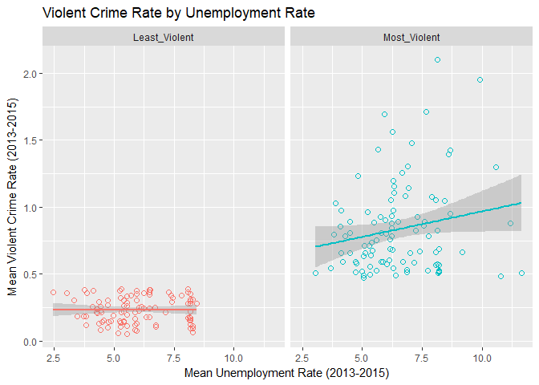<!-- -->


```r
# Find avg grad rate by city
GR_by_city <- risk_VCR_final %>% 
  group_by(., City, State) %>% 
  summarise(Grad_rate_avg = mean(Grad_Rate, na.rm = T))

risk_VCR_avg_GR <- left_join(risk_VCR_avg, GR_by_city, by = c("State", "City"))

# Plot mean VCR against college grad rate
top100_GR <- risk_VCR_avg_GR %>% 
  arrange(., desc(VCR_avg)) %>% 
  distinct(., VCR_avg, .keep_all = T) %>% 
  top_n(., 100, VCR_avg) %>% 
  mutate(rank = "Most_Violent")

bot100_GR <- risk_VCR_avg_GR %>%
  arrange(., desc(VCR_avg)) %>% 
  distinct(., VCR_avg, .keep_all = T) %>% 
  top_n(., -100, VCR_avg) %>% 
  mutate(rank = "Least_Violent")

VCR_GR <- bind_rows(top100_GR, bot100_GR)

VCR_GR_scat <- ggplot(VCR_GR, aes(x = Grad_rate_avg, y = VCR_avg, col = rank)) +
  geom_point(size = 2, shape = 1, na.rm = T, show.legend = F) +
  geom_smooth(method = "lm", se = T, show.legend = F) +
  facet_grid(. ~ rank) +
  labs(title = "Violent Crime Rate by Graduation Rate", 
       x = "Mean Graduation Rate (2013-2015)", y = "Mean Violent Crime Rate (2013-2015)")
```

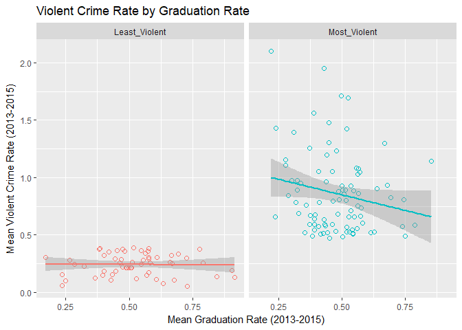<!-- -->


```r
# Plot VCR, GR, and UR distributions for top and bot 100 VCR cities
VCR_hist <- ggplot(VCR_GR, aes(x = VCR_avg, fill = rank)) +
  geom_histogram(binwidth = 0.04, alpha = 0.6, na.rm = T) +
  labs(title = "Violent Crime Rate Sample Distribution", 
       x = "Mean Violent Crime Rate (2013-2015)", y = "# of Cities") +
  guides(fill=guide_legend(title = "Top 100 Cities"))

GR_hist <- ggplot(VCR_GR, aes(x = Grad_rate_avg, fill = rank)) +
  geom_histogram(binwidth = 0.02, alpha = 0.6, show.legend = F, na.rm = T) +
  facet_grid(. ~ rank) +
  labs(title = "Graduation Rate Sample Distribution", 
       x = "Mean Graduation Rate (2013-2015)", y = "# of Cities")

UR_hist <- ggplot(VCR_UR, aes(x = Unemp_rate_avg, fill = rank)) +
  geom_histogram(binwidth = 0.25, alpha = 0.6, show.legend = F, na.rm = T) +
  facet_grid(. ~ rank) +
  labs(title = "Unemployment Rate Sample Distribution", 
       x = "Mean Unemployment Rate (2013-2015)", y = "# of Cities")
```

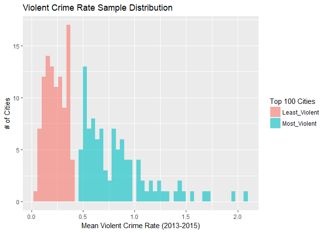<!-- -->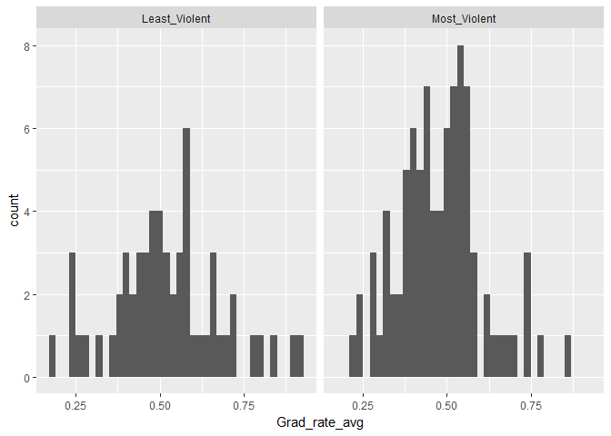<!-- -->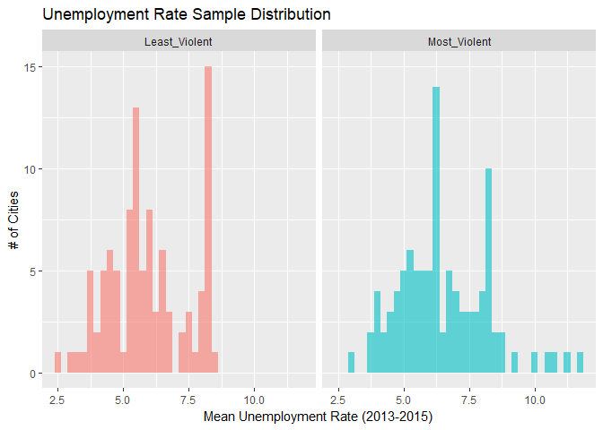<!-- -->


```r
# Plot overlapping densities for VCR, GR, and UR
VCR_den <- ggplot(VCR_GR, aes(x = VCR_avg, fill = rank)) +
  geom_density(na.rm = T, alpha = 0.6) +
  labs(title = "Violent Crime Rate Density Comparison", 
       x = "Mean Violent Crime Rate (2013-2015)", y = "Density") +
  guides(fill=guide_legend(title = "Top 100 Cities"))

GR_den <- ggplot(VCR_GR, aes(x = Grad_rate_avg, fill = rank)) +
  geom_density(na.rm = T, alpha = 0.6) +
  labs(title = "Graduation Rate Density Comparison", 
       x = "Mean Graduation Rate (2013-2015)", y = "Density") +
  guides(fill=guide_legend(title = "Top 100 Cities"))

UR_den <- ggplot(VCR_UR, aes(x = Unemp_rate_avg, fill = rank)) +
  geom_density(na.rm = T, alpha = 0.6) +
  labs(title = "Unemployment Rate Density Comparison", 
       x = "Mean Unemployment Rate (2013-2015)", y = "Density") +
  guides(fill=guide_legend(title = "Top 100 Cities"))
```

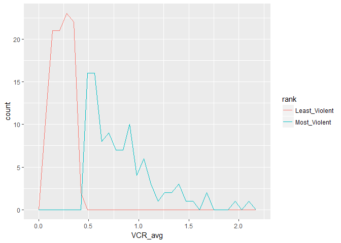<!-- --><!-- -->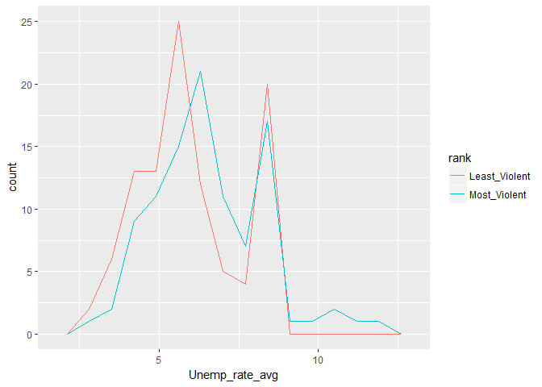<!-- -->


```r
# Group city and state to find averages of college data
risk_VCR_final_grouped <- risk_VCR_final %>% 
  mutate(Cost_total = rowMeans(.[25:26], na.rm = T, dims = 1)) %>% 
  group_by(., City, State) %>% 
  summarise(., "Median_income_avg" = mean(Median_Earnings_10years, na.rm = T),
            "Median_debt_avg" = mean(Median_Debt_Grads, na.rm = T),
            "Retention_rate_avg" = mean(Retention_Rate, na.rm = T),
            "Cost_avg" = mean(Cost_total, na.rm = T))

# Retain only averages of data from data exploration plots
matrix_1 <- VCR_GR %>% 
  select(., 1:2, 12, 19:22)

matrix_2 <- left_join(matrix_1, risk_VCR_final_grouped, by = c("State", "City"))
matrix_2 <- as_data_frame(matrix_2) %>% 
  mutate_at(., 1:3, funs(as.factor)) %>% 
  mutate_at(., 7, funs(as.factor))

# Central Tendancy comparisons of VCR, UR, and GR by rank
matrix_1_MV <- subset(matrix_1, subset = rank == "Most_Violent")
summary(matrix_1_MV)
```

```
##     State               City              County             VCR_avg      
##  Length:100         Length:100         Length:100         Min.   :0.4689  
##  Class :character   Class :character   Class :character   1st Qu.:0.5797  
##  Mode  :character   Mode  :character   Mode  :character   Median :0.7540  
##                                                           Mean   :0.8354  
##                                                           3rd Qu.:0.9674  
##                                                           Max.   :2.0999  
##                                                                           
##  Unemp_rate_avg   Grad_rate_avg        rank          
##  Min.   : 3.028   Min.   :0.2203   Length:100        
##  1st Qu.: 5.332   1st Qu.:0.3927   Class :character  
##  Median : 6.250   Median :0.4816   Mode  :character  
##  Mean   : 6.518   Mean   :0.4791                     
##  3rd Qu.: 7.747   3rd Qu.:0.5474                     
##  Max.   :11.667   Max.   :0.8515                     
##                   NA's   :12
```

```r
matrix_1_LV <- subset(matrix_1, subset = rank == "Least_Violent")
summary(matrix_1_LV)
```

```
##     State               City              County         
##  Length:100         Length:100         Length:100        
##  Class :character   Class :character   Class :character  
##  Mode  :character   Mode  :character   Mode  :character  
##                                                          
##                                                          
##                                                          
##                                                          
##     VCR_avg        Unemp_rate_avg  Grad_rate_avg        rank          
##  Min.   :0.05086   Min.   :2.467   Min.   :0.1715   Length:100        
##  1st Qu.:0.15056   1st Qu.:4.763   1st Qu.:0.4299   Class :character  
##  Median :0.23140   Median :5.787   Median :0.5106   Mode  :character  
##  Mean   :0.23266   Mean   :5.929   Mean   :0.5221                     
##  3rd Qu.:0.30786   3rd Qu.:7.168   3rd Qu.:0.6000                     
##  Max.   :0.38591   Max.   :8.450   Max.   :0.9159                     
##                                    NA's   :42
```

```r
# Plot matrix data comparing all variables
comparison_plot <- ggpairs(matrix_2, 
                           columns = c(4:6, 8:11),
                           title = "100 Most Violent Cities vs 100 Least Violent Cities",
                           upper = list(
                             continuous = "cor",
                             mapping = aes(color = rank, alpha = 0.6)
                           ),
                           lower = list(
                             continuous = "smooth",
                             mapping = aes(color = rank, alpha = 0.6)
                           ),
                           diag = list(
                             continuous = "densityDiag",
                             mapping = aes(color = rank, alpha = 0.6)
                           )
)
```

<!-- -->

### -------------------------------------------- ###
###           Models and Predictions             ###
### -------------------------------------------- ###


```r
# Separate by rank variable into 2 separate data frames to create 2 separate linear regressions for 
# comparison purposes
MV_df <- filter(matrix_2, rank == "Most_Violent")

LV_df <- filter(matrix_2, rank == "Least_Violent")

## --------------------------------------------
## Stepwise Mulitple Linear Regression Feature Selection (Most Violent Series)
## --------------------------------------------

# Regession using all predictors available
lm_MV_VCR_1 <- lm(VCR_avg ~ Unemp_rate_avg + Grad_rate_avg + Median_income_avg +    
                  Median_debt_avg + Retention_rate_avg + Cost_avg,
                  data = MV_df)
```


```
## 
## Call:
## lm(formula = VCR_avg ~ Unemp_rate_avg + Grad_rate_avg + Median_income_avg + 
##     Median_debt_avg + Retention_rate_avg + Cost_avg, data = MV_df)
## 
## Residuals:
##      Min       1Q   Median       3Q      Max 
## -0.58543 -0.22867 -0.03829  0.17296  1.09834 
## 
## Coefficients:
##                      Estimate Std. Error t value Pr(>|t|)   
## (Intercept)         5.353e-01  3.313e-01   1.616  0.10995   
## Unemp_rate_avg      7.208e-02  2.271e-02   3.173  0.00213 **
## Grad_rate_avg      -5.409e-01  3.803e-01  -1.422  0.15877   
## Median_income_avg   4.995e-06  4.680e-06   1.067  0.28901   
## Median_debt_avg     1.725e-05  1.218e-05   1.416  0.16069   
## Retention_rate_avg -4.950e-01  3.799e-01  -1.303  0.19634   
## Cost_avg           -5.234e-07  1.298e-05  -0.040  0.96792   
## ---
## Signif. codes:  0 '***' 0.001 '**' 0.01 '*' 0.05 '.' 0.1 ' ' 1
## 
## Residual standard error: 0.33 on 81 degrees of freedom
##   (12 observations deleted due to missingness)
## Multiple R-squared:  0.1743,	Adjusted R-squared:  0.1132 
## F-statistic:  2.85 on 6 and 81 DF,  p-value: 0.01436
```


```r
# Reduce the model by removing least correlated predictor, the avgerage cost of colleges
lm_MV_VCR_2 <- lm(VCR_avg ~ Unemp_rate_avg + Grad_rate_avg + Median_income_avg +
                  Median_debt_avg + Retention_rate_avg,
                  data = MV_df)
```


```
## 
## Call:
## lm(formula = VCR_avg ~ Unemp_rate_avg + Grad_rate_avg + Median_income_avg + 
##     Median_debt_avg + Retention_rate_avg, data = MV_df)
## 
## Residuals:
##      Min       1Q   Median       3Q      Max 
## -0.58404 -0.22820 -0.03652  0.17211  1.09644 
## 
## Coefficients:
##                      Estimate Std. Error t value Pr(>|t|)   
## (Intercept)         5.309e-01  3.101e-01   1.712  0.09068 . 
## Unemp_rate_avg      7.211e-02  2.257e-02   3.195  0.00198 **
## Grad_rate_avg      -5.439e-01  3.709e-01  -1.466  0.14636   
## Median_income_avg   4.995e-06  4.651e-06   1.074  0.28598   
## Median_debt_avg     1.709e-05  1.142e-05   1.496  0.13860   
## Retention_rate_avg -4.956e-01  3.772e-01  -1.314  0.19255   
## ---
## Signif. codes:  0 '***' 0.001 '**' 0.01 '*' 0.05 '.' 0.1 ' ' 1
## 
## Residual standard error: 0.328 on 82 degrees of freedom
##   (12 observations deleted due to missingness)
## Multiple R-squared:  0.1743,	Adjusted R-squared:  0.124 
## F-statistic: 3.462 on 5 and 82 DF,  p-value: 0.006883
```


```r
# Remove median income due to high multicolinearty with median debt
lm_MV_VCR_3 <- lm(VCR_avg ~ Unemp_rate_avg + Grad_rate_avg + Median_debt_avg +
                  Retention_rate_avg,
                  data = MV_df)
```


```
## 
## Call:
## lm(formula = VCR_avg ~ Unemp_rate_avg + Grad_rate_avg + Median_debt_avg + 
##     Retention_rate_avg, data = MV_df)
## 
## Residuals:
##      Min       1Q   Median       3Q      Max 
## -0.57624 -0.25277 -0.04578  0.19652  1.10324 
## 
## Coefficients:
##                      Estimate Std. Error t value Pr(>|t|)   
## (Intercept)         5.647e-01  3.088e-01   1.829  0.07099 . 
## Unemp_rate_avg      7.105e-02  2.257e-02   3.149  0.00228 **
## Grad_rate_avg      -4.651e-01  3.639e-01  -1.278  0.20482   
## Median_debt_avg     2.119e-05  1.078e-05   1.967  0.05258 . 
## Retention_rate_avg -4.402e-01  3.740e-01  -1.177  0.24263   
## ---
## Signif. codes:  0 '***' 0.001 '**' 0.01 '*' 0.05 '.' 0.1 ' ' 1
## 
## Residual standard error: 0.3283 on 83 degrees of freedom
##   (12 observations deleted due to missingness)
## Multiple R-squared:  0.1627,	Adjusted R-squared:  0.1223 
## F-statistic: 4.032 on 4 and 83 DF,  p-value: 0.004888
```


```r
# Repalce median debt with median income and compare to model 3
lm_MV_VCR_4 <- lm(VCR_avg ~ Unemp_rate_avg + Grad_rate_avg + Median_income_avg +
                  Retention_rate_avg,
                  data = MV_df)
```


```
## 
## Call:
## lm(formula = VCR_avg ~ Unemp_rate_avg + Grad_rate_avg + Median_income_avg + 
##     Retention_rate_avg, data = MV_df)
## 
## Residuals:
##     Min      1Q  Median      3Q     Max 
## -0.6260 -0.2223 -0.0255  0.1532  1.0326 
## 
## Coefficients:
##                      Estimate Std. Error t value Pr(>|t|)   
## (Intercept)         8.031e-01  2.529e-01   3.176  0.00210 **
## Unemp_rate_avg      6.524e-02  2.226e-02   2.931  0.00436 **
## Grad_rate_avg      -5.038e-01  3.727e-01  -1.352  0.18010   
## Median_income_avg   7.322e-06  4.416e-06   1.658  0.10103   
## Retention_rate_avg -5.373e-01  3.790e-01  -1.418  0.16000   
## ---
## Signif. codes:  0 '***' 0.001 '**' 0.01 '*' 0.05 '.' 0.1 ' ' 1
## 
## Residual standard error: 0.3304 on 83 degrees of freedom
##   (12 observations deleted due to missingness)
## Multiple R-squared:  0.1518,	Adjusted R-squared:  0.1109 
## F-statistic: 3.713 on 4 and 83 DF,  p-value: 0.007876
```


```r
# Debt is more stat. sig., reduce model 3 by removing retention rate of college 
# students due to multicolinearity with graduation rate 
lm_MV_VCR_5 <- lm(VCR_avg ~ Unemp_rate_avg + Grad_rate_avg + Median_debt_avg,
                  data = MV_df)
```


```
## 
## Call:
## lm(formula = VCR_avg ~ Unemp_rate_avg + Grad_rate_avg + Median_debt_avg, 
##     data = MV_df)
## 
## Residuals:
##      Min       1Q   Median       3Q      Max 
## -0.55387 -0.24977 -0.06389  0.20400  1.06520 
## 
## Coefficients:
##                   Estimate Std. Error t value Pr(>|t|)   
## (Intercept)      3.944e-01  2.733e-01   1.443  0.15281   
## Unemp_rate_avg   6.808e-02  2.248e-02   3.029  0.00326 **
## Grad_rate_avg   -7.305e-01  2.862e-01  -2.552  0.01251 * 
## Median_debt_avg  2.157e-05  1.080e-05   1.998  0.04892 * 
## ---
## Signif. codes:  0 '***' 0.001 '**' 0.01 '*' 0.05 '.' 0.1 ' ' 1
## 
## Residual standard error: 0.329 on 84 degrees of freedom
##   (12 observations deleted due to missingness)
## Multiple R-squared:  0.1487,	Adjusted R-squared:  0.1183 
## F-statistic: 4.892 on 3 and 84 DF,  p-value: 0.003496
```


```r
## --------------------------------------------
## Stepwise Multiple Linear Regression Feature Selection (Least Violent Series)
## --------------------------------------------

# Regression using all predictors available
lm_LV_VCR_1 <- lm(VCR_avg ~ Unemp_rate_avg + Grad_rate_avg + Median_income_avg +
                  Median_debt_avg + Retention_rate_avg + Cost_avg,
                  data = LV_df)
```


```
## 
## Call:
## lm(formula = VCR_avg ~ Unemp_rate_avg + Grad_rate_avg + Median_income_avg + 
##     Median_debt_avg + Retention_rate_avg + Cost_avg, data = LV_df)
## 
## Residuals:
##       Min        1Q    Median        3Q       Max 
## -0.172400 -0.067379 -0.005014  0.072925  0.127042 
## 
## Coefficients:
##                      Estimate Std. Error t value Pr(>|t|)    
## (Intercept)         5.710e-01  1.040e-01   5.492 1.76e-06 ***
## Unemp_rate_avg     -5.227e-03  8.722e-03  -0.599   0.5520    
## Grad_rate_avg       3.002e-02  1.034e-01   0.290   0.7730    
## Median_income_avg  -1.388e-06  1.684e-06  -0.824   0.4141    
## Median_debt_avg    -4.575e-06  3.693e-06  -1.239   0.2219    
## Retention_rate_avg -7.773e-02  8.233e-02  -0.944   0.3502    
## Cost_avg           -7.504e-06  2.994e-06  -2.506   0.0159 *  
## ---
## Signif. codes:  0 '***' 0.001 '**' 0.01 '*' 0.05 '.' 0.1 ' ' 1
## 
## Residual standard error: 0.08454 on 45 degrees of freedom
##   (48 observations deleted due to missingness)
## Multiple R-squared:  0.2595,	Adjusted R-squared:  0.1607 
## F-statistic: 2.628 on 6 and 45 DF,  p-value: 0.02859
```


```r
# Reduce by removing least signifanct predictor, grauation rate of college students
lm_LV_VCR_2 <- lm(VCR_avg ~ Unemp_rate_avg + Median_income_avg + Median_debt_avg + 
                  Retention_rate_avg + Cost_avg,
                  data = LV_df)
```


```
## 
## Call:
## lm(formula = VCR_avg ~ Unemp_rate_avg + Median_income_avg + Median_debt_avg + 
##     Retention_rate_avg + Cost_avg, data = LV_df)
## 
## Residuals:
##       Min        1Q    Median        3Q       Max 
## -0.170916 -0.066771  0.000509  0.073513  0.123701 
## 
## Coefficients:
##                      Estimate Std. Error t value Pr(>|t|)    
## (Intercept)         5.844e-01  9.619e-02   6.076 2.07e-07 ***
## Unemp_rate_avg     -5.370e-03  8.537e-03  -0.629    0.532    
## Median_income_avg  -1.240e-06  1.561e-06  -0.794    0.431    
## Median_debt_avg    -5.135e-06  3.337e-06  -1.539    0.131    
## Retention_rate_avg -7.129e-02  7.169e-02  -0.994    0.325    
## Cost_avg           -7.307e-06  2.893e-06  -2.526    0.015 *  
## ---
## Signif. codes:  0 '***' 0.001 '**' 0.01 '*' 0.05 '.' 0.1 ' ' 1
## 
## Residual standard error: 0.08287 on 47 degrees of freedom
##   (47 observations deleted due to missingness)
## Multiple R-squared:  0.2748,	Adjusted R-squared:  0.1976 
## F-statistic: 3.562 on 5 and 47 DF,  p-value: 0.008204
```


```r
# Remove next least significant predictor, unemployment rate
lm_LV_VCR_3 <- lm(VCR_avg ~ Median_income_avg + Median_debt_avg + Retention_rate_avg +
                  Cost_avg,
                  data = LV_df)
```


```
## 
## Call:
## lm(formula = VCR_avg ~ Median_income_avg + Median_debt_avg + 
##     Retention_rate_avg + Cost_avg, data = LV_df)
## 
## Residuals:
##       Min        1Q    Median        3Q       Max 
## -0.169482 -0.070918 -0.001438  0.069519  0.131794 
## 
## Coefficients:
##                      Estimate Std. Error t value Pr(>|t|)    
## (Intercept)         5.515e-01  8.018e-02   6.878 1.13e-08 ***
## Median_income_avg  -1.052e-06  1.523e-06  -0.691  0.49301    
## Median_debt_avg    -4.760e-06  3.262e-06  -1.459  0.15102    
## Retention_rate_avg -7.623e-02  7.081e-02  -1.077  0.28705    
## Cost_avg           -7.706e-06  2.805e-06  -2.747  0.00844 ** 
## ---
## Signif. codes:  0 '***' 0.001 '**' 0.01 '*' 0.05 '.' 0.1 ' ' 1
## 
## Residual standard error: 0.08234 on 48 degrees of freedom
##   (47 observations deleted due to missingness)
## Multiple R-squared:  0.2687,	Adjusted R-squared:  0.2077 
## F-statistic: 4.409 on 4 and 48 DF,  p-value: 0.004079
```


```r
# Remove median income due to high multicolinearity with median debt
lm_LV_VCR_4 <- lm(VCR_avg ~ Median_debt_avg + Retention_rate_avg + Cost_avg,
                 data = LV_df)
```


```
## 
## Call:
## lm(formula = VCR_avg ~ Median_debt_avg + Retention_rate_avg + 
##     Cost_avg, data = LV_df)
## 
## Residuals:
##       Min        1Q    Median        3Q       Max 
## -0.188180 -0.066447 -0.006014  0.072517  0.170639 
## 
## Coefficients:
##                      Estimate Std. Error t value Pr(>|t|)    
## (Intercept)         5.182e-01  7.977e-02   6.495  3.7e-08 ***
## Median_debt_avg    -6.073e-06  3.108e-06  -1.954   0.0564 .  
## Retention_rate_avg -8.702e-02  6.839e-02  -1.273   0.2091    
## Cost_avg           -5.983e-06  2.785e-06  -2.148   0.0366 *  
## ---
## Signif. codes:  0 '***' 0.001 '**' 0.01 '*' 0.05 '.' 0.1 ' ' 1
## 
## Residual standard error: 0.08491 on 50 degrees of freedom
##   (46 observations deleted due to missingness)
## Multiple R-squared:  0.2144,	Adjusted R-squared:  0.1673 
## F-statistic:  4.55 on 3 and 50 DF,  p-value: 0.006774
```


```r
## --------------------------------------------
## Best Subsets Regression Feature Selection
## --------------------------------------------

# Use Best subsets regression to plot adjusted R2 of all variables
MV_df_na <- MV_df[complete.cases(MV_df),]
MV_df_na <- MV_df_na[c(4:6, 8:11)]

LV_df_na <- LV_df[complete.cases(LV_df),]
LV_df_na <- LV_df_na[c(4:6, 8:11)]

best_lm_MV_VCR <- regsubsets(VCR_avg ~ ., data = MV_df_na)

best_lm_LV_VCR <- regsubsets(VCR_avg ~ ., data = LV_df_na)
```

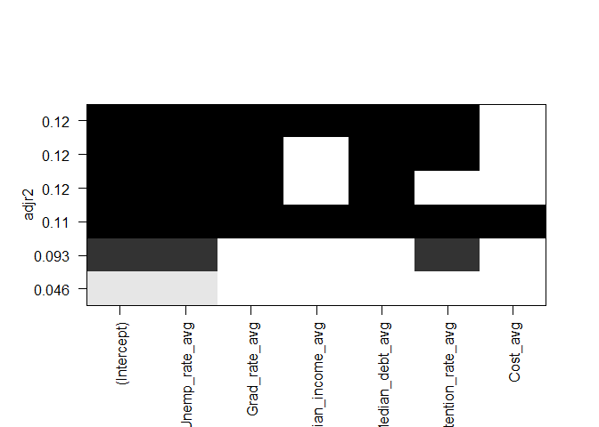<!-- -->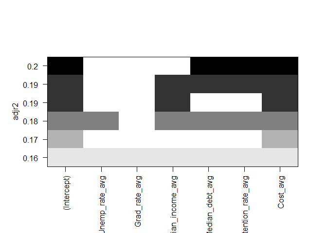<!-- -->


```r
# Predicted R2 for all models using Tom Hopper's function
pred_r_squared <- function(linear.model) {
  lm.anova <- anova(linear.model)
  tss <- sum(lm.anova$"Sum Sq")
  # predictive R^2
  pred.r.squared <- 1 - PRESS(linear.model)/(tss)
  return(pred.r.squared)
}
PRESS <- function(linear.model) {
  pr <- residuals(linear.model)/(1 - lm.influence(linear.model)$hat)
  PRESS <- sum(pr^2)
  return(PRESS)
}

MV_pred_names <- c("MV_Model_1", "MV_Model_2", "MV_Model_3", "MV_Model_4", "MV_Model_5")

MV_pred_r2_results <- c(pred_r_squared(lm_MV_VCR_1),
                        pred_r_squared(lm_MV_VCR_2),
                        pred_r_squared(lm_MV_VCR_3),
                        pred_r_squared(lm_MV_VCR_4),
                        pred_r_squared(lm_MV_VCR_5))

MV_model_results <- data.frame(MV_pred_names, MV_pred_r2_results)
```

```
##   MV_pred_names MV_pred_r2_results
## 1    MV_Model_1        0.003965607
## 2    MV_Model_2        0.031134277
## 3    MV_Model_3        0.034660659
## 4    MV_Model_4        0.025533228
## 5    MV_Model_5        0.039979844
```


```r
LV_pred_names <- c("LV_Model_1", "LV_Model_2", "LV_Model_3", "LV_Model_4")

LV_pred_r2_results <- c(pred_r_squared(lm_LV_VCR_1),
                        pred_r_squared(lm_LV_VCR_2),
                        pred_r_squared(lm_LV_VCR_3),
                        pred_r_squared(lm_LV_VCR_4))

LV_model_results <- data.frame(LV_pred_names, LV_pred_r2_results)
```


```
##   LV_pred_names LV_pred_r2_results
## 1    LV_Model_1         0.00131812
## 2    LV_Model_2         0.08025219
## 3    LV_Model_3         0.11140922
## 4    LV_Model_4         0.09599753
```


```r
## --------------------------------------------
## Cross Validation of Linear Models
## --------------------------------------------

# Train and test linear regressions via a repeated k-fold cross validation
tcont <- trainControl(method = "repeatedcv", number = 10, repeats = 10)

cv_lm_MV_VCR_5 <- train(VCR_avg ~ Unemp_rate_avg + Grad_rate_avg + Median_debt_avg,
                        data = na.omit(MV_df),
                        trControl = tcont,
                        method = "lm")
```


```
## Linear Regression 
## 
## 88 samples
##  3 predictor
## 
## No pre-processing
## Resampling: Cross-Validated (10 fold, repeated 10 times) 
## Summary of sample sizes: 76, 80, 79, 79, 80, 79, ... 
## Resampling results:
## 
##   RMSE       Rsquared  MAE      
##   0.3301628  0.176099  0.2709161
## 
## Tuning parameter 'intercept' was held constant at a value of TRUE
```


```r
cv_lm_LV_VCR_3 <- train(VCR_avg ~ Median_debt_avg + Retention_rate_avg + Cost_avg + 
                        Median_income_avg,
                        data = na.omit(LV_df),
                        trControl = tcont,
                        method = "lm")
```


```
## Linear Regression 
## 
## 52 samples
##  4 predictor
## 
## No pre-processing
## Resampling: Cross-Validated (10 fold, repeated 10 times) 
## Summary of sample sizes: 48, 46, 46, 46, 47, 47, ... 
## Resampling results:
## 
##   RMSE        Rsquared   MAE       
##   0.08446332  0.2849449  0.07423731
## 
## Tuning parameter 'intercept' was held constant at a value of TRUE
```


```r
# Calculate RMSE for comparison against k-fold cross validation results of final models 
# (highest predicted R2)
RMSE_lm_MV_VCR_5 <- sqrt(sum((residuals(lm_MV_VCR_5)/(1-hatvalues(lm_MV_VCR_5)))^2)/length(lm_MV_VCR_5$residuals))
```


```
## [1] 0.3413583
```


```r
RMSE_lm_LV_VCR_3 <- sqrt(sum((residuals(lm_LV_VCR_3)/(1-hatvalues(lm_LV_VCR_3)))^2)/length(lm_LV_VCR_3$residuals))
```


```
## [1] 0.08638
```


### -------------------------------------------- ###
###               Data Visualization             ###
### -------------------------------------------- ###


```r
# Table of correlation matrix
sjt.corr(MV_df_na, title = "Correlation Matrix of Variables (MV data set)")
```

<table style="border-collapse:collapse; border:none;">
<caption style="font-weight: bold; text-align:left;">Correlation Matrix of Variables (MV data set)</caption>
<tr>
<th style="font-style:italic; font-weight:normal; border-top:double black; border-bottom:1px solid black; padding:0.2cm;">&nbsp;</th>
<th style="font-style:italic; font-weight:normal; border-top:double black; border-bottom:1px solid black; padding:0.2cm;">VCR_avg</th>
<th style="font-style:italic; font-weight:normal; border-top:double black; border-bottom:1px solid black; padding:0.2cm;">Unemp_rate_avg</th>
<th style="font-style:italic; font-weight:normal; border-top:double black; border-bottom:1px solid black; padding:0.2cm;">Grad_rate_avg</th>
<th style="font-style:italic; font-weight:normal; border-top:double black; border-bottom:1px solid black; padding:0.2cm;">Median_income_avg</th>
<th style="font-style:italic; font-weight:normal; border-top:double black; border-bottom:1px solid black; padding:0.2cm;">Median_debt_avg</th>
<th style="font-style:italic; font-weight:normal; border-top:double black; border-bottom:1px solid black; padding:0.2cm;">Retention_rate_avg</th>
<th style="font-style:italic; font-weight:normal; border-top:double black; border-bottom:1px solid black; padding:0.2cm;">Cost_avg</th>
</tr>
<tr>
<td style="font-style:italic;">VCR_avg</td>
<td style="padding:0.2cm; text-align:center;">&nbsp;</td>
<td style="padding:0.2cm; text-align:center;">0.239<span style="vertical-align:super;font-size:0.8em;">*</span></td>
<td style="padding:0.2cm; text-align:center; color:#999999;">-0.195<span style="vertical-align:super;font-size:0.8em;"></span></td>
<td style="padding:0.2cm; text-align:center; color:#999999;">0.043<span style="vertical-align:super;font-size:0.8em;"></span></td>
<td style="padding:0.2cm; text-align:center; color:#999999;">0.105<span style="vertical-align:super;font-size:0.8em;"></span></td>
<td style="padding:0.2cm; text-align:center; color:#999999;">-0.194<span style="vertical-align:super;font-size:0.8em;"></span></td>
<td style="padding:0.2cm; text-align:center; color:#999999;">-0.029<span style="vertical-align:super;font-size:0.8em;"></span></td>
</tr>
<tr>
<td style="font-style:italic;">Unemp_rate_avg</td>
<td style="padding:0.2cm; text-align:center;">0.239<span style="vertical-align:super;font-size:0.8em;">*</span></td>
<td style="padding:0.2cm; text-align:center;">&nbsp;</td>
<td style="padding:0.2cm; text-align:center; color:#999999;">0.124<span style="vertical-align:super;font-size:0.8em;"></span></td>
<td style="padding:0.2cm; text-align:center; color:#999999;">-0.054<span style="vertical-align:super;font-size:0.8em;"></span></td>
<td style="padding:0.2cm; text-align:center;">-0.216<span style="vertical-align:super;font-size:0.8em;">*</span></td>
<td style="padding:0.2cm; text-align:center; color:#999999;">0.172<span style="vertical-align:super;font-size:0.8em;"></span></td>
<td style="padding:0.2cm; text-align:center; color:#999999;">-0.064<span style="vertical-align:super;font-size:0.8em;"></span></td>
</tr>
<tr>
<td style="font-style:italic;">Grad_rate_avg</td>
<td style="padding:0.2cm; text-align:center; color:#999999;">-0.195<span style="vertical-align:super;font-size:0.8em;"></span></td>
<td style="padding:0.2cm; text-align:center; color:#999999;">0.124<span style="vertical-align:super;font-size:0.8em;"></span></td>
<td style="padding:0.2cm; text-align:center;">&nbsp;</td>
<td style="padding:0.2cm; text-align:center;">0.364<span style="vertical-align:super;font-size:0.8em;">***</span></td>
<td style="padding:0.2cm; text-align:center; color:#999999;">0.135<span style="vertical-align:super;font-size:0.8em;"></span></td>
<td style="padding:0.2cm; text-align:center;">0.630<span style="vertical-align:super;font-size:0.8em;">***</span></td>
<td style="padding:0.2cm; text-align:center;">0.306<span style="vertical-align:super;font-size:0.8em;">**</span></td>
</tr>
<tr>
<td style="font-style:italic;">Median_income_avg</td>
<td style="padding:0.2cm; text-align:center; color:#999999;">0.043<span style="vertical-align:super;font-size:0.8em;"></span></td>
<td style="padding:0.2cm; text-align:center; color:#999999;">-0.054<span style="vertical-align:super;font-size:0.8em;"></span></td>
<td style="padding:0.2cm; text-align:center;">0.364<span style="vertical-align:super;font-size:0.8em;">***</span></td>
<td style="padding:0.2cm; text-align:center;">&nbsp;</td>
<td style="padding:0.2cm; text-align:center;">0.365<span style="vertical-align:super;font-size:0.8em;">***</span></td>
<td style="padding:0.2cm; text-align:center;">0.305<span style="vertical-align:super;font-size:0.8em;">**</span></td>
<td style="padding:0.2cm; text-align:center;">0.224<span style="vertical-align:super;font-size:0.8em;">*</span></td>
</tr>
<tr>
<td style="font-style:italic;">Median_debt_avg</td>
<td style="padding:0.2cm; text-align:center; color:#999999;">0.105<span style="vertical-align:super;font-size:0.8em;"></span></td>
<td style="padding:0.2cm; text-align:center;">-0.216<span style="vertical-align:super;font-size:0.8em;">*</span></td>
<td style="padding:0.2cm; text-align:center; color:#999999;">0.135<span style="vertical-align:super;font-size:0.8em;"></span></td>
<td style="padding:0.2cm; text-align:center;">0.365<span style="vertical-align:super;font-size:0.8em;">***</span></td>
<td style="padding:0.2cm; text-align:center;">&nbsp;</td>
<td style="padding:0.2cm; text-align:center; color:#999999;">0.041<span style="vertical-align:super;font-size:0.8em;"></span></td>
<td style="padding:0.2cm; text-align:center;">0.382<span style="vertical-align:super;font-size:0.8em;">***</span></td>
</tr>
<tr>
<td style="font-style:italic;">Retention_rate_avg</td>
<td style="padding:0.2cm; text-align:center; color:#999999;">-0.194<span style="vertical-align:super;font-size:0.8em;"></span></td>
<td style="padding:0.2cm; text-align:center; color:#999999;">0.172<span style="vertical-align:super;font-size:0.8em;"></span></td>
<td style="padding:0.2cm; text-align:center;">0.630<span style="vertical-align:super;font-size:0.8em;">***</span></td>
<td style="padding:0.2cm; text-align:center;">0.305<span style="vertical-align:super;font-size:0.8em;">**</span></td>
<td style="padding:0.2cm; text-align:center; color:#999999;">0.041<span style="vertical-align:super;font-size:0.8em;"></span></td>
<td style="padding:0.2cm; text-align:center;">&nbsp;</td>
<td style="padding:0.2cm; text-align:center; color:#999999;">0.206<span style="vertical-align:super;font-size:0.8em;"></span></td>
</tr>
<tr>
<td style="font-style:italic;">Cost_avg</td>
<td style="padding:0.2cm; text-align:center; color:#999999;">-0.029<span style="vertical-align:super;font-size:0.8em;"></span></td>
<td style="padding:0.2cm; text-align:center; color:#999999;">-0.064<span style="vertical-align:super;font-size:0.8em;"></span></td>
<td style="padding:0.2cm; text-align:center;">0.306<span style="vertical-align:super;font-size:0.8em;">**</span></td>
<td style="padding:0.2cm; text-align:center;">0.224<span style="vertical-align:super;font-size:0.8em;">*</span></td>
<td style="padding:0.2cm; text-align:center;">0.382<span style="vertical-align:super;font-size:0.8em;">***</span></td>
<td style="padding:0.2cm; text-align:center; color:#999999;">0.206<span style="vertical-align:super;font-size:0.8em;"></span></td>
<td style="padding:0.2cm; text-align:center;">&nbsp;</td>
</tr>
<tr>
<td colspan="8" style="border-bottom:double black; border-top:1px solid black; font-style:italic; font-size:0.9em; text-align:right;">Computed correlation used pearson-method with listwise-deletion.</td>
</tr>
 
</table>

```r
sjt.corr(LV_df_na, title = "Correlation Matrix of Variables (LV data set)")
```

<table style="border-collapse:collapse; border:none;">
<caption style="font-weight: bold; text-align:left;">Correlation Matrix of Variables (LV data set)</caption>
<tr>
<th style="font-style:italic; font-weight:normal; border-top:double black; border-bottom:1px solid black; padding:0.2cm;">&nbsp;</th>
<th style="font-style:italic; font-weight:normal; border-top:double black; border-bottom:1px solid black; padding:0.2cm;">VCR_avg</th>
<th style="font-style:italic; font-weight:normal; border-top:double black; border-bottom:1px solid black; padding:0.2cm;">Unemp_rate_avg</th>
<th style="font-style:italic; font-weight:normal; border-top:double black; border-bottom:1px solid black; padding:0.2cm;">Grad_rate_avg</th>
<th style="font-style:italic; font-weight:normal; border-top:double black; border-bottom:1px solid black; padding:0.2cm;">Median_income_avg</th>
<th style="font-style:italic; font-weight:normal; border-top:double black; border-bottom:1px solid black; padding:0.2cm;">Median_debt_avg</th>
<th style="font-style:italic; font-weight:normal; border-top:double black; border-bottom:1px solid black; padding:0.2cm;">Retention_rate_avg</th>
<th style="font-style:italic; font-weight:normal; border-top:double black; border-bottom:1px solid black; padding:0.2cm;">Cost_avg</th>
</tr>
<tr>
<td style="font-style:italic;">VCR_avg</td>
<td style="padding:0.2cm; text-align:center;">&nbsp;</td>
<td style="padding:0.2cm; text-align:center; color:#999999;">-0.085<span style="vertical-align:super;font-size:0.8em;"></span></td>
<td style="padding:0.2cm; text-align:center; color:#999999;">-0.066<span style="vertical-align:super;font-size:0.8em;"></span></td>
<td style="padding:0.2cm; text-align:center; color:#999999;">-0.196<span style="vertical-align:super;font-size:0.8em;"></span></td>
<td style="padding:0.2cm; text-align:center;">-0.318<span style="vertical-align:super;font-size:0.8em;">*</span></td>
<td style="padding:0.2cm; text-align:center; color:#999999;">-0.125<span style="vertical-align:super;font-size:0.8em;"></span></td>
<td style="padding:0.2cm; text-align:center;">-0.429<span style="vertical-align:super;font-size:0.8em;">**</span></td>
</tr>
<tr>
<td style="font-style:italic;">Unemp_rate_avg</td>
<td style="padding:0.2cm; text-align:center; color:#999999;">-0.085<span style="vertical-align:super;font-size:0.8em;"></span></td>
<td style="padding:0.2cm; text-align:center;">&nbsp;</td>
<td style="padding:0.2cm; text-align:center; color:#999999;">-0.031<span style="vertical-align:super;font-size:0.8em;"></span></td>
<td style="padding:0.2cm; text-align:center; color:#999999;">-0.219<span style="vertical-align:super;font-size:0.8em;"></span></td>
<td style="padding:0.2cm; text-align:center; color:#999999;">-0.180<span style="vertical-align:super;font-size:0.8em;"></span></td>
<td style="padding:0.2cm; text-align:center; color:#999999;">0.069<span style="vertical-align:super;font-size:0.8em;"></span></td>
<td style="padding:0.2cm; text-align:center; color:#999999;">0.152<span style="vertical-align:super;font-size:0.8em;"></span></td>
</tr>
<tr>
<td style="font-style:italic;">Grad_rate_avg</td>
<td style="padding:0.2cm; text-align:center; color:#999999;">-0.066<span style="vertical-align:super;font-size:0.8em;"></span></td>
<td style="padding:0.2cm; text-align:center; color:#999999;">-0.031<span style="vertical-align:super;font-size:0.8em;"></span></td>
<td style="padding:0.2cm; text-align:center;">&nbsp;</td>
<td style="padding:0.2cm; text-align:center;">0.380<span style="vertical-align:super;font-size:0.8em;">**</span></td>
<td style="padding:0.2cm; text-align:center; color:#999999;">-0.120<span style="vertical-align:super;font-size:0.8em;"></span></td>
<td style="padding:0.2cm; text-align:center;">0.515<span style="vertical-align:super;font-size:0.8em;">***</span></td>
<td style="padding:0.2cm; text-align:center; color:#999999;">0.043<span style="vertical-align:super;font-size:0.8em;"></span></td>
</tr>
<tr>
<td style="font-style:italic;">Median_income_avg</td>
<td style="padding:0.2cm; text-align:center; color:#999999;">-0.196<span style="vertical-align:super;font-size:0.8em;"></span></td>
<td style="padding:0.2cm; text-align:center; color:#999999;">-0.219<span style="vertical-align:super;font-size:0.8em;"></span></td>
<td style="padding:0.2cm; text-align:center;">0.380<span style="vertical-align:super;font-size:0.8em;">**</span></td>
<td style="padding:0.2cm; text-align:center;">&nbsp;</td>
<td style="padding:0.2cm; text-align:center;">0.287<span style="vertical-align:super;font-size:0.8em;">*</span></td>
<td style="padding:0.2cm; text-align:center;">0.281<span style="vertical-align:super;font-size:0.8em;">*</span></td>
<td style="padding:0.2cm; text-align:center; color:#999999;">0.030<span style="vertical-align:super;font-size:0.8em;"></span></td>
</tr>
<tr>
<td style="font-style:italic;">Median_debt_avg</td>
<td style="padding:0.2cm; text-align:center;">-0.318<span style="vertical-align:super;font-size:0.8em;">*</span></td>
<td style="padding:0.2cm; text-align:center; color:#999999;">-0.180<span style="vertical-align:super;font-size:0.8em;"></span></td>
<td style="padding:0.2cm; text-align:center; color:#999999;">-0.120<span style="vertical-align:super;font-size:0.8em;"></span></td>
<td style="padding:0.2cm; text-align:center;">0.287<span style="vertical-align:super;font-size:0.8em;">*</span></td>
<td style="padding:0.2cm; text-align:center;">&nbsp;</td>
<td style="padding:0.2cm; text-align:center; color:#999999;">-0.133<span style="vertical-align:super;font-size:0.8em;"></span></td>
<td style="padding:0.2cm; text-align:center;">0.341<span style="vertical-align:super;font-size:0.8em;">*</span></td>
</tr>
<tr>
<td style="font-style:italic;">Retention_rate_avg</td>
<td style="padding:0.2cm; text-align:center; color:#999999;">-0.125<span style="vertical-align:super;font-size:0.8em;"></span></td>
<td style="padding:0.2cm; text-align:center; color:#999999;">0.069<span style="vertical-align:super;font-size:0.8em;"></span></td>
<td style="padding:0.2cm; text-align:center;">0.515<span style="vertical-align:super;font-size:0.8em;">***</span></td>
<td style="padding:0.2cm; text-align:center;">0.281<span style="vertical-align:super;font-size:0.8em;">*</span></td>
<td style="padding:0.2cm; text-align:center; color:#999999;">-0.133<span style="vertical-align:super;font-size:0.8em;"></span></td>
<td style="padding:0.2cm; text-align:center;">&nbsp;</td>
<td style="padding:0.2cm; text-align:center; color:#999999;">-0.034<span style="vertical-align:super;font-size:0.8em;"></span></td>
</tr>
<tr>
<td style="font-style:italic;">Cost_avg</td>
<td style="padding:0.2cm; text-align:center;">-0.429<span style="vertical-align:super;font-size:0.8em;">**</span></td>
<td style="padding:0.2cm; text-align:center; color:#999999;">0.152<span style="vertical-align:super;font-size:0.8em;"></span></td>
<td style="padding:0.2cm; text-align:center; color:#999999;">0.043<span style="vertical-align:super;font-size:0.8em;"></span></td>
<td style="padding:0.2cm; text-align:center; color:#999999;">0.030<span style="vertical-align:super;font-size:0.8em;"></span></td>
<td style="padding:0.2cm; text-align:center;">0.341<span style="vertical-align:super;font-size:0.8em;">*</span></td>
<td style="padding:0.2cm; text-align:center; color:#999999;">-0.034<span style="vertical-align:super;font-size:0.8em;"></span></td>
<td style="padding:0.2cm; text-align:center;">&nbsp;</td>
</tr>
<tr>
<td colspan="8" style="border-bottom:double black; border-top:1px solid black; font-style:italic; font-size:0.9em; text-align:right;">Computed correlation used pearson-method with listwise-deletion.</td>
</tr>
 
</table>

```r
# Table of regression model coefficients
sjt.lm(lm_MV_VCR_5, lm_MV_VCR_4, lm_MV_VCR_3, lm_MV_VCR_2, lm_MV_VCR_1,
       group.pred = F,
       p.numeric = F,
       emph.p = T,
       show.ci = F,
       show.se = T,
       show.header = T,
       show.fstat = T,
       string.dv = "Model Coefficients to predict VCR for Most Violent Cities") 
```

<table style="border-collapse:collapse; border:none;">
<tr>
<td style="padding:0.2cm; border-top:double;" rowspan="2"><em>Predictors</em></td>
<td colspan="15" style="padding:0.2cm; border-top:double; text-align:center; border-bottom:1px solid;"><em>Model Coefficients to predict VCR for Most Violent Cities</em></td>
</tr>

<td style=" padding-left:0.5em; padding-right:0.5em;">&nbsp;</td>
<td style="padding:0.2cm; text-align:center; " colspan="2">VCR_avg</td>
<td style=" padding-left:0.5em; padding-right:0.5em;">&nbsp;</td>
<td style="padding:0.2cm; text-align:center; " colspan="2">VCR_avg</td>
<td style=" padding-left:0.5em; padding-right:0.5em;">&nbsp;</td>
<td style="padding:0.2cm; text-align:center; " colspan="2">VCR_avg</td>
<td style=" padding-left:0.5em; padding-right:0.5em;">&nbsp;</td>
<td style="padding:0.2cm; text-align:center; " colspan="2">VCR_avg</td>
<td style=" padding-left:0.5em; padding-right:0.5em;">&nbsp;</td>
<td style="padding:0.2cm; text-align:center; " colspan="2">VCR_avg</td>
</tr>
<tr>
<td style="padding:0.2cm; font-style:italic;">&nbsp;</td>
<td style="padding-left:0.5em; padding-right:0.5em; font-style:italic;">&nbsp;</td>
<td style="padding:0.2cm; text-align:center; font-style:italic; ">B</td>
<td style="padding:0.2cm; text-align:center; font-style:italic; ">std. Error</td>
<td style="padding-left:0.5em; padding-right:0.5em; font-style:italic;">&nbsp;</td>
<td style="padding:0.2cm; text-align:center; font-style:italic; ">B</td>
<td style="padding:0.2cm; text-align:center; font-style:italic; ">std. Error</td>
<td style="padding-left:0.5em; padding-right:0.5em; font-style:italic;">&nbsp;</td>
<td style="padding:0.2cm; text-align:center; font-style:italic; ">B</td>
<td style="padding:0.2cm; text-align:center; font-style:italic; ">std. Error</td>
<td style="padding-left:0.5em; padding-right:0.5em; font-style:italic;">&nbsp;</td>
<td style="padding:0.2cm; text-align:center; font-style:italic; ">B</td>
<td style="padding:0.2cm; text-align:center; font-style:italic; ">std. Error</td>
<td style="padding-left:0.5em; padding-right:0.5em; font-style:italic;">&nbsp;</td>
<td style="padding:0.2cm; text-align:center; font-style:italic; ">B</td>
<td style="padding:0.2cm; text-align:center; font-style:italic; ">std. Error</td> 
</tr>
<tr>
<td style="padding:0.2cm; border-top:1px solid; text-align:left;">(Intercept)</td>
<td style="padding-left:0.5em; padding-right:0.5em; border-top:1px solid; ">&nbsp;</td>
<td style="padding:0.2cm; text-align:center; border-top:1px solid; ">0.39&nbsp;</td>
<td style="padding:0.2cm; text-align:center; border-top:1px solid; ">0.27</td>
<td style="padding-left:0.5em; padding-right:0.5em; border-top:1px solid; ">&nbsp;</td>
<td style="padding:0.2cm; text-align:center; border-top:1px solid; ">0.80&nbsp;**</td>
<td style="padding:0.2cm; text-align:center; border-top:1px solid; ">0.25</td>
<td style="padding-left:0.5em; padding-right:0.5em; border-top:1px solid; ">&nbsp;</td>
<td style="padding:0.2cm; text-align:center; border-top:1px solid; ">0.56&nbsp;</td>
<td style="padding:0.2cm; text-align:center; border-top:1px solid; ">0.31</td>
<td style="padding-left:0.5em; padding-right:0.5em; border-top:1px solid; ">&nbsp;</td>
<td style="padding:0.2cm; text-align:center; border-top:1px solid; ">0.53&nbsp;</td>
<td style="padding:0.2cm; text-align:center; border-top:1px solid; ">0.31</td>
<td style="padding-left:0.5em; padding-right:0.5em; border-top:1px solid; ">&nbsp;</td>
<td style="padding:0.2cm; text-align:center; border-top:1px solid; ">0.54&nbsp;</td>
<td style="padding:0.2cm; text-align:center; border-top:1px solid; ">0.33</td>
</tr>
<tr>
<td style="padding:0.2cm; text-align:left;">Unemp_rate_avg</td>
<td style="padding-left:0.5em; padding-right:0.5em;">&nbsp;</td>
<td style="padding:0.2cm; text-align:center; ">0.07&nbsp;**</td>
<td style="padding:0.2cm; text-align:center; ">0.02</td>
<td style="padding-left:0.5em; padding-right:0.5em;">&nbsp;</td>
<td style="padding:0.2cm; text-align:center; ">0.07&nbsp;**</td>
<td style="padding:0.2cm; text-align:center; ">0.02</td>
<td style="padding-left:0.5em; padding-right:0.5em;">&nbsp;</td>
<td style="padding:0.2cm; text-align:center; ">0.07&nbsp;**</td>
<td style="padding:0.2cm; text-align:center; ">0.02</td>
<td style="padding-left:0.5em; padding-right:0.5em;">&nbsp;</td>
<td style="padding:0.2cm; text-align:center; ">0.07&nbsp;**</td>
<td style="padding:0.2cm; text-align:center; ">0.02</td>
<td style="padding-left:0.5em; padding-right:0.5em;">&nbsp;</td>
<td style="padding:0.2cm; text-align:center; ">0.07&nbsp;**</td>
<td style="padding:0.2cm; text-align:center; ">0.02</td>
</tr>
<tr>
<td style="padding:0.2cm; text-align:left;">Grad_rate_avg</td>
<td style="padding-left:0.5em; padding-right:0.5em;">&nbsp;</td>
<td style="padding:0.2cm; text-align:center; ">&#45;0.73&nbsp;*</td>
<td style="padding:0.2cm; text-align:center; ">0.29</td>
<td style="padding-left:0.5em; padding-right:0.5em;">&nbsp;</td>
<td style="padding:0.2cm; text-align:center; ">&#45;0.50&nbsp;</td>
<td style="padding:0.2cm; text-align:center; ">0.37</td>
<td style="padding-left:0.5em; padding-right:0.5em;">&nbsp;</td>
<td style="padding:0.2cm; text-align:center; ">&#45;0.47&nbsp;</td>
<td style="padding:0.2cm; text-align:center; ">0.36</td>
<td style="padding-left:0.5em; padding-right:0.5em;">&nbsp;</td>
<td style="padding:0.2cm; text-align:center; ">&#45;0.54&nbsp;</td>
<td style="padding:0.2cm; text-align:center; ">0.37</td>
<td style="padding-left:0.5em; padding-right:0.5em;">&nbsp;</td>
<td style="padding:0.2cm; text-align:center; ">&#45;0.54&nbsp;</td>
<td style="padding:0.2cm; text-align:center; ">0.38</td>
</tr>
<tr>
<td style="padding:0.2cm; text-align:left;">Median_debt_avg</td>
<td style="padding-left:0.5em; padding-right:0.5em;">&nbsp;</td>
<td style="padding:0.2cm; text-align:center; ">0.00&nbsp;*</td>
<td style="padding:0.2cm; text-align:center; ">0.00</td>
<td style="padding-left:0.5em; padding-right:0.5em;">&nbsp;</td>
<td style="padding:0.2cm; text-align:center; ">&nbsp;</td>
<td style="padding:0.2cm; text-align:center; "></td>
<td style="padding-left:0.5em; padding-right:0.5em;">&nbsp;</td>
<td style="padding:0.2cm; text-align:center; ">0.00&nbsp;</td>
<td style="padding:0.2cm; text-align:center; ">0.00</td>
<td style="padding-left:0.5em; padding-right:0.5em;">&nbsp;</td>
<td style="padding:0.2cm; text-align:center; ">0.00&nbsp;</td>
<td style="padding:0.2cm; text-align:center; ">0.00</td>
<td style="padding-left:0.5em; padding-right:0.5em;">&nbsp;</td>
<td style="padding:0.2cm; text-align:center; ">0.00&nbsp;</td>
<td style="padding:0.2cm; text-align:center; ">0.00</td>
</tr>
<tr>
<td style="padding:0.2cm; text-align:left;">Median_income_avg</td>
<td style="padding-left:0.5em; padding-right:0.5em;">&nbsp;</td>
<td style="padding:0.2cm; text-align:center; ">&nbsp;</td>
<td style="padding:0.2cm; text-align:center; "></td>
<td style="padding-left:0.5em; padding-right:0.5em;">&nbsp;</td>
<td style="padding:0.2cm; text-align:center; ">0.00&nbsp;</td>
<td style="padding:0.2cm; text-align:center; ">0.00</td>
<td style="padding-left:0.5em; padding-right:0.5em;">&nbsp;</td>
<td style="padding:0.2cm; text-align:center; ">&nbsp;</td>
<td style="padding:0.2cm; text-align:center; "></td>
<td style="padding-left:0.5em; padding-right:0.5em;">&nbsp;</td>
<td style="padding:0.2cm; text-align:center; ">0.00&nbsp;</td>
<td style="padding:0.2cm; text-align:center; ">0.00</td>
<td style="padding-left:0.5em; padding-right:0.5em;">&nbsp;</td>
<td style="padding:0.2cm; text-align:center; ">0.00&nbsp;</td>
<td style="padding:0.2cm; text-align:center; ">0.00</td>
</tr>
<tr>
<td style="padding:0.2cm; text-align:left;">Retention_rate_avg</td>
<td style="padding-left:0.5em; padding-right:0.5em;">&nbsp;</td>
<td style="padding:0.2cm; text-align:center; ">&nbsp;</td>
<td style="padding:0.2cm; text-align:center; "></td>
<td style="padding-left:0.5em; padding-right:0.5em;">&nbsp;</td>
<td style="padding:0.2cm; text-align:center; ">&#45;0.54&nbsp;</td>
<td style="padding:0.2cm; text-align:center; ">0.38</td>
<td style="padding-left:0.5em; padding-right:0.5em;">&nbsp;</td>
<td style="padding:0.2cm; text-align:center; ">&#45;0.44&nbsp;</td>
<td style="padding:0.2cm; text-align:center; ">0.37</td>
<td style="padding-left:0.5em; padding-right:0.5em;">&nbsp;</td>
<td style="padding:0.2cm; text-align:center; ">&#45;0.50&nbsp;</td>
<td style="padding:0.2cm; text-align:center; ">0.38</td>
<td style="padding-left:0.5em; padding-right:0.5em;">&nbsp;</td>
<td style="padding:0.2cm; text-align:center; ">&#45;0.49&nbsp;</td>
<td style="padding:0.2cm; text-align:center; ">0.38</td>
</tr>
<tr>
<td style="padding:0.2cm; text-align:left;">Cost_avg</td>
<td style="padding-left:0.5em; padding-right:0.5em;">&nbsp;</td>
<td style="padding:0.2cm; text-align:center; ">&nbsp;</td>
<td style="padding:0.2cm; text-align:center; "></td>
<td style="padding-left:0.5em; padding-right:0.5em;">&nbsp;</td>
<td style="padding:0.2cm; text-align:center; ">&nbsp;</td>
<td style="padding:0.2cm; text-align:center; "></td>
<td style="padding-left:0.5em; padding-right:0.5em;">&nbsp;</td>
<td style="padding:0.2cm; text-align:center; ">&nbsp;</td>
<td style="padding:0.2cm; text-align:center; "></td>
<td style="padding-left:0.5em; padding-right:0.5em;">&nbsp;</td>
<td style="padding:0.2cm; text-align:center; ">&nbsp;</td>
<td style="padding:0.2cm; text-align:center; "></td>
<td style="padding-left:0.5em; padding-right:0.5em;">&nbsp;</td>
<td style="padding:0.2cm; text-align:center; ">&#45;0.00&nbsp;</td>
<td style="padding:0.2cm; text-align:center; ">0.00</td>
</tr>
<tr>
<td style="padding:0.2cm; padding-top:0.1cm; padding-bottom:0.1cm; text-align:left; border-top:1px solid;">Observations</td>
<td style="padding-left:0.5em; padding-right:0.5em; border-top:1px solid;">&nbsp;</td><td style="padding:0.2cm; padding-top:0.1cm; padding-bottom:0.1cm; text-align:center; border-top:1px solid;" colspan="2">88</td>
<td style="padding-left:0.5em; padding-right:0.5em; border-top:1px solid;">&nbsp;</td><td style="padding:0.2cm; padding-top:0.1cm; padding-bottom:0.1cm; text-align:center; border-top:1px solid;" colspan="2">88</td>
<td style="padding-left:0.5em; padding-right:0.5em; border-top:1px solid;">&nbsp;</td><td style="padding:0.2cm; padding-top:0.1cm; padding-bottom:0.1cm; text-align:center; border-top:1px solid;" colspan="2">88</td>
<td style="padding-left:0.5em; padding-right:0.5em; border-top:1px solid;">&nbsp;</td><td style="padding:0.2cm; padding-top:0.1cm; padding-bottom:0.1cm; text-align:center; border-top:1px solid;" colspan="2">88</td>
<td style="padding-left:0.5em; padding-right:0.5em; border-top:1px solid;">&nbsp;</td><td style="padding:0.2cm; padding-top:0.1cm; padding-bottom:0.1cm; text-align:center; border-top:1px solid;" colspan="2">88</td>
</tr>
<tr>
<td style="padding:0.2cm; text-align:left; padding-top:0.1cm; padding-bottom:0.1cm;">R<sup>2</sup> / adj. R<sup>2</sup></td>

<td style="padding-left:0.5em; padding-right:0.5em;">&nbsp;</td><td style="padding:0.2cm; text-align:center; padding-top:0.1cm; padding-bottom:0.1cm;" colspan="2">.149 / .118</td>

<td style="padding-left:0.5em; padding-right:0.5em;">&nbsp;</td><td style="padding:0.2cm; text-align:center; padding-top:0.1cm; padding-bottom:0.1cm;" colspan="2">.152 / .111</td>

<td style="padding-left:0.5em; padding-right:0.5em;">&nbsp;</td><td style="padding:0.2cm; text-align:center; padding-top:0.1cm; padding-bottom:0.1cm;" colspan="2">.163 / .122</td>

<td style="padding-left:0.5em; padding-right:0.5em;">&nbsp;</td><td style="padding:0.2cm; text-align:center; padding-top:0.1cm; padding-bottom:0.1cm;" colspan="2">.174 / .124</td>

<td style="padding-left:0.5em; padding-right:0.5em;">&nbsp;</td><td style="padding:0.2cm; text-align:center; padding-top:0.1cm; padding-bottom:0.1cm;" colspan="2">.174 / .113</td>
 </tr>
 <tr>
 <td style="padding:0.2cm; text-align:left; padding-top:0.1cm; padding-bottom:0.1cm;">F&#45;statistics</td>

<td style="padding-left:0.5em; padding-right:0.5em;">&nbsp;</td> <td style="padding:0.2cm; text-align:center; padding-top:0.1cm; padding-bottom:0.1cm;" colspan="2">4.892**</td>

<td style="padding-left:0.5em; padding-right:0.5em;">&nbsp;</td> <td style="padding:0.2cm; text-align:center; padding-top:0.1cm; padding-bottom:0.1cm;" colspan="2">3.713**</td>

<td style="padding-left:0.5em; padding-right:0.5em;">&nbsp;</td> <td style="padding:0.2cm; text-align:center; padding-top:0.1cm; padding-bottom:0.1cm;" colspan="2">4.032**</td>

<td style="padding-left:0.5em; padding-right:0.5em;">&nbsp;</td> <td style="padding:0.2cm; text-align:center; padding-top:0.1cm; padding-bottom:0.1cm;" colspan="2">3.462**</td>

<td style="padding-left:0.5em; padding-right:0.5em;">&nbsp;</td> <td style="padding:0.2cm; text-align:center; padding-top:0.1cm; padding-bottom:0.1cm;" colspan="2">2.850*</td>
 </tr>
<tr style="padding:0.2cm; border-top:1px solid;">
<td style="padding:0.2cm;">Notes</td><td style="padding:0.2cm; text-align:right;" colspan="15"><em>* p&lt;.05&nbsp;&nbsp;&nbsp;** p&lt;.01&nbsp;&nbsp;&nbsp;*** p&lt;.001</em></td>
</tr>
</table>

```r
sjt.lm(lm_LV_VCR_4, lm_LV_VCR_3, lm_LV_VCR_2, lm_LV_VCR_1,
       group.pred = F,
       p.numeric = F,
       emph.p = T,
       show.ci = F,
       show.se = T,
       show.header = T,
       show.fstat = T,
       string.dv = "Model Coefficients to predict VCR for Least Violent Cities") 
```

<table style="border-collapse:collapse; border:none;">
<tr>
<td style="padding:0.2cm; border-top:double;" rowspan="2"><em>Predictors</em></td>
<td colspan="12" style="padding:0.2cm; border-top:double; text-align:center; border-bottom:1px solid;"><em>Model Coefficients to predict VCR for Least Violent Cities</em></td>
</tr>

<td style=" padding-left:0.5em; padding-right:0.5em;">&nbsp;</td>
<td style="padding:0.2cm; text-align:center; " colspan="2">VCR_avg</td>
<td style=" padding-left:0.5em; padding-right:0.5em;">&nbsp;</td>
<td style="padding:0.2cm; text-align:center; " colspan="2">VCR_avg</td>
<td style=" padding-left:0.5em; padding-right:0.5em;">&nbsp;</td>
<td style="padding:0.2cm; text-align:center; " colspan="2">VCR_avg</td>
<td style=" padding-left:0.5em; padding-right:0.5em;">&nbsp;</td>
<td style="padding:0.2cm; text-align:center; " colspan="2">VCR_avg</td>
</tr>
<tr>
<td style="padding:0.2cm; font-style:italic;">&nbsp;</td>
<td style="padding-left:0.5em; padding-right:0.5em; font-style:italic;">&nbsp;</td>
<td style="padding:0.2cm; text-align:center; font-style:italic; ">B</td>
<td style="padding:0.2cm; text-align:center; font-style:italic; ">std. Error</td>
<td style="padding-left:0.5em; padding-right:0.5em; font-style:italic;">&nbsp;</td>
<td style="padding:0.2cm; text-align:center; font-style:italic; ">B</td>
<td style="padding:0.2cm; text-align:center; font-style:italic; ">std. Error</td>
<td style="padding-left:0.5em; padding-right:0.5em; font-style:italic;">&nbsp;</td>
<td style="padding:0.2cm; text-align:center; font-style:italic; ">B</td>
<td style="padding:0.2cm; text-align:center; font-style:italic; ">std. Error</td>
<td style="padding-left:0.5em; padding-right:0.5em; font-style:italic;">&nbsp;</td>
<td style="padding:0.2cm; text-align:center; font-style:italic; ">B</td>
<td style="padding:0.2cm; text-align:center; font-style:italic; ">std. Error</td> 
</tr>
<tr>
<td style="padding:0.2cm; border-top:1px solid; text-align:left;">(Intercept)</td>
<td style="padding-left:0.5em; padding-right:0.5em; border-top:1px solid; ">&nbsp;</td>
<td style="padding:0.2cm; text-align:center; border-top:1px solid; ">0.52&nbsp;***</td>
<td style="padding:0.2cm; text-align:center; border-top:1px solid; ">0.08</td>
<td style="padding-left:0.5em; padding-right:0.5em; border-top:1px solid; ">&nbsp;</td>
<td style="padding:0.2cm; text-align:center; border-top:1px solid; ">0.55&nbsp;***</td>
<td style="padding:0.2cm; text-align:center; border-top:1px solid; ">0.08</td>
<td style="padding-left:0.5em; padding-right:0.5em; border-top:1px solid; ">&nbsp;</td>
<td style="padding:0.2cm; text-align:center; border-top:1px solid; ">0.58&nbsp;***</td>
<td style="padding:0.2cm; text-align:center; border-top:1px solid; ">0.10</td>
<td style="padding-left:0.5em; padding-right:0.5em; border-top:1px solid; ">&nbsp;</td>
<td style="padding:0.2cm; text-align:center; border-top:1px solid; ">0.57&nbsp;***</td>
<td style="padding:0.2cm; text-align:center; border-top:1px solid; ">0.10</td>
</tr>
<tr>
<td style="padding:0.2cm; text-align:left;">Median_debt_avg</td>
<td style="padding-left:0.5em; padding-right:0.5em;">&nbsp;</td>
<td style="padding:0.2cm; text-align:center; ">&#45;0.00&nbsp;</td>
<td style="padding:0.2cm; text-align:center; ">0.00</td>
<td style="padding-left:0.5em; padding-right:0.5em;">&nbsp;</td>
<td style="padding:0.2cm; text-align:center; ">&#45;0.00&nbsp;</td>
<td style="padding:0.2cm; text-align:center; ">0.00</td>
<td style="padding-left:0.5em; padding-right:0.5em;">&nbsp;</td>
<td style="padding:0.2cm; text-align:center; ">&#45;0.00&nbsp;</td>
<td style="padding:0.2cm; text-align:center; ">0.00</td>
<td style="padding-left:0.5em; padding-right:0.5em;">&nbsp;</td>
<td style="padding:0.2cm; text-align:center; ">&#45;0.00&nbsp;</td>
<td style="padding:0.2cm; text-align:center; ">0.00</td>
</tr>
<tr>
<td style="padding:0.2cm; text-align:left;">Retention_rate_avg</td>
<td style="padding-left:0.5em; padding-right:0.5em;">&nbsp;</td>
<td style="padding:0.2cm; text-align:center; ">&#45;0.09&nbsp;</td>
<td style="padding:0.2cm; text-align:center; ">0.07</td>
<td style="padding-left:0.5em; padding-right:0.5em;">&nbsp;</td>
<td style="padding:0.2cm; text-align:center; ">&#45;0.08&nbsp;</td>
<td style="padding:0.2cm; text-align:center; ">0.07</td>
<td style="padding-left:0.5em; padding-right:0.5em;">&nbsp;</td>
<td style="padding:0.2cm; text-align:center; ">&#45;0.07&nbsp;</td>
<td style="padding:0.2cm; text-align:center; ">0.07</td>
<td style="padding-left:0.5em; padding-right:0.5em;">&nbsp;</td>
<td style="padding:0.2cm; text-align:center; ">&#45;0.08&nbsp;</td>
<td style="padding:0.2cm; text-align:center; ">0.08</td>
</tr>
<tr>
<td style="padding:0.2cm; text-align:left;">Cost_avg</td>
<td style="padding-left:0.5em; padding-right:0.5em;">&nbsp;</td>
<td style="padding:0.2cm; text-align:center; ">&#45;0.00&nbsp;*</td>
<td style="padding:0.2cm; text-align:center; ">0.00</td>
<td style="padding-left:0.5em; padding-right:0.5em;">&nbsp;</td>
<td style="padding:0.2cm; text-align:center; ">&#45;0.00&nbsp;**</td>
<td style="padding:0.2cm; text-align:center; ">0.00</td>
<td style="padding-left:0.5em; padding-right:0.5em;">&nbsp;</td>
<td style="padding:0.2cm; text-align:center; ">&#45;0.00&nbsp;*</td>
<td style="padding:0.2cm; text-align:center; ">0.00</td>
<td style="padding-left:0.5em; padding-right:0.5em;">&nbsp;</td>
<td style="padding:0.2cm; text-align:center; ">&#45;0.00&nbsp;*</td>
<td style="padding:0.2cm; text-align:center; ">0.00</td>
</tr>
<tr>
<td style="padding:0.2cm; text-align:left;">Median_income_avg</td>
<td style="padding-left:0.5em; padding-right:0.5em;">&nbsp;</td>
<td style="padding:0.2cm; text-align:center; ">&nbsp;</td>
<td style="padding:0.2cm; text-align:center; "></td>
<td style="padding-left:0.5em; padding-right:0.5em;">&nbsp;</td>
<td style="padding:0.2cm; text-align:center; ">&#45;0.00&nbsp;</td>
<td style="padding:0.2cm; text-align:center; ">0.00</td>
<td style="padding-left:0.5em; padding-right:0.5em;">&nbsp;</td>
<td style="padding:0.2cm; text-align:center; ">&#45;0.00&nbsp;</td>
<td style="padding:0.2cm; text-align:center; ">0.00</td>
<td style="padding-left:0.5em; padding-right:0.5em;">&nbsp;</td>
<td style="padding:0.2cm; text-align:center; ">&#45;0.00&nbsp;</td>
<td style="padding:0.2cm; text-align:center; ">0.00</td>
</tr>
<tr>
<td style="padding:0.2cm; text-align:left;">Unemp_rate_avg</td>
<td style="padding-left:0.5em; padding-right:0.5em;">&nbsp;</td>
<td style="padding:0.2cm; text-align:center; ">&nbsp;</td>
<td style="padding:0.2cm; text-align:center; "></td>
<td style="padding-left:0.5em; padding-right:0.5em;">&nbsp;</td>
<td style="padding:0.2cm; text-align:center; ">&nbsp;</td>
<td style="padding:0.2cm; text-align:center; "></td>
<td style="padding-left:0.5em; padding-right:0.5em;">&nbsp;</td>
<td style="padding:0.2cm; text-align:center; ">&#45;0.01&nbsp;</td>
<td style="padding:0.2cm; text-align:center; ">0.01</td>
<td style="padding-left:0.5em; padding-right:0.5em;">&nbsp;</td>
<td style="padding:0.2cm; text-align:center; ">&#45;0.01&nbsp;</td>
<td style="padding:0.2cm; text-align:center; ">0.01</td>
</tr>
<tr>
<td style="padding:0.2cm; text-align:left;">Grad_rate_avg</td>
<td style="padding-left:0.5em; padding-right:0.5em;">&nbsp;</td>
<td style="padding:0.2cm; text-align:center; ">&nbsp;</td>
<td style="padding:0.2cm; text-align:center; "></td>
<td style="padding-left:0.5em; padding-right:0.5em;">&nbsp;</td>
<td style="padding:0.2cm; text-align:center; ">&nbsp;</td>
<td style="padding:0.2cm; text-align:center; "></td>
<td style="padding-left:0.5em; padding-right:0.5em;">&nbsp;</td>
<td style="padding:0.2cm; text-align:center; ">&nbsp;</td>
<td style="padding:0.2cm; text-align:center; "></td>
<td style="padding-left:0.5em; padding-right:0.5em;">&nbsp;</td>
<td style="padding:0.2cm; text-align:center; ">0.03&nbsp;</td>
<td style="padding:0.2cm; text-align:center; ">0.10</td>
</tr>
<tr>
<td style="padding:0.2cm; padding-top:0.1cm; padding-bottom:0.1cm; text-align:left; border-top:1px solid;">Observations</td>
<td style="padding-left:0.5em; padding-right:0.5em; border-top:1px solid;">&nbsp;</td><td style="padding:0.2cm; padding-top:0.1cm; padding-bottom:0.1cm; text-align:center; border-top:1px solid;" colspan="2">54</td>
<td style="padding-left:0.5em; padding-right:0.5em; border-top:1px solid;">&nbsp;</td><td style="padding:0.2cm; padding-top:0.1cm; padding-bottom:0.1cm; text-align:center; border-top:1px solid;" colspan="2">53</td>
<td style="padding-left:0.5em; padding-right:0.5em; border-top:1px solid;">&nbsp;</td><td style="padding:0.2cm; padding-top:0.1cm; padding-bottom:0.1cm; text-align:center; border-top:1px solid;" colspan="2">53</td>
<td style="padding-left:0.5em; padding-right:0.5em; border-top:1px solid;">&nbsp;</td><td style="padding:0.2cm; padding-top:0.1cm; padding-bottom:0.1cm; text-align:center; border-top:1px solid;" colspan="2">52</td>
</tr>
<tr>
<td style="padding:0.2cm; text-align:left; padding-top:0.1cm; padding-bottom:0.1cm;">R<sup>2</sup> / adj. R<sup>2</sup></td>

<td style="padding-left:0.5em; padding-right:0.5em;">&nbsp;</td><td style="padding:0.2cm; text-align:center; padding-top:0.1cm; padding-bottom:0.1cm;" colspan="2">.214 / .167</td>

<td style="padding-left:0.5em; padding-right:0.5em;">&nbsp;</td><td style="padding:0.2cm; text-align:center; padding-top:0.1cm; padding-bottom:0.1cm;" colspan="2">.269 / .208</td>

<td style="padding-left:0.5em; padding-right:0.5em;">&nbsp;</td><td style="padding:0.2cm; text-align:center; padding-top:0.1cm; padding-bottom:0.1cm;" colspan="2">.275 / .198</td>

<td style="padding-left:0.5em; padding-right:0.5em;">&nbsp;</td><td style="padding:0.2cm; text-align:center; padding-top:0.1cm; padding-bottom:0.1cm;" colspan="2">.259 / .161</td>
 </tr>
 <tr>
 <td style="padding:0.2cm; text-align:left; padding-top:0.1cm; padding-bottom:0.1cm;">F&#45;statistics</td>

<td style="padding-left:0.5em; padding-right:0.5em;">&nbsp;</td> <td style="padding:0.2cm; text-align:center; padding-top:0.1cm; padding-bottom:0.1cm;" colspan="2">4.550**</td>

<td style="padding-left:0.5em; padding-right:0.5em;">&nbsp;</td> <td style="padding:0.2cm; text-align:center; padding-top:0.1cm; padding-bottom:0.1cm;" colspan="2">4.409**</td>

<td style="padding-left:0.5em; padding-right:0.5em;">&nbsp;</td> <td style="padding:0.2cm; text-align:center; padding-top:0.1cm; padding-bottom:0.1cm;" colspan="2">3.562**</td>

<td style="padding-left:0.5em; padding-right:0.5em;">&nbsp;</td> <td style="padding:0.2cm; text-align:center; padding-top:0.1cm; padding-bottom:0.1cm;" colspan="2">2.628*</td>
 </tr>
<tr style="padding:0.2cm; border-top:1px solid;">
<td style="padding:0.2cm;">Notes</td><td style="padding:0.2cm; text-align:right;" colspan="12"><em>* p&lt;.05&nbsp;&nbsp;&nbsp;** p&lt;.01&nbsp;&nbsp;&nbsp;*** p&lt;.001</em></td>
</tr>
</table>

```r
# List of Predicted R2 for model comparison
MV_model_results
```

```
##   MV_pred_names MV_pred_r2_results
## 1    MV_Model_1        0.003965607
## 2    MV_Model_2        0.031134277
## 3    MV_Model_3        0.034660659
## 4    MV_Model_4        0.025533228
## 5    MV_Model_5        0.039979844
```

```r
LV_model_results
```

```
##   LV_pred_names LV_pred_r2_results
## 1    LV_Model_1         0.00131812
## 2    LV_Model_2         0.08025219
## 3    LV_Model_3         0.11140922
## 4    LV_Model_4         0.09599753
```

```r
# Trendlines of regression predictors
sjp.lm(lm_MV_VCR_5, 
       type = "eff", 
       facet.grid = T, 
       title = "Most Violent Model Predictor Trends")
```

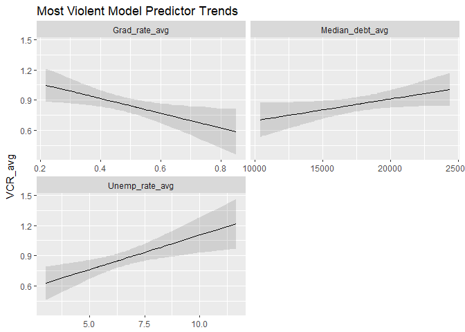<!-- -->

```r
sjp.lm(lm_LV_VCR_3, 
       type = "eff", 
       facet.grid = T,
       title = "Least Violent Model Predictor Trends")
```

```
## `sjp.lm()` will become deprecated in the future. Please use `plot_model()` instead.
```

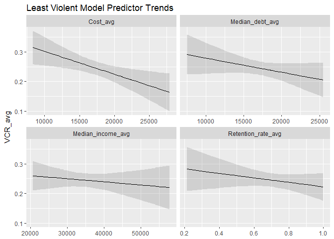<!-- -->

```r
# Effects of regression predictors
sjp.lm(lm_MV_VCR_5, 
       type = "lm", 
       show.values = T, 
       show.p = T,
       title = "Most Violent Model Predictor Effects",
       axis.title = "VCR_avg Estimates")
```

```
## `sjp.lm()` will become deprecated in the future. Please use `plot_model()` instead.
```

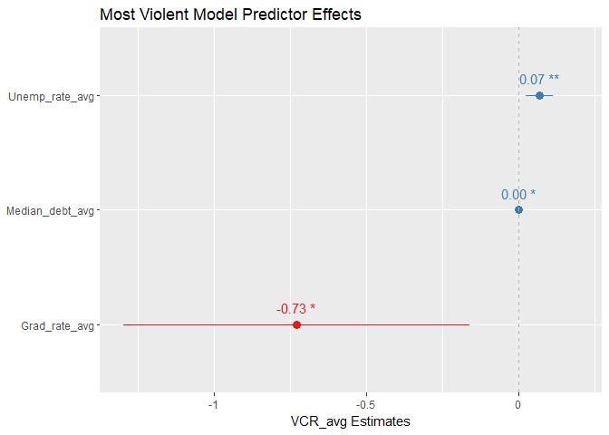<!-- -->

```r
sjp.lm(lm_LV_VCR_3,
       type = "lm", 
       show.values = T, 
       show.p = T,
       title = "Least Violent Model Predictor Effects",
       axis.title = "VCR_avg Estimates")
```

```
## `sjp.lm()` will become deprecated in the future. Please use `plot_model()` instead.
```

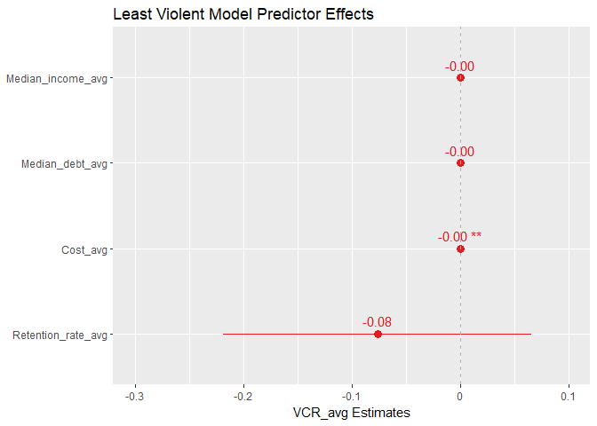<!-- -->

```r
# MV_model residual plots to visualize randomness of data
plot_model(lm_MV_VCR_5, 
           type = c("diag"))
```

```
## [[1]]
```

<!-- -->

```
## 
## [[2]]
```

<!-- -->

```
## 
## [[3]]
```

<!-- -->

```
## 
## [[4]]
```

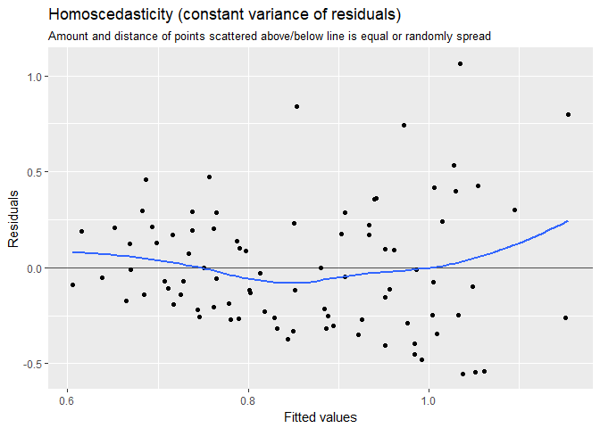<!-- -->

```r
# LV_model residual plots to visualize randomness of data
plot_model(lm_LV_VCR_3, 
           type = c("diag"))
```

```
## [[1]]
```

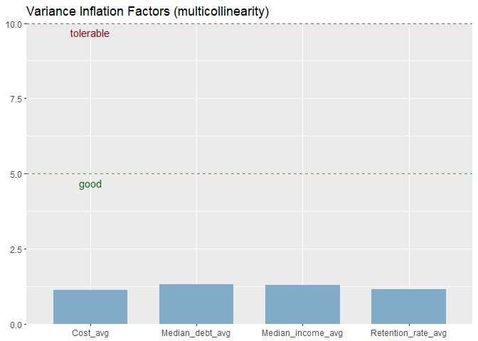<!-- -->

```
## 
## [[2]]
```

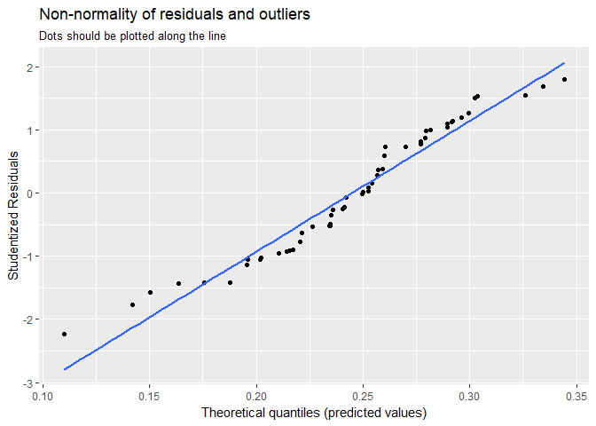<!-- -->

```
## 
## [[3]]
```

<!-- -->

```
## 
## [[4]]
```

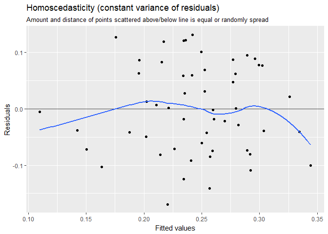<!-- -->
